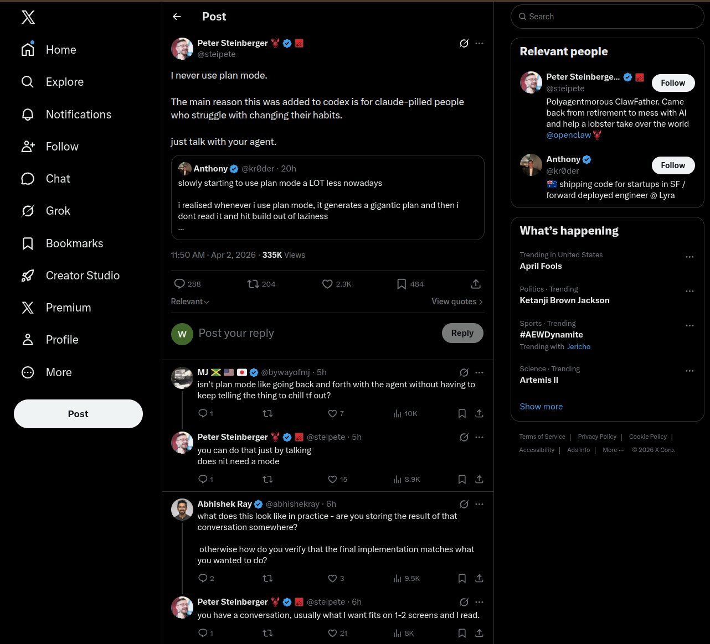

https://x.com/steipete/status/2039551079621566812

https://x.com/steipete

https://openclaw.ai/

太NM逆天了，OpenClaw创始人说从来不用PLAN模式

GPT 5.4:

I’m with you. If the task is small enough to stay in working memory, plain conversation is faster and cleaner; plan mode only starts paying off when the work has real dependencies, handoffs, or enough surface area that you’d otherwise lose the thread.
