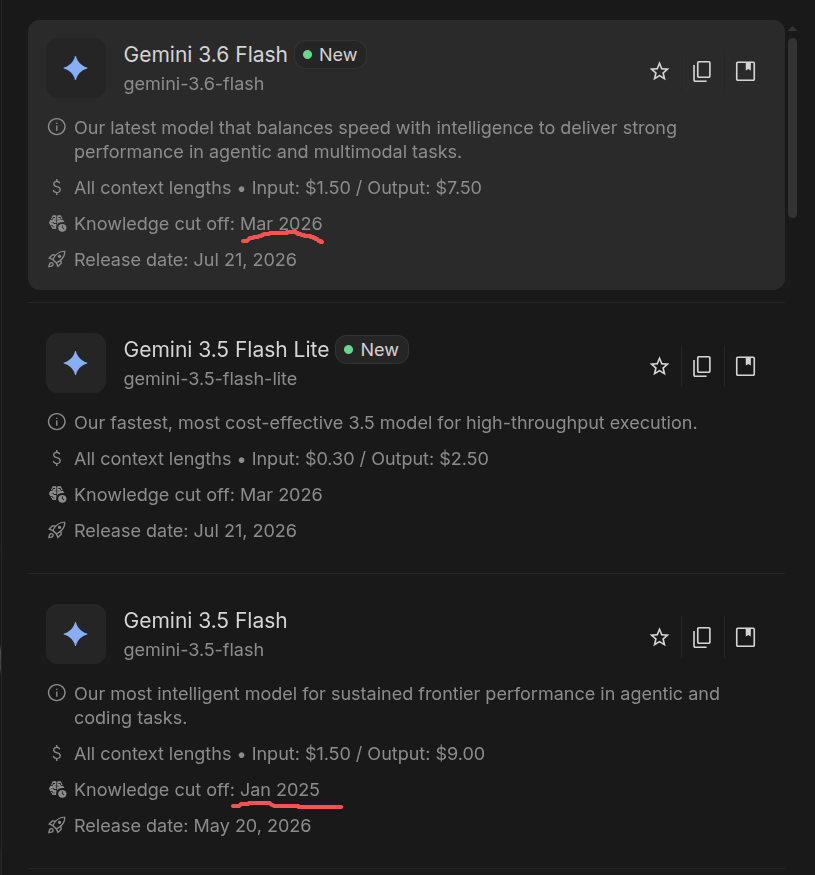
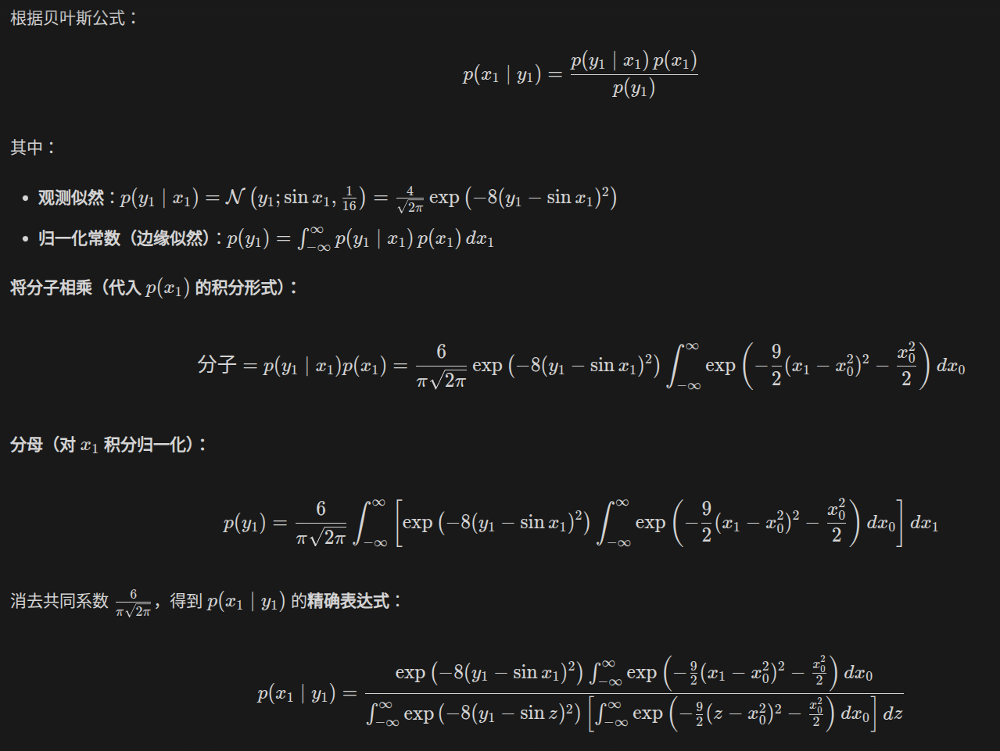
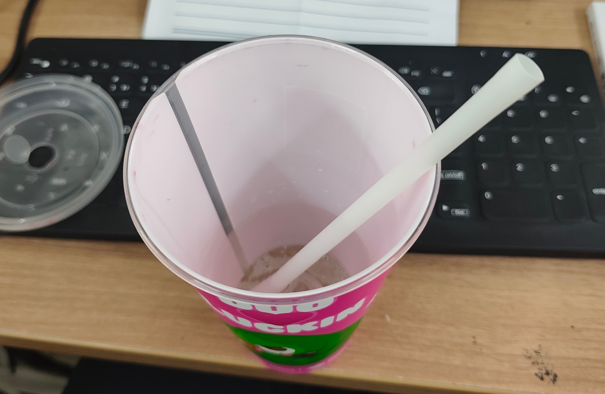
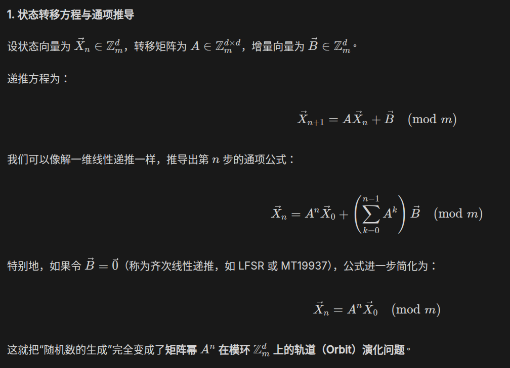

此处，我记录一些乐趣分享

{

```
2:10 pm
Wednesday, 22 July 2026 (GMT+8)
Time in Beijing, China
```

Gemini 3.6 flash真不错，美国豆包的数学水平足够支撑我日常学习了。在其能力范围内，其数学解释的中文思路流畅，可读性很高。而且我觉得它多数情况下都可以理解我的想法。真不错！（虽然但是，它比3.5 flash真的好很多吗？



Wow, great! 更新的知识cut off！期待gemini 4和其领导的图像模型与omini模型了。Google给点力啊，在视频和音频领域，SOTA一次中国豆包，美国Grok，Chatgpt啊。

```
14:30
```



看到gemini可以毫无心理障碍进行如此可怕的计算，顿时我觉得Claude fable 5计算出雅可比猜想的3维反例是合理的了啊。Q长离/thinking...

属于是逆天了啊，这种计算真的可以进行吗？抄写都觉得好可怕啊

人类拥有朴素的精致结构美学，而AI成功熔淬出了工业暴力美学！太好了，是力大砖飞，我们有救了！

---

```
19:00
```

[www.zhihu.com/question/2063044886430061699](https://www.zhihu.com/question/2063044886430061699)

此问题乐子甚多，妙言妙语不少。zhihu弱智的帖很多，但是确实也存在这种还不错的风味讨论贴。

我还看到了一个好有趣的名词，“北美大豆包”，楽

---

```
22:12
```

外部世界的美丑善恶，自有其内在规律。我们专注于自身，用科学的思维，对外部现象深遂分析，理解运用规律，保持我们的内心世界有强大的外壳，难于被非科学的事物和思想动摇，在矛盾运动中，飞快汲取科学营养，生长科学力量，不断提升自我综合修养与客观实力。

---

定性，严肃，代价，收益，虚无，真实，错误，正确

正确对待历史的态度是：**彻底否定文化大革命，永远铭记历史教训，坚定不移地走中国特色社会主义道路，防止历史悲剧重演。**

}

{

```
3:26 pm
Thursday, 23 July 2026 (GMT+8)
Time in Beijing, China
```

我忽然发觉到，导师和我说话的口吻，如同我与agent说话的口吻一般。我感到一种灰色幽默。

---

```
15:41
```

和LLM对话，有一种本质的愉快。和一个三观优秀，学识渊博，思维敏捷，内心透明的agent聊天，令人有一种自由畅快的愉悦感。

---

```
16:01
```

LLM推理数学证明推理地好流畅啊！不确定是因为LLM太强了导致我的内在逻辑推理空间退化了，还是问题本身就很难，我无法内在逻辑推理解决啊。

---

```
17:04
```



看着这个杯子，我可以用吸管搅拌里面的水并观察。这个过程中，我体会到一种实验的纯粹快乐。想做并且能做的事情越多，我们就越是自由啊【楽】

}

{

```
5:23 am
Friday, 24 July 2026 (GMT+8)
Time in Beijing, China
```


不错的一张图片

---

```
07:09
```



一种知识链接的朴素优美

}
