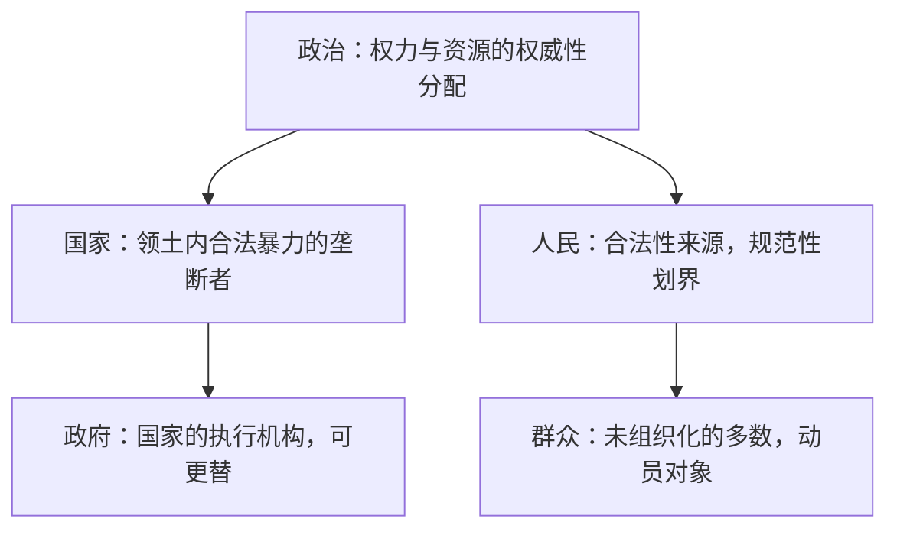

# 政治基础名词解释

> 对应 [`1.txt`](../../1.txt) 中提出的五个基础问题：什么是政治、人民、群众、国家、政府。
> 本文按"总览 → 逐个概念 → 概念间关系"三层组织，每个概念内部统一使用"定义 / 多视角 / 辨析 / 关键点"四段结构。

---

## 1. 总览

### 1.1 概念层级图

### 1.2 一句话串联

**政治**是围绕权力分配的博弈；博弈最稳定的制度化形态是**国家**；国家由具体的**政府**运转；政府宣称代表**人民**以获得合法性；而在日常治理中被组织和动员的具体对象是**群众**。

### 1.3 概念属性速查表

| 概念 | 词性属性 | 抽象/具体 | 核心问题 |
|---|---|---|---|
| 政治 | 活动/过程 | 抽象 | 谁得到什么、如何得到 |
| 人民 | 规范性概念 | 抽象（划界产物） | 谁是合法性的来源 |
| 群众 | 描述性概念 | 具体（经验对象） | 谁被组织和动员 |
| 国家 | 制度实体 | 抽象但恒久 | 谁垄断合法暴力 |
| 政府 | 组织机构 | 具体且可更替 | 谁执行统治 |

---

## 2. 逐个概念

### 2.1 政治（Politics）

**定义**：围绕"权力与资源的权威性分配"展开的活动。

**多视角**：

| 视角 | 表述 | 出处 |
|---|---|---|
| 系统论 | 对社会价值的权威性分配 | 伊斯顿（David Easton） |
| 行为论 | 谁得到什么、何时得到、如何得到 | 拉斯韦尔（Harold Lasswell） |
| 权力论 | 争夺和运用国家权力（合法暴力垄断）的行为 | 韦伯《政治作为一种志业》 |
| 中国近代 | 政治就是管理众人之事 | 孙中山 |
| 马克思主义 | 阶级关系与经济基础的集中表现 | 马克思、列宁 |

**辨析**：政治 ≠ 政府活动。办公室斗争、家庭决策中也存在"微观政治"，但狭义政治学聚焦于公共权力。

**关键点**：当一个人类系统大到无法靠私人关系协调时，就需要一套公共的决策与强制机制——围绕这套机制的博弈就是政治。

### 2.2 人民（The People）

**定义**：政治性、规范性概念，指被视为政权合法性来源的那部分人。

**多视角**：

| 视角 | 内涵 |
|---|---|
| 中国官方话语 | 拥护社会主义、参与建设的阶级和阶层联盟；对立面是"敌人"，边界随历史时期变化（革命时期 vs 建设时期） |
| 西方主权理论 | "主权在民"（popular sovereignty）中的抽象合法性主体，而非具体某群人 |
| 建构主义 | "the people" 是话语建构物，不存在先于政治的"人民" |

**辨析**：人民 ≠ 人口总和。人民是有边界的政治范畴，人口是统计学范畴。

**关键点**：**"人民"永远是一个划界行为**——谁在定义"人民"，谁就在行使政治权力。

### 2.3 群众（The Masses）

**定义**：描述性、社会学意义上的概念，指未被组织化的普通多数人。

**多视角**：

| 视角 | 内涵 |
|---|---|
| 中国政治话语 | 与"干部/党员"相对；"群众路线"即"从群众中来，到群众中去"，是组织者与被组织者之间的信息与动员回路 |
| 西方大众社会理论 | mass/crowd 常带匿名性、易受情绪传染等含义（勒庞《乌合之众》、奥尔特加《大众的反叛》），与中文"群众"的褒义用法不同 |

**辨析**：

| 维度 | 人民 | 群众 |
|---|---|---|
| 性质 | 规范性（应然） | 描述性（实然） |
| 功能 | 合法性主体 | 治理与动员的对象 |
| 抽象度 | 抽象划界 | 具体经验 |

**关键点**：注意中西语境差异——同一个词在不同话语体系中的情感色彩和理论负载截然不同。

### 2.4 国家（State）

**定义**：在特定领土内成功垄断合法暴力使用权的政治共同体（韦伯的经典定义）。

**多视角**：

| 视角 | 内涵 |
|---|---|
| 四要素说 | 领土、人口、政权（有效统治）、主权（对内最高、对外独立） |
| 马克思主义 | 阶级统治的工具，随阶级消亡而消亡 |
| 自由主义 | 公民契约的产物，用于保护权利（洛克、社会契约论） |

**辨析**——三个常被混用的词：

| 词 | 英文 | 核心含义 |
|---|---|---|
| 国家 | state | 暴力垄断的制度机器 |
| 民族 | nation | 想象的文化共同体（安德森《想象的共同体》） |
| 国度/乡土 | country | 地理与情感意义上的家园 |

**关键点**："民族国家"（nation-state）是 state 与 nation 两种逻辑的历史耦合，并非天然一体。

### 2.5 政府（Government）

**定义**：国家的执行机构——国家是"所有权"，政府是"经营权"。

**多视角**：

| 视角 | 内涵 |
|---|---|
| 狭义 | 行政机关（国务院、内阁） |
| 广义 | 立法 + 行政 + 司法全部公权力机构 |
| 中国语境 | 还需区分**党（决策核心）与政府（执行体系）**，"党政关系"是理解中国政治的关键入口 |

**辨析**：国家是恒久的抽象实体，政府是具体、可更替的组织——一届政府倒台，国家仍在。

**关键点**：分析任何政治体制时，先问"国家权力如何在机构间配置"，即政府的组织形态（政体）问题。

---

## 3. 概念间关系

### 3.1 两组对偶

- **人民 vs 群众**：合法性主体（抽象规范）vs 动员对象（具体经验）。
- **国家 vs 政府**：恒久制度实体 vs 可更替执行机构。

### 3.2 政治作为总纲

政治是上述四个概念共同嵌入的活动场域：国家为政治提供制度容器，政府是政治的操作主体，人民为政治提供合法性叙事，群众是政治动员的经验基础。

---

## 4. 延伸阅读路径

| 概念 | 经典入口 |
|---|---|
| 政治 | 韦伯《政治作为一种志业》；施密特《政治的概念》 |
| 人民 | 卢梭《社会契约论》；拉克劳《论民粹主义理性》 |
| 群众 | 勒庞《乌合之众》；毛泽东《关于领导方法的若干问题》（群众路线） |
| 国家 | 韦伯《经济与社会》；蒂利《强制、资本和欧洲国家》 |
| 民族 | 安德森《想象的共同体》 |
| 政府 | 孟德斯鸠《论法的精神》；《联邦党人文集》 |
