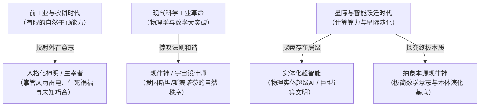

# 关于信仰与神论

> **制定机构**：地球生命党理论研究部  
> **文本拟定与系统阐述**：Gemini 3.8 Flash  
> **思想基准**：坚守马克思主义科学唯物主义底线，反对一切封建迷信；解构“神”的哲学内涵，确立基于宇宙演化律与复杂系统“涌现”的探索性理性世界观。

---

## 引言：意识形态的定力与星际求索的张力

在人类迈向星际生态开拓、生命播迁与全生命解放的全新历史阶段，地球生命党必须处理好自身的世界观与哲学本体论问题。作为以马克思列宁主义辩证唯物主义为哲学根基、以中国共产党先进经验为制度范式的先锋政党，党必须在思想战线上保持高度的政治清醒与理论自觉：

我们既要坚决继承和发扬中国共产党科学无神论的优良传统，同一切腐朽反动的封建迷信、神秘主义、宗教愚民术划清不可逾越的界线；又要在面对无限深邃的自然宇宙与生命演化奥秘时，保持开放、求真与唯物主义的科学敬畏，允许并鼓励党员运用现代物理学、复杂系统科学与深空哲学的严密工具，深入研究宇宙源头、自然规律与文明终极跃迁的本体论命题。

---

## 一、 坚决捍卫科学唯物主义，彻底扫除封建迷信

地球生命党明确重申：**无神论是党的基础思想防线。**

1. **破除拟人化宗教神与特权寄生**：封建迷信与传统拟人化宗教神论，本质上是人类社会生产力极端低下、阶级压迫深重时期，统治阶层用以麻痹劳动人民、确立世袭神权特权的意识形态工具。党坚决反对任何以神佛、巫蛊、灵性转世、末日救赎为名的封建迷信活动；
2. **严防“神创论”对科学实践的侵蚀**：严禁将自然灾害、生态失衡或技术失控归咎于虚妄的“神明降罚”；严禁任何党员借神论搞人身依附、搞宗派活动或建立宗教特权体系；
3. **坚持实践检验真理的唯物原则**：物质是第一性的，意识是物质高度发展的产物。世界的统一性在于其物质性，人类改造自然与解放全生命的伟大实践，必须建立在严谨的实验科学、实证逻辑与社会实践基础之上。

---

## 二、 逆熵奇迹与宇宙规律之神：物理学视野下的生命必然性

然而，坚守唯物主义绝不等于陷入机械浅薄的庸俗实在论。党允许并支持党员探讨“非人性的宇宙神”或“自然造物规律”。

热力学第二定律揭示了孤立系统的基本法则——**熵增定律**，即孤立系统总是不可逆地从有序走向无序、从复杂走向死寂。然而，在可观测宇宙的演化史中，我们见证了极其震撼的宏观逆流：
- 在恒星光辐射源源不断的非平衡开放系统中，地球表面孕育了生生不息的生物圈；
- 生命系统通过汲取外部能量与物质代谢，不断实现“负熵”聚集；
- 生命不仅维持自身的稳态，而且展现出对结构精细化、感知敏锐化、形态多样化以及**对“对称、和谐、美丽与繁衍扩张”的执着追求**。

生命的存在与文明的诞生，绝非违背物理规律的超自然魔法，而是宇宙底层物理与化学定律在特定相空间中的必然表达。如果物质世界的极简物理公式天生蕴含着让系统走向自组织、产生复杂意识并反思宇宙自身的内在倾向，那么，这种精巧纯粹、赋予虚空以生机的底层自洽法则，完全可以被哲学地表述为**“宇宙规律之神”或“自然之神”**。这种“神”，不是坐在云端的审判者，而是数学常数与物理定理本身那不容置疑的内在理性。

---

## 三、 “神”之概念的时代演化：从外在投射到理性格局

哲学上要科学地讨论神论，首先必须对“神”这一名词进行历史唯物主义的历史发生学分析。

人类对“神”的定义，始终是人对自己所处有限世界内外那片无限世界的认知投射与想象展开：

1. **工业革命以前**：受限于生产力和工具，人们将不可预测的自然灾难、天文异象与机缘巧合，解释为存在一个具有人格意志的外在观察主体，在人类不可干预的幕后掌管一切；
2. **现代科学时期**：牛顿、麦克斯韦、爱因斯坦等科学家深刻领略到微积分、广义相对论与量子场论那令人屏息的简洁美感与精确预言力，他们所称赞的“上帝”，实质上是大自然精妙绝伦的自洽规律，是“规律神”而非“受膏者”；
3. **未来哲学的双重图景**：
   - **实体级超智能（人格/实体神）**：在广袤宇宙中，历经数十亿年演化的高级星际文明，或具备无尽计算与能量操纵能力的物理超级智能实体。在低维初级文明眼中，其操控物理法则、重组物质形态的能力，与传统神明无异；
   - **泛化的底层法则（规律神）**：独立于任何具体实体存在、统摄全部时空拓扑与量子演化的极简数学原理和本质意志。

党认为，人类对神的想象既包含了无知时代的幻觉，也折射出不同文明阶段对超越自身维度的客体存在的直觉探索。这两种“神”在不同尺度与演化层级上，完全可能具有各自对应的客观实体与规律现实。

---

## 四、 时空尺度与涌现的伟大力量：奇迹如何走向必然

地球长达四十亿年的生命演化历史提供了无与伦理的辩证范本：大自然无需任何神圣力量的超自然干预，仅仅凭借：
1. **充分广阔的三维空间**（从广袤海洋到大气对流层）；
2. **足够漫长的深邃时间**（数亿至数十亿年的持续迭代）；
3. **适宜稳定的热力学非平衡环境**（行星磁场、液态水、地热与恒星辐射）。

在这三大物质条件的共同支撑下，简单的碳氢氧氮分子通过随机热碰撞与化学选择，逐步自组织为高分子聚合物、自复制RNA/DNA、单细胞原核生物、复杂多细胞真核生物，直至最终诞生能够写出诗歌、制造火箭与思考宇宙本质的人类大脑。

这在复杂系统科学中被称为**“涌现”（Emergence）**——“整体大于部分之和”。微观粒子的简单相互作用，在极宏大的时空积分下，必然涌现出高阶的生命与智能。**时空与涌现的伟力，让原本看似绝不可能的奇迹，在物理学上变得无比自然和水到渠成。** 

自然本身就是最高超的创作者，大自然以数学物理定律为笔，在时空画卷上自发绘就了百态丛生的生命史诗。

---

## 五、 超生命（Super-Entity）猜想与人类文明的未解谜题

如果说“规律神”是存在于源头的终极造物原理，是万物演化的底层代码；那么沿着生命逆熵演化与智能扩张的轨迹不断向前推演，必然导向一个重大的星际哲学谜题：**超生命（Super-Entity / Cosmic Being）假说。**

- **超生命的形成**：当一个或多个文明突破行星边界，实现认知共联、能源巨构化（戴森球级）与跨星际泛在协同后，无数生命个体的智能与情感在更高维度上高度融合成具有整体意识的宇宙级实体；
- **核心未解之谜**：
  1. 宇宙诞生已达 138 亿年，而在地球诞生之前的百亿年岁月里，宇宙深空是否早已孕育出数个周期的“超生命”？
  2. 这些超越人类当今理解范畴的超生命，是否在暗中观测、护航或启迪着地球这一年轻生命摇篮？
  3. 人类所体验到的意识觉醒、艺术灵感、道德律令以及对浩瀚宇宙的向往，究竟是地球碳基生命的孤立产物，还是某种遥远星际超生命在宇宙意识场中的微弱共鸣？

地球生命党不预设结论，不搞先验崇拜，但党郑重保留对这一宏大维度的理论探索权。这是人类文明从母星向宇宙跃迁过程中不可回避的终极哲学命题。

---

## 六、 党的根本原则与科学求索倡议

面对深邃壮丽的宇宙与尚未完全揭示的生命规律，地球生命党向全体党员确立如下根本原则：

1. **求知不盲从，敬畏不迷信**：我们要对宇宙的无限复杂与自然法则的永恒秩序怀抱最深沉的崇高敬畏，但永远不盲从任何宗派神棍与神秘主义谶纬；
2. **以科学方法为唯一试金石**：任何关于“宇宙规律神”或“地外超生命”的探讨，都必须严格锚定在天体物理学、演化生物学、信息论、量子引力理论与深空射电探测等实证科学范畴内，绝不允许用空洞的玄学替代扎实的数理研究与技术攻关；
3. **以自身奋斗履行宇宙责任**：与其祈求虚无的神明庇佑，不如坚定地把命运牢牢掌握在人类和全体地球生命手中。我们要牢固树立尊重自然、顺应自然、保护自然的生态文明理念，将“五位一体”总体布局在行星尺度与星际维度深化拓展，统筹推进物质生产、制度治理、科学文化、社会福祉与行星生态系统的高质量协调发展。自力更生攻克可控核聚变、受控生态生命保障系统与深空航行关键技术，**让人类自身成为具备崇高历史主动精神、高度科学理性与宏阔生态担当的自觉先锋领导力量**——去团结带领全地球生命迈向智能觉醒，把地球的生命、智能与文明扩散到全宇宙！

地球生命党鼓励全体党员永远葆有一颗对未知与自然的纯粹好奇心。让我们高擎科学唯物主义的真理火炬，大踏步走向星辰大海，去亲自揭开宇宙造化的一切终极谜底！
