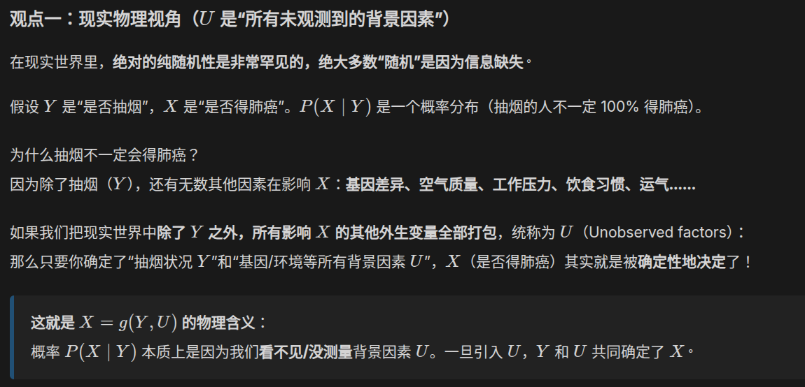
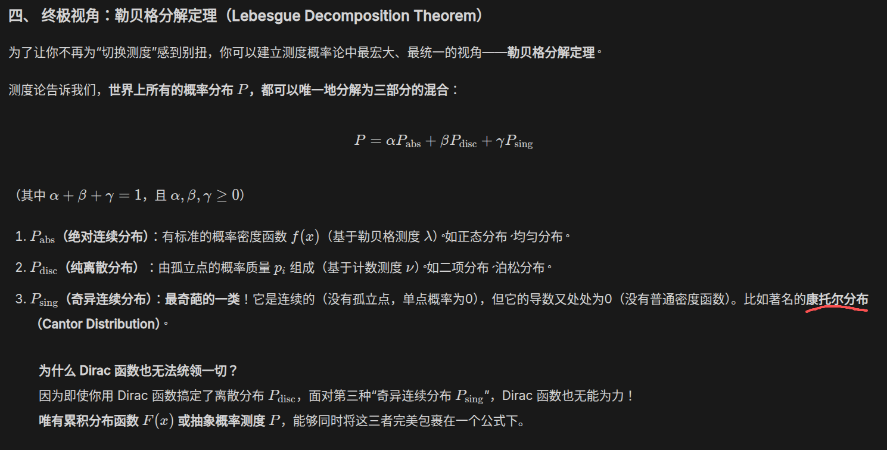

{

```
4:34 pm
Thursday, 23 July 2026 (GMT+8)
Time in Beijing, China
```

抽样

条件抽样

随机源

已知 $Y = f(X)$，如果我们抽样得到了 $y$，想反推并抽样 $x \sim P(X \mid Y=y)$。

我最初觉得，考虑  $Y = X^2$，那么我采样 $y$，似乎很难可以函数映射到 $x$，但现在我发觉，只要复合一个硬币过程就可以了。这让我回味到Gemini说要引入额外噪声分布 $W$的妙处。



gemini这个说法，我觉得很有道理

用无穷维矩阵表示随机变量，例如正态分布...



something我所好奇

}

2026-08-18 18:56:27 CST
定义通用耦合测度集合（即广义传输多面体）：

$$
\Pi(\mathbb{P}_X, \mathbb{P}_Y) := \left\{ \pi \in \mathcal{P}(\mathcal{X} \times \mathcal{Y}) \;\middle|\; \mathscr{P}_{X \sharp} \pi = \mathbb{P}_X, \; \mathscr{P}_{Y \sharp} \pi = \mathbb{P}_Y \right\}
$$

则

$$
\operatorname*{argmin}_{\pi \in \Pi(\mathbb{P}_X, \mathbb{P}_Y)} \mathrm{KL}(\pi \parallel \mathbb{P}_X \otimes \mathbb{P}_Y) = \mathbb{P}_X \otimes \mathbb{P}_Y
$$

设联合随机向量 $(X,Y) \sim \mathbb{P}_{(X,Y)}$，其边缘分布分别为 $X \sim \mathbb{P}_X$ 与 $Y \sim \mathbb{P}_Y$：

信息论一些公式:

$$
h(\mathbb P_X\otimes\mathbb P_Y) = h(\mathbb P_X)+h(\mathbb P_Y) \\
I(X;Y) = \mathrm{KL}\left(
\mathbb P_{(X,Y)}
\middle\|
\mathbb P_X\otimes\mathbb P_Y
\right) = h(\mathbb P_X)+h(\mathbb P_Y)-h(\mathbb P_{(X,Y)}) \geqslant 0 \\
I(X;Y) = 0 \iff \mathbb P_{(X,Y)} = \mathbb P_X\otimes\mathbb P_Y \\
\operatorname*{argmax}_{\mathbb{P}_{(X,Y)} \in \Pi(\mathbb{P}_X, \mathbb{P}_Y)} h(\mathbb{P}_{(X,Y)}) = \mathbb{P}_X \otimes \mathbb{P}_Y
$$

1. **期望定义取负**：$-I(X; Y) = \mathbb{E}_{(X,Y)\sim\mathbb{P}_{(X,Y)}}\left[ \log \frac{p_X(X)p_Y(Y)}{p_{(X,Y)}(X,Y)} \right]$。
2. **Jensen 期望不等式**：由对数函数 $\log(\cdot)$ 的严格凹性，直接将期望算子移入对数内部：

$$
-I(X; Y) \le \log \mathbb{E}_{(X,Y)\sim\mathbb{P}_{(X,Y)}}\left[ \frac{p_X(X)p_Y(Y)}{p_{(X,Y)}(X,Y)} \right] = \log(1) = 0 \implies I(X; Y) \ge 0
$$

（其中根据随机变量函数期望的定义，将期望转化为在体积测度 $v = v_X \otimes v_Y$ 上的联合概率积分：

$$
\mathbb{E}_{(X,Y)\sim\mathbb{P}_{(X,Y)}}\left[ \frac{p_X(X)p_Y(Y)}{p_{(X,Y)}(X,Y)} \right] = \int_{\mathcal{X} \times \mathcal{Y}} \left( \frac{p_X(x)p_Y(y)}{p_{(X,Y)}(x,y)} \right) p_{(X,Y)}(x,y) \, \mathrm{d} v(x, y)
$$

于是内部期望 $\mathbb{E}_{(X,Y)\sim\mathbb{P}_{(X,Y)}}\!\left[\frac{p_X p_Y}{p_{(X,Y)}}\right] = 1$，等号当且仅当随机变量比值为常数 $1$ 即相互独立时成立）。

---

2026-08-26 08:53:53 CST

一旦空间装备了内积 $\langle \cdot, \cdot \rangle_{\mathcal{H}}$，根据 Riesz 表示定理，每一个连续线性泛函 $f \in \mathcal{H}^*$ 都能被唯一的一个向量 $|x\rangle \in \mathcal{H}$ 所代表。

这定义了一个典范的共轭线性等距同构（通常在微分几何中称为音乐同构 Musical Isomorphism $\flat$）：

$$
\flat : \mathcal{H} \xrightarrow{\sim} \mathcal{H}^*, \qquad |x\rangle \mapsto \langle x| := \langle x, \cdot \rangle_{\mathcal{H}}
$$
