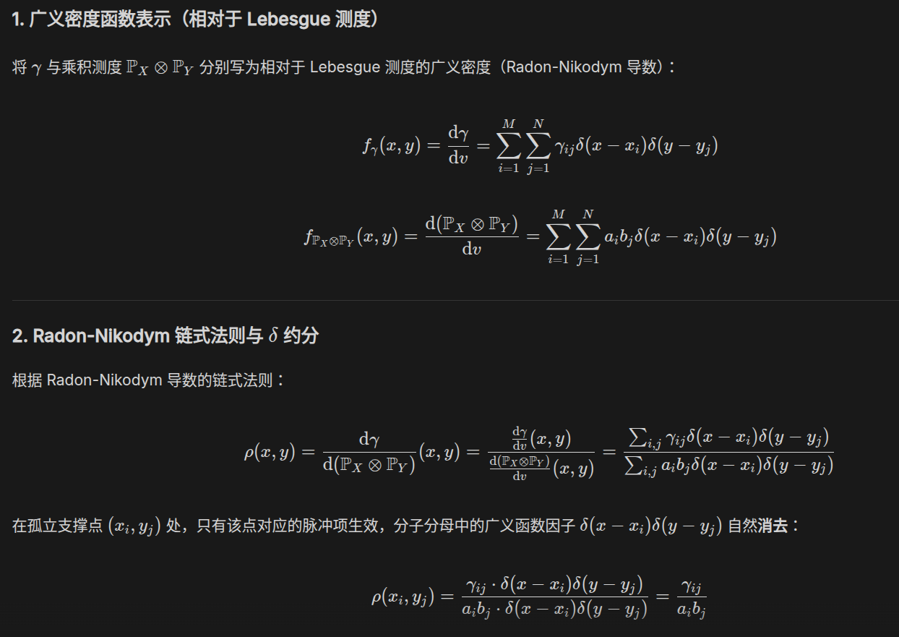
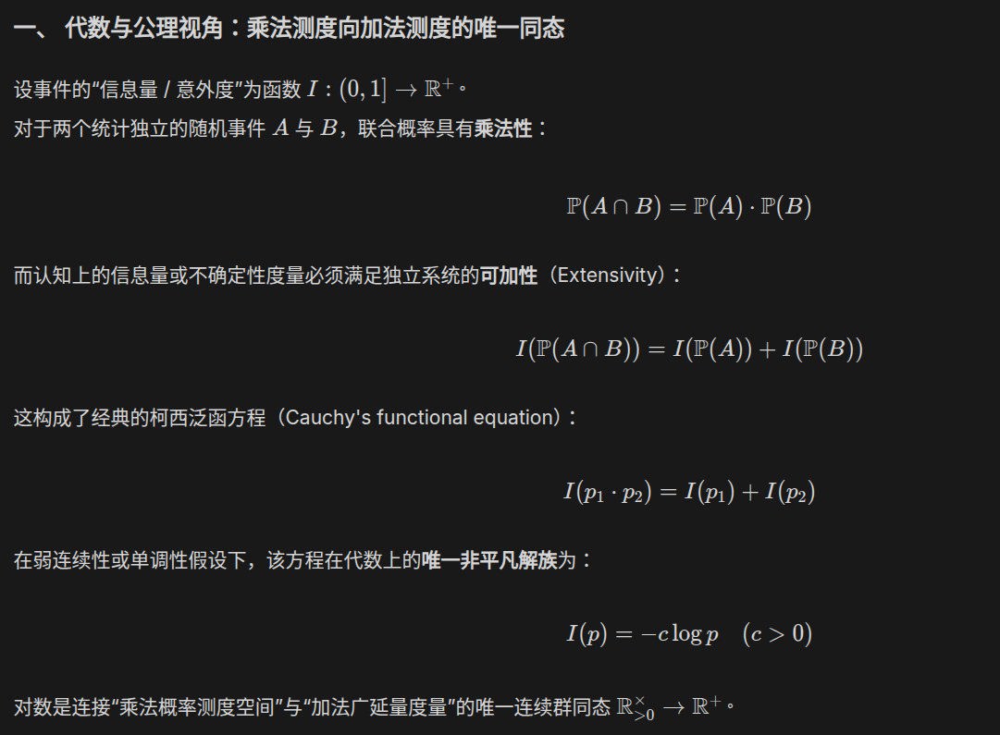

# Next

首先需要澄清一个概念：条件 $\mathbf{1}_N^{\text{T}} w = 1$ **不是“与 $1$ 向量正交”**（正交是内积为零 $\mathbf{1}_N^{\text{T}} w = 0$），而是要求**权重向量 $w$ 的所有元素之和等于 $1$**：

$$
\mathbf{1}_N^{\text{T}} w = \sum_{i=1}^N w_i = 1
$$

在几何与线性代数中，满足 $\sum_{i=1}^N w_i = 1$ 的线性组合被称为**仿射组合（Affine Combination）**。之所以必须引入该条件，有以下三个深刻的数学与物理原因：

---

### 1. 物理坐标系的平移不变性（Translation Invariance）

物理规律不应依赖于参考系原点的选择。

假设对所有样本点叠加一个任意的常数平移量 $c \in \mathbb{R}^{d_x}$，定义新坐标系下的样本矩阵为 $\widetilde{\mathbf{X}}$，其中第 $i$ 列为 $\tilde{x}^{(i)} = x^{(i)} + c$：

$$
\widetilde{\mathbf{X}} = \mathbf{X} + c \mathbf{1}_{1 \times N}
$$

用同样的权重 $w$ 进行组合，在新坐标系下的点为：

$$
\tilde{v} = \widetilde{\mathbf{X}} w = (\mathbf{X} + c \mathbf{1}_{1 \times N}) w = \mathbf{X} w + c (\mathbf{1}_N^{\text{T}} w)
$$

若要保证组合点随着坐标原点的平移而发生**等量平移**（即 $\tilde{v} = v + c$），必须且仅须：

$$
\mathbf{1}_N^{\text{T}} w = 1
$$

如果 $\mathbf{1}_N^{\text{T}} w \neq 1$，平移原点会导致估计结果发生畸变，这在物理上是不自洽的。

---

### 2. 仿射子空间与“均值+扰动”分解的等价性

状态样本点 $\left\{x^{(1)}, \dots, x^{(N)}\right\}$ 通常聚集在真值附近，整体远离坐标原点 $\mathbf{0}$。

* **线性子空间（Linear Subspace）**：强制包含坐标原点 $\mathbf{0}$。
* **仿射子空间（Affine Subspace）**：不要求包含原点，而是以**样本均值 $\bar{x}$** 为基点，加上**样本扰动（Deviation）**所张成的空间。

数学上，任何仿射组合点 $v = \mathbf{X} w$ 都可以精确分解为“均值 + 扰动线性组合”：

$$
v = \bar{x} + \mathbf{X}' w
$$

其中 $\bar{x} = \mathbf{X} \mathbf{1}_N$ 是均值向量，$\mathbf{X}' = \mathbf{X}(\mathbf{I}_N - \mathbf{1}_N)$ 是扰动矩阵。

**证明**：

$$
\bar{x} + \mathbf{X}' w = \mathbf{X} \mathbf{1}_N + \mathbf{X}(\mathbf{I}_N - \mathbf{1}_N)w = \mathbf{X} w + \mathbf{X} \mathbf{1}_N (1 - \mathbf{1}_N^{\text{T}} w)
$$

当且仅当 $\mathbf{1}_N^{\text{T}} w = 1$ 时，尾项 $\mathbf{X} \mathbf{1}_N (1 - \mathbf{1}_N^{\text{T}} w) = \mathbf{0}$，上式严格成立。

---

}

{

}

{

是的，**$\mathbf{1}_N$ 确实是一个 $N \times N$ 的方阵**，而不是标量，也不是列向量！

在集合方法的文献（如 Evensen 原著 Eq 9.12）中，符号约定如下：

### 1. $\mathbf{1}_N$ 的矩阵具体形式

设 $\boldsymbol{e}_N = [1, 1, \dots, 1]^{\mathrm{T}} \in \mathbb{R}^N$ 为全 1 的**列向量**。

矩阵 $\mathbf{1}_N \in \mathbb{R}^{N \times N}$ 定义为全 1 向量与其转置的外积除以样本数 $N$：

$$
\mathbf{1}_N = \frac{1}{N} \boldsymbol{e}_N \boldsymbol{e}_N^{\mathrm{T}} = \begin{pmatrix} \frac{1}{N} & \frac{1}{N} & \dots & \frac{1}{N} \\ \frac{1}{N} & \frac{1}{N} & \dots & \frac{1}{N} \\ \vdots & \vdots & \ddots & \vdots \\ \frac{1}{N} & \frac{1}{N} & \dots & \frac{1}{N} \end{pmatrix}_{N \times N}
$$

即 $\mathbf{1}_N$ 是一个**每一个元素都等于 $1/N$ 的 $N \times N$ 方阵**。

---

### 2. 矩阵减法 $\mathbf{I}_N - \mathbf{1}_N$

因为单位阵 $\mathbf{I}_N$ 和 $\mathbf{1}_N$ 都是同维度的 $N \times N$ 矩阵，所以**完全可以直接做矩阵减法**：

$$
\mathscr{P}_{\mathbf{1}}^\perp = \mathbf{I}_N - \mathbf{1}_N = \begin{pmatrix} 1 - \frac{1}{N} & -\frac{1}{N} & \dots & -\frac{1}{N} \\ -\frac{1}{N} & 1 - \frac{1}{N} & \dots & -\frac{1}{N} \\ \vdots & \vdots & \ddots & \vdots \\ -\frac{1}{N} & -\frac{1}{N} & \dots & 1 - \frac{1}{N} \end{pmatrix}_{N \times N}
$$

---

### 3. 这个矩阵相减在做什么？

假设某一个状态变量在 $N$ 个样本上的取值构成行向量 $r = [x^{(1)}, x^{(2)}, \dots, x^{(N)}]$：

1. **右乘 $\mathbf{1}_N$（求均值并广播）**：

   $$
   r \mathbf{1}_N = r \left( \frac{1}{N} \boldsymbol{e}_N \boldsymbol{e}_N^{\mathrm{T}} \right) = \left( \frac{1}{N} \sum_{j=1}^N x^{(j)} \right) \boldsymbol{e}_N^{\mathrm{T}} = [\bar{x}, \bar{x}, \dots, \bar{x}]
   $$
2. **右乘 $(\mathbf{I}_N - \mathbf{1}_N)$（原向量减去均值向量）**：

   $$
   r (\mathbf{I}_N - \mathbf{1}_N) = r \mathbf{I}_N - r \mathbf{1}_N = [x^{(1)}, \dots, x^{(N)}] - [\bar{x}, \dots, \bar{x}] = [x^{(1)}-\bar{x}, \dots, x^{(N)}-\bar{x}]
   $$

因此，$\mathbf{I}_N - \mathbf{1}_N$ 确实是一个严谨的 $N \times N$ 矩阵，它在代数上实现了“提取均值并作差（去均值中心化）”的功能！

}

{

你的敏锐洞察完全切中了线性代数与泛函分析的核心：**下标 $\mathbf{1}$ 确实只是特例，对应着一维均值子空间。**

可以将此投影矩阵表示精确推广至任意非零向量 $v$、任意 $k$ 维子空间 $W$ 乃至带度量矩阵（Weighted Metric）的泛函空间。

---

### 1. 推广一：任意单向量子空间 $W = \text{span}\{v\}$

设 $v \in \mathbb{R}^N$ ($v \neq \mathbf{0}$)，正交投影算子 $\mathscr{P}_v$ 与余投影算子 $\mathscr{P}_v^\perp$ 的矩阵表示为：

$$
\mathscr{P}_v = \frac{v v^{\mathrm{T}}}{v^{\mathrm{T}} v}, \quad \mathscr{P}_v^\perp = \mathbf{I}_N - \frac{v v^{\mathrm{T}}}{v^{\mathrm{T}} v}
$$

**验证特例**：当 $v = \boldsymbol{e}_N = [1, 1, \dots, 1]^{\mathrm{T}}$ 时，$v^{\mathrm{T}} v = N$，则 $\frac{v v^{\mathrm{T}}}{v^{\mathrm{T}} v} = \frac{1}{N} \boldsymbol{e}_{N \times N} = \mathbf{1}_N$，精确还原了 $\mathscr{P}_{\mathbf{1}}^\perp = \mathbf{I}_N - \mathbf{1}_N$。

---

### 2. 推广二：任意 $k$ 维子空间 $W = \text{span}\{v_1, \dots, v_k\}$

设基向量按列构造成列满秩矩阵 $\mathbf{V} = [v_1, v_2, \dots, v_k] \in \mathbb{R}^{N \times k}$，则到子空间 $W = \text{col}(\mathbf{V})$ 上的正交投影算子与其余投影算子为：

$$
\mathscr{P}_W = \mathbf{V} \left( \mathbf{V}^{\mathrm{T}} \mathbf{V} \right)^{-1} \mathbf{V}^{\mathrm{T}}
$$

$$
\mathscr{P}_W^\perp = \mathbf{I}_N - \mathbf{V} \left( \mathbf{V}^{\mathrm{T}} \mathbf{V} \right)^{-1} \mathbf{V}^{\mathrm{T}}
$$

（当 $W$ 为正交规范基时，$\mathbf{V}^{\mathrm{T}} \mathbf{V} = \mathbf{I}_k$，上式简化为 $\mathscr{P}_W = \mathbf{V} \mathbf{V}^{\mathrm{T}}$）。

---

### 3. 推广三：加权度量空间（Weighted Metric Inner Product）

若 Hilbert 空间配有正定度量矩阵 $\mathbf{G}$（内积定义为 $\langle x, y \rangle_{\mathbf{G}} = x^{\mathrm{T}} \mathbf{G} y$），则在 $\mathbf{G}$-内积下的正交余投影算子表示为：

$$
\mathscr{P}_{W, \mathbf{G}}^\perp = \mathbf{I}_N - \mathbf{V} \left( \mathbf{V}^{\mathrm{T}} \mathbf{G} \mathbf{V} \right)^{-1} \mathbf{V}^{\mathrm{T}} \mathbf{G}
$$

---

### 4. 在数据同化与信号处理中的物理意义

在集合同化（EnKF/ES）中：

* 取 $W = \text{span}\{\boldsymbol{e}_N\}$，$\mathscr{P}_{\mathbf{1}}^\perp$ 作用是**扣除一阶原点矩（中心化/去均值）**；
* 若要同时**消除系统的线性趋势、周期性漂移或特定低频噪音模态**，只需将基矩阵拓展为 $\mathbf{V} = [\boldsymbol{e}_N, v_{\text{trend}}, v_{\text{sine}}, \dots]$，直接应用 $\mathscr{P}_W^\perp$，即可在一步代数乘法内将所有不需要的子空间噪声完全正交滤除！

}

{

**1. Radon-Nikodym 定义**：设 $\mu=\gamma, \nu=\mathbb{P}_X \otimes \mathbb{P}_Y$，按定义有 $\mu(E) = \int_E \rho(x,y) \, \mathrm{d}\nu(x,y)$。
**2. 取单点原子集测试**：选取单点区域 $E = \{(x_i, y_j)\}$，左右两端的测度质量分别为：

$$
\mu(\{(x_i, y_j)\}) = \gamma_{ij}, \quad \nu(\{(x_i, y_j)\}) = a_i b_j
$$

**3. 单点积分退化**：单点集上积分退化为乘积 $\int_{\{(x_i, y_j)\}} \rho \, \mathrm{d}\nu = \rho(x_i, y_j) \cdot \nu(\{(x_i, y_j)\}) = \rho(x_i, y_j) \cdot a_i b_j$。
**4. 对齐求解**：联立得 $\gamma_{ij} = \rho(x_i, y_j) \cdot a_i b_j$，两边同除以 $a_i b_j$ 即得 $\rho(x_i, y_j) = \frac{\mathrm{d}\gamma}{\mathrm{d}(\mathbb{P}_X \otimes \mathbb{P}_Y)}(x_i, y_j) = \frac{\gamma_{ij}}{a_i b_j}$。

}

{

}

对任意非负可测函数（或可积函数）$f: X \times Y \to \mathbb{R}$，关于半直积测度的积分完全由**逐次积分（先对 $y$ 积分，再对 $x$ 积分）**给出：

$$
\int_{X \times Y} f(x, y) \, \mathrm{d}(\mu \ltimes K)(x, y) = \int_X \left( \int_Y f(x, y) \, K(x, \mathrm{d}y) \right) \mu(\mathrm{d}x)
$$

半直积测度精确表达了联合分布 = 边缘先验 $\times$ 条件转移分布”**这一全概率法则：

$$
\mathbb{P}_{(X, Y)} = \mathbb{P}_X \ltimes \mathbb{P}_{Y \mid X}
$$
