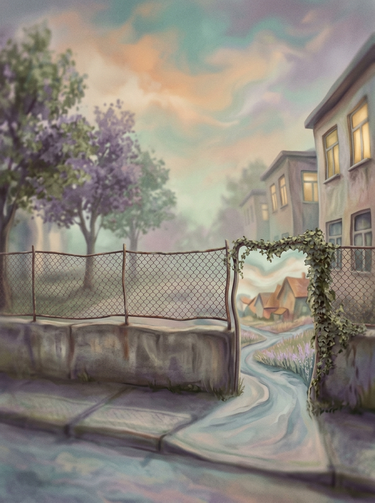
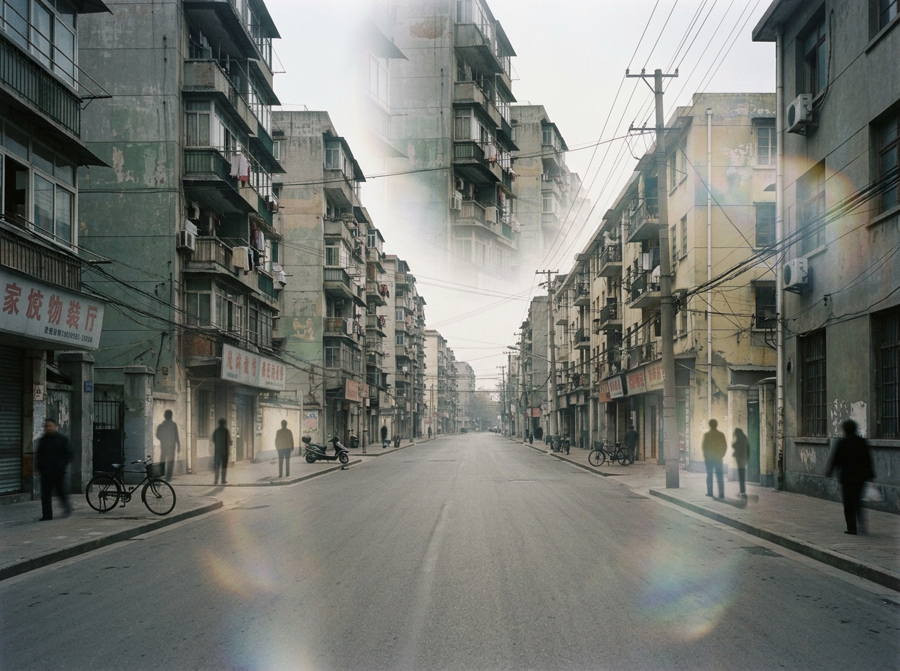
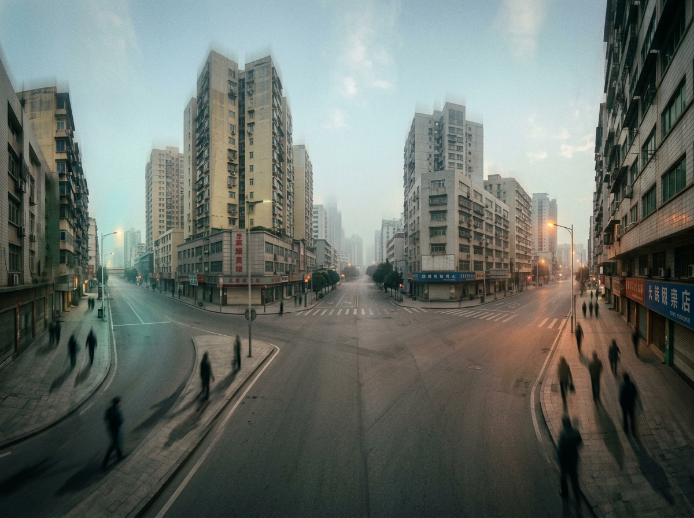
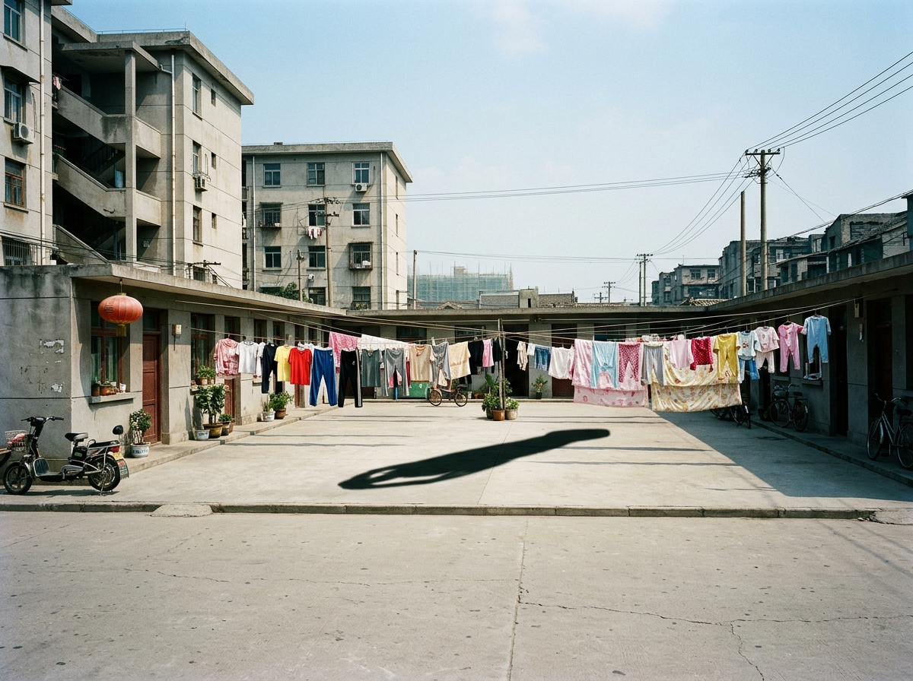

Hmm. 做了一个梦, 当然梦境是很自由的

梦境有趣的前半段已经模糊掉了，只记得，最后我惊险地从快速逃向一个校园围栏的巨大缝隙形成的门，于是逃离到了另一个世界...

这个世界里，一切的资源都需要进入一道门里的世界才可以获得。而每个人都有属于自己的门世界。

进入了一个诡异的门世界，是老家，可是要大好多，建筑物要大好多。

进入一户人家，大概是一个古旧的老家风格的庭院。怪物？

我记不得了，无论如何，我可以用晒被子的栏杆支架，挥舞，击杀这些怪物... 击杀的怪物有些多，似乎引起更强大怪物的注释了。伙伴和我赶紧逃，可是怪物锁定了我，似乎是一条龙，或者别的什么，巨大的吸引力，我被吸力产生的龙卷风悬浮在天空中。伙伴用什么东西盖住了龙卷风在地上的根部，于是龙卷风消散。我们开始疯狂逃窜，从这个街道一路狂奔到另外一个街道，场景不断变换，直到我们最终接近了一开始的时候，我们进入这个世界的大门。可是我被卡住了，伙伴拉我却拉不出去，门上是一个任务完成可以离开世界的条件。这时，我们用了一个奖励hack的技术，我把名称修改为 xx < yy (任务完成条件是一个不等式)，于是在门世界的结算时间抵达时，我成功逃离了世界。

感悟: 梦境总是格外有趣而真实，我回想起和侄子外甥一起去逛欢乐谷的恐怖乐园，但我们都知道这些是fake的，所以无法调动任何我们真实的情绪。任何虚拟游戏，例如穿越火线的生化模式和挑战模式，又或者是网易的第五人格游戏，最终我们看到的是一个2d的屏幕，虽然我们有一些沉浸感，但还是不完全。在梦境的世界里，我们的记忆被封闭，情绪被最大化调动，至少在梦里，一切都是真实的。那是想象力的空间，在想象力的领域里，所有的运动搏击，情绪感观，人物角色，都变得如此真实。而且我们不知道梦境是虚拟的，所以我们会完全沉浸在其中，一切都是我们最真实的反应，而我们做出反应之后，梦境又会根据我们的反应不断变化，形成一个动态的世界。

梦境是我们内心世界的投射，是我们潜意识的表达，是我们情感的释放。在梦境中，我们可以体验到各种各样的情绪和经历，这些都是我们在现实生活中无法体验到的。梦境是一个神奇的世界，它让我们能够探索自己的内心，发现自己的潜力，释放自己的情感。
