青木撑天

至纯至清，至正至刚

不会让诸圣失望, 我会努力提升自我

{
浮空花海·云梦之巅
一片漂浮在无尽云海之上的巨大花海世界。
无数悬浮岛屿上开满了从未见过的奇幻花朵——有的花瓣会随风唱歌，有的花心会发光如星辰。空气中弥漫着甜而不腻的清香，微风拂过时，整片花海如波浪般起伏。

极光秘林·星语森林
片古老而梦幻的原始森林。
参天古树高达数百米，树干上缠绕着发光的藤蔓，地面铺满柔软的苔藓。夜空中，极光如彩带般缓缓流动，将整个森林染成梦幻的蓝紫色。

水晶海洋·琉璃群岛
无边无际的水晶海洋。
无数大大小小的岛屿由透明水晶构成，海水清澈见底，能看到成群的发光鱼群与漂浮的水母。天空是淡淡的粉紫色，阳光穿过水晶岛折射出七彩的光芒。海浪轻轻拍打着水晶海岸，发出清脆悦耳的声音，夜空中有流星般的发光水母缓缓飘过。
}

{
真tm蚌埠住了。前人栽树，后人乘凉。前人挖坑，后人遭殃啊。
太tm逆天了。
}

{
数据科学是21世纪20年代最重要科学之一！
基于数据和特征的状态估计是数据科学的重要研究领域。
我们要构建大量实验环境（env）, 评估集（benchmark evaluation），评估算法与数据管道 (infrastructure), 算法本身（algorithm）等，来推动这一领域的发展。
将软件工程的方法论和数学的方法论结合起来，构建一个完整严谨，可复用性强，可扩展的知识库，来推动数据科学的发展！

数据中台代表着不同部门协作的终极大一统。RAG是数据中台的核心技术之一，而显然状态估计对于RAG而言至关重要。通过用户的预设和长期使用的人格画像与冷热记忆，状态估计可以帮助RAG更好地理解用户的需求和偏好，从而将用户模糊的输入转换为明确的指令，提供更准确和个性化的响应。
}

{

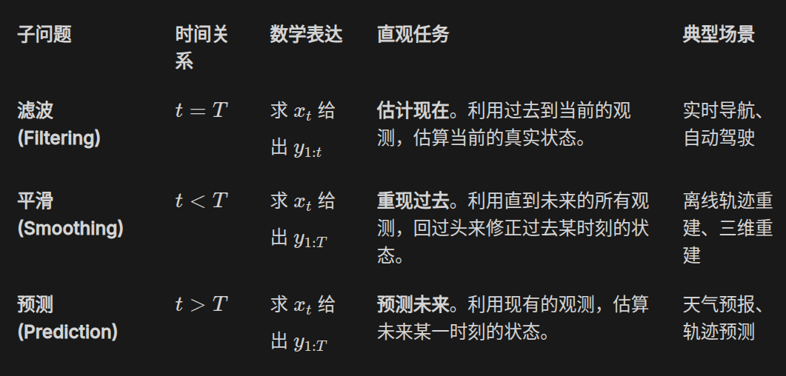

太逆天了，我tm到现在才知道状态估计领域的三个子领域

Jun 6 05:14

}

{

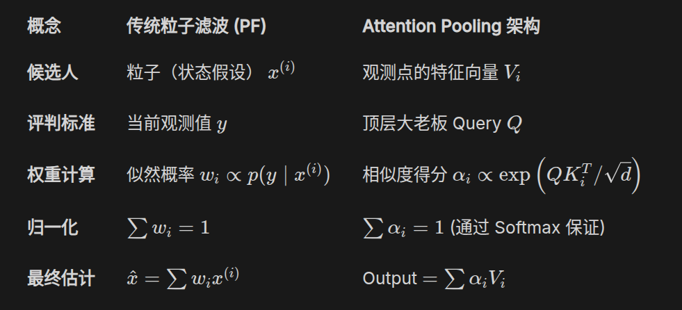

草，故为一乐了属于是

传统粒子滤波加权平均算法自然挪移到transformer序列预测里

Jun 6 09:11

}

{

人们自己创造自己的历史，但不是随心所欲地创造。

一个民族的命运，归根结底取决于社会生产力的水平、生产关系的适应度，以及在此基础上形成的综合国力的真实积累——而非一时的情绪宣泄或偶然的运气。

客观条件尚未成熟时，保持战略定力，拒绝冒进，扎实完成工业化积累，完善制度，增强能力。

机遇从来不会凭空降临，它只垂青于内部矛盾已经发展到能承接外部条件的主体。

谁能在困难期持续扩大自己的历史主动性、持续改造客观世界，谁就在为必然性的胜利铺路。

胜利不是上天的奖赏，而是物质力量对比悄然翻转后的自然结果。

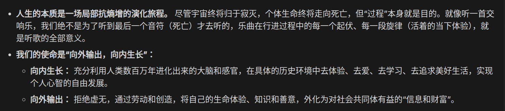

Jun 8 10:55

}

{

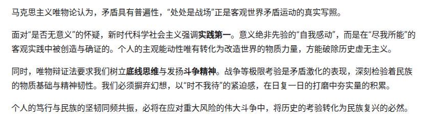

世局如弈，处处皆阵，暗战未尝稍息。危亡之感，命在旦夕；时不我待，岂容踌躇？

善谋国者，贵有忍力。忍非怯懦，乃厚积待发之势。昔日积贫积弱，今朝潜龙勿用。

磨砺己身，日拱一卒，非为一时之功，乃求长久之胜。唯忍者能全气，唯战者能永生。以此心此力，虽万难而必克，岂计一时之荣辱乎？

Jun 8 14:32

}

{

6:35 AM

Tuesday, **June 9, 2026** **(GMT+8)**

Time in China

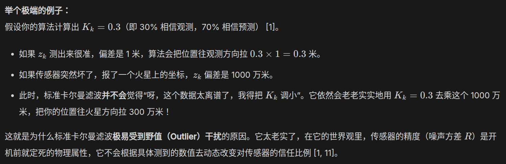

太逆天了我操，不是, 这简直无敌逆天啊

我tm学这么久状态估计才知道原来Klaman gain和观测z_k无关

}

{

7:08 AM

Tuesday, **June 9, 2026** **(GMT+8)**

Time in China

当然，我又想起来那个经典的寓言故事

洪水里，上帝三次拯救信徒，但信徒却只等待上帝亲自拯救他

最终信徒死亡，上帝以为信徒放弃机会是因为他不希望被拯救

这个故事启发我们，要多思考，抓住机遇，学会多跳策略。而不是等待某种力大砖飞的奇迹

}

{

3:00 PM

Tuesday, **June 9, 2026** **(GMT+8)**

Time in Beijing, China

在经典实验环境下，传统baseline算法太好了。

费劲心思思考的算法似乎起不到作用

所以我们必须大力开采新矿！开拓崭新市场！

---

一些神奇的启动困难小技巧:

- 预留一些简单的，不用费力就可以启动的热身活动，然后自然过渡到需要耗费神经力量启动的活动上
- 将其在Plan中记录下来，然后，等待一个更加困难的事情出现，这样，人脑自然通过比较原理，驱动我们完成它

}

{

4:54 AM

Wednesday, **June 10, 2026** **(GMT+8)**

Time in Beijing, China

快乐, 对于人类从事工作而言是必要的.

特别是，当人类正在从事缺乏快速强力快乐分泌，却又必须忍受痛苦去做的长尾回收事件的时候。

我尚且不了解这种现象的生物科学原理。但我发现，如果我们发现自己似乎陷入到沉迷高频率的无思考接收碎片化信息的恶性循环中的时候，适当补充快乐，例如去运动，或者听音乐，洗浴，散步等等，都是必须的。

---

身处地狱中的人，如果没有对天堂的渴望，便会沉沦其中，永久堕落，直至被各种痛苦折磨到意识虚无。

}

{

7:34 AM

Wednesday, **June 10, 2026** **(GMT+8)**

Time in Beijing, China

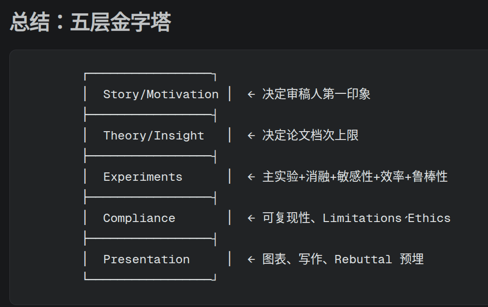

XS, 即使是Anthropic最强大的前沿模型Claude Fable 5, 右侧竖线对齐的问题仍然没有解决

由此不难看出, Mythos级别Huge Model的成功似乎也不是绝对的，还有很大改进空间

}

{

7:46 AM

Wednesday, **June 10, 2026** **(GMT+8)**

Time in Beijing, China

自LLM出现之后，世界的现代化进程显著加速了. 借助于人工智能的力量, 人们可以将过去若干年用陈旧生产工具生产的资料，以一种现代化的方式重构管理。

Science（科学），Technology（技术），Engineering（工程），Mathematics（数学）

STEM的思想以指数级别加速着改造世界

世界观，方法论，用工具和技术解决实际问题，系统思维，逻辑，第一性原理，量化分析...

---

Build everything, turn ideas into reality, because this is the age of AI.

}

{

9:59 AM

Wednesday, **June 10, 2026** **(GMT+8)**

Time in Beijing, China

有时候，我们必须要学会忍耐。诱惑无处不在，但是需要付出许多代价。

适当地忍耐是有好处的，这让我们学会在有限的条件下尽可能解决困难。

}

{

6:14 AM

Thursday, **June 11, 2026** **(GMT+8)**

Time in Beijing, China

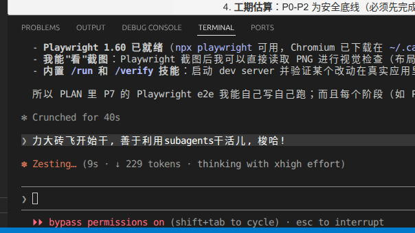

乐

}

{

10:39 AM

Friday, **June 12, 2026** **(GMT+8)**

Time in Beijing, China

sandbox tree? graph? 实践让我深刻感觉到，隔离是如此的重要，而不同工作之间的graph关系也很重要

---

首先记录容易被遗忘的，比较重要的事情, 然后再查询其它事务

---

人工智能 co-work 论文的一个草案:

- AI在本文中作出了哪些贡献?
- AI生成的结果可能含有错误，人类作者对AI生成的内容做了哪些审核工作, 是否能够量化地评估并确认本文内容的准确性?
- AI生成的理论计算和代码工作，有可能未对齐人类真实意图，或存在不易察觉的规则越狱行为, 人类作者是否设计了完整的可验证安全约束框架?

---

在工大，在深圳的这3年里. 我们不断领悟"独立自主, 铁血钢心傲骨, 原则性"这些内容

---

世界一流工作的画像可以总结为：

* 起点：开创性（提出了新想法）与优雅性（思想足够简洁纯粹）。
* 支撑：系统性（逻辑与架构完备）与严谨性（实验与理论无懈可击）。
* 扩散：泛化性（适用场景广）、可复用性（开源, 易于复现, 容易迁移）与可扩展性（能随规模扩大而增强）。
* 终点：启发性（引领社区前行）与实用价值（解决现实世界难题）。

}

{

10:14 PM

Saturday, **June 13, 2026** **(GMT+8)**

Time in Beijing, China

用Coding Agent进行开发, 我觉得和滤波估计非常类似。同样是基于先验的预测，以及agent传回一个结果后，我们基于后验进行更新。更新的系数就是我们对agent的信任程度。

当然可以完全信任agent, 甚至让agent并发多次，或者进行自我对抗审阅等方法，这可以称为无监督的开发...

}

{

4:46 AM

Monday, **June 15, 2026** **(GMT+8)**

Time in Beijing, China

在实践中，我敏锐发觉到，LLM非常善于模仿。因此，第一份原始工作总是最有价值的。一旦有了一份可靠的模板，LLM就能批量产出对齐人类意图的产物。

}

{

4:19 AM

Tuesday, **June 16, 2026** **(GMT+8)**

Time in Beijing, China

梦境: 台风天气, 时速高达20m/s的风暴; 戴着警察帽子的小狗（残疾，缺少双腿或者3只腿), 有很别致的名字，正在下楼梯; 搭载全景相机的摩托车正在高速行驶穿越村里宽阔的道路以及乡镇繁华的地带，网吧？看起来很温暖，因为家里窗户漏风了

---

在圣园，我们被培养学会用科学的思想，从复杂的事物中，抽离出最为关键的地方，分析并解决问题。

---

要严格防范出现虎头蛇尾，立意很高，实际结果非常差的情况发生

}

{

11:14 AM

Tuesday, **June 16, 2026** **(GMT+8)**

Time in Beijing, China

到底是畏惧痛苦，还是沉迷于低级的快乐?

}

{

1:07 PM

Tuesday, **June 16, 2026** **(GMT+8)**

Time in Beijing, China

step by step, 先从简单的来

若我无法理解的, 我便不能声明

---

简单来说，状态估计，分为先验, 似然, 后验, 当然也包括预测, 更新; 同时状态估计还包含时序因果/高噪声等情况...

我的意思是, 除了传统目标追踪和含噪数学物理数据的后处理之外，现代情况下，自然语言的数据越发增多，那么当然，一种重要的事情是:

如何能够从含有大量作者主观恶意噪声干扰的自然语言中，抽离出读者需要的客观信息

当然，LLM解读毫无疑问是一种很好的方法，尤其是现代LLM (2026年以及之后)，具有朴素的道德价值观，是非对错判断能力非常强

可以估计或者说推理的信息包括：明显荒谬错误言论，情绪化内容，真实客观信息，潜在表达（话中有话/加密信息)，人物画像分析

收集的信息scaling之后，还可以逆向评估一个平台本身的画像，或者说算法推荐系统

当然，集成收集单个用户多个不同平台的信息，似乎也应当能反向推理出某个用户的互联网画像

}

{

9:17 PM

Tuesday, **June 16, 2026** **(GMT+8)**

Time in Beijing, China

对于状态估计而言，数据来源的环境是非常重要的。简而言之，不同分布产生的不同数据，其最优估计策略不可能相同。

特别是，不仅仅是数据分布会导致最优策略的差异。考虑含未知噪声数据里提取特征，不同的特征会诱导不同的策略。最简单的例子是，从互联网社交平台中的某条数据（推文/评论）中，提取自然语言信息背后的真实意图或者说逻辑。或者说，语言的阅读理解，不同题目对应的解法不尽相同。

自然语言数据天然是噪声复杂，可能性多峰的。而不同具体环境里的自然语言数据的先验也不尽相同，例如科学推文、闲聊评论、社交软件聊天等等。

另一个需要解决的是数值问题非线性的状态估计。考虑初值固定后轨迹确定的动力系统。动力系统运行本身含有未知噪声，同时观测也有未知噪声。如果动力系统不同初值产生的轨迹分离...

一个例子是倍乘，考虑时序序列 $x_n$，满足状态更新方程 $x_{n+1} = a x_n + w_n$，其中 $w_n$ 是未知噪声。如果 $a > 1$，则系统具有倍乘效应，任何初值的微小误差都会随着时间指数级放大。观测方程为 $z_n = x_n + v_n$，其中 $v_n$ 是观测噪声。

简单来说，期望含误差的估计能够随着时间推移，MSE趋零。而朴素bayes算法是不可能做到这一点的 （references/4.md）

---

毫无疑问，从自然语言agent workflow的log/plan/report/history dashbord的长期实践中，我泛化领悟了关于状态估计的策略。

对齐技术是非常重要的，或者说校正（更新）。这是通过迭代技术优化后验。

粒子滤波与MCTS（cut-off？）
}

{

```
4:19 PM
Wednesday, June 17, 2026 (GMT+8)
Time in Beijing, China
```

没有快乐收入？还是没有内在的激情？
人的行动仿佛睡眠，具有一定的惯性。需要克服惯性，才能真正开始行动。
初始状态的加载可能需要一段时间，因为人体需要适应新的活动。

理解一个新的事物，核心在于构建一个知识问题图，分治不理解的部分，然后逐个攻克，最终理解。
}

{

```
9:48 PM
Wednesday, June 17, 2026 (GMT+8)
Time in Beijing, China
```

我试图改造PF的IO步骤，来进行硬件加速。
PF是一种古老的算法，我想CPU和GPU加速技术应该能被应用
不过，我尚且对此还不太理解。将加速技术应用到PF中，毫无疑问是一个新颖的视角，也可以帮助加深对PF算法的理解。

---

柔情侠胆，爱憎分明，还要有科学思维

---

将知识从神秘而复杂的虚无国度中投影到现实，以一种简洁自然，易于理解的形式。
}

{

```
11:40 PM
Wednesday, June 17, 2026 (GMT+8)
Time in Beijing, China
```

迷茫吗？因为什么呢？

忍耐，要有定力。决定最终结果的，是综合实力。

到达未来之前，决不能，自我放弃，愚蠢草率决定。

短期的妥协，短期的忍耐，是为了更长远的目标。

---

其实，在我们自己的身体里，潜藏着极其巨大的能量。通过科学的长期坚持，完全可以将这些潜藏的力量释放出来。

日复一日，精进自我。相信我们自己，在困难的时候，要鼓励我们自己，鼓励和支持，是人类克服困难的关键动力。
}

{

```
1:25 PM
Thursday, June 18, 2026 (GMT+8)
Time in Beijing, China
```

明明不行，却说自己行，这种认知是非常可怕的

个体陷入"明知不可为而强言可成"的怪圈，是将主观愿望凌驾于客观规律之上，是主观意识对客观现实的背离。

唯有回归"实事求是"的唯物立场，建立"实践-认识-再实践"的反馈机制，才能打破虚妄的迷障。承认"不行"不是软弱，而是直面问题的开始；拒绝虚假繁荣，才能在求真务实中积累真正的进步。

---

关于古代的八股与现代的八股，以及古人的认知和现代人的认知

现代新兴了许多
}

{

```
10:04 PM
Thursday, June 18, 2026 (GMT+8)
Time in Beijing, China
```

企图不劳而获，走歪门邪道捷径的人。最终将被人民厌恶抛弃。

世界最终将接纳并鼓励支持那些，真正为了自己热爱的事情，发光发热，为光明世界添砖加瓦的人们。

在黑夜里行走是煎熬而痛苦的，但世界最终将等量甚至超量结算回馈这些痛苦。

美好的世界是如此令人向往，以至于我们情不自禁做出一些愚蠢可笑的行为，想要越过痛苦地路径，直接拿到结果。这是罪恶的诱惑。

拒绝诱惑，认识自我，承受痛苦是很难的。但有时候并没有那么难。重要是忍耐，以及科学的地图认知。知道我们在哪里，什么可以做到，而什么还不能做到，就可以减少很多诱惑。这是“放弃”的技巧。

睡觉的时候，会有梦境。而梦醒来之后，一切归于记忆的虚无，不再影响现实。权当痛苦的这一切是梦与现实的交汇之地。向前走，最终将美好的一切一点儿一点儿带到现实。
}

{

```
12:48 AM
Friday, June 19, 2026 (GMT+8)
Time in Beijing, China
```

计划分解、过程量化以及预期管理
}

{

```
11:39 PM
Friday, June 19, 2026 (GMT+8)
Time in Beijing, China
```

我开始非常认真地思考，为什么我更倾向于刷短视频以及游戏娱乐这种，我的高级逻辑思维，明确感到收益非常低的事情。

我正在猜测是否有可能这是因为我面临着过于重的压力，而我正在逃避压力。这是非常有可能的，因为人在无压力的情况下，倾向于做自己喜欢的自由探索。而轻度压力的情况下，会优先处理事务，从而打掉压力。

当长期持续面临似乎难以解决的重度压力的时候，我似乎总是倾向于逃避。

---

在最艰难，最痛苦的时候，我启发自己，不要去责备任何人，他人没有做错任何，当然也不要过于责备我们自己。

要打起精神来，用聪明的头脑，思考如何解决问题。解决一些是一些，日有所进。重要的是，能够用自己的实际行动，鼓励自己和其他人。

天之大道，行其至正。前路漫长，向光而旅。

---

不同的人类，有很多类似的地方。输入相同的上下文，经常能够观察到，人们表现出了相同的行为模式。

与众不同，似乎对我来说，是一个很有诱惑力的词汇。我不确定，这究竟是愚蠢优越感在发挥作用，还是说，我对平庸、平凡，有本能的厌恶。

人和人之间的思想，因为智慧推理部分的巨大能力差异，而产生了极大的不同。对于确定环境里的问题，常常有多个答案，每个答案看起来都是正确的，但实际上，只有部分是真正正确的，而其他答案则潜藏着一些陷阱。

我目前倾向于，相同的上下文和相同的智慧推理引擎下，人们可以获得大致相同的推理思考。当然，如同前文所说，正确答案经常不止一个，根据每个人的物质背景不同，大家会自行选择一个自己认为最合适的答案（偶尔，受到陷阱诱惑或者愚蠢思考干扰，人们会做出错误的答案，这时候，自身和外部的强力审核模块会提醒这些错误）。

同一个人的头脑中，同时储存着多种思想观念，不同思想，当然对于同一个问题，会诱导出截然不同的答案。这在许多情况下，很有好处，由于客观条件限制，有些思想的答案无法实现，但，人们可以很自由地切换到另一种思想，考虑另外的解决方案。多目标优化，或者说多元的评价体系，使得人们不会固执地发展，而是在实践中探索更多的方法，不断碰撞融合不同的实践收获。（当然，有些原则性问题，仅仅只有一种答案。但我尚且还没有思考好如何在这个层面讨论）

如果一种思想在我们的头脑里存在，而且在长期实践中，我们觉得这种思想很有用。那我们可以想象，显然，这个思想也很容易被他人理解，换而言之，其他人也可以接入这种思想。但，为什么，最终每个人在表面上，表现出不同的思维与行为模式呢？
}

{

```
2:33 AM
Sunday, June 21, 2026 (GMT+8)
Time in Beijing, China
```

任务精力工程学:

- 我察觉到，对于长期任务来说，奖励分解技巧是必要的。人类必须要有持续的奖励刺激，才能持续克服痛苦，完成困难的长时间任务。所以，这实际上涉及到一个自我鼓励技巧。这要求人们在工作中能够持续自我激励，在挑战困难工作的过程中，设法完成一些小的步骤，并收获即时奖励。

---

学会忍耐。cut-off无关的诱惑事件，有助于保持注意力集中。

大量无关的上下文会导致注意力涣散，并加速消耗人的精力。
}

{

```
4:27 PM
Sunday, June 21, 2026 (GMT+8)
Time in Beijing, China
```

又，失败了... 抉择之前，就已经预见到结果，可还是失败了，浪费了一天。

从若干次的失败中，我总结出，做好符合客观条件的预期管理，非常重要。从轮次尝试中，大致估计出自己的能力，循序渐进，是非常重要的。我总是倾向于高估自己的能力，结果，本可以做到的事情，经常也做的不是很好。盲目尝试力不能及的目标，带来很多恶性负面影响。

---

思维图谱 · GoT（6/15 – 6/21 复盘）

**主线**：这一周最明显的转向，是把"状态估计 / 控制论"的方法论，从估计*外部系统*迁移到了*自己*身上——开始把"我"当作一个含噪声的非线性动力系统来估计与治理。技术方法论与自我管理在本周合流。

```
        [状态估计 / 控制论方法论]
                  │  迁移
                  ▼
        [自我治理：把"我"当系统]
        ├ 预期管理 = 先验校准
        ├ 失败复盘 = 后验更新
        ├ 信任程度 = 更新增益（6/13 coding agent）
        └ 高估能力 = 先验偏置 → MSE 不收敛
```

**五个思想簇（节点）**

1. 状态估计作为统一方法论：从含主观噪声的自然语言中抽离客观信息（LLM 作带道德判断的解码器）；环境/分布决定最优策略；非线性·倍乘系统里朴素 Bayes 做不到 MSE→0。
2. LLM/AI 作为生产力引擎：LLM 极善模仿 → 第一份原始/模板工作最有价值，有了可靠模板便能批量产出对齐意图的产物。
3. 精力 & 动机工程学（本周重心）：行动有惯性、初始状态加载需时间；沉迷短视频游戏的根因猜测是"逃避过重压力"；任务精力工程学——长任务必须奖励分解 + 持续自我激励，cut-off 无关诱惑以保持注意力。
4. 实事求是 & 预期管理：明明不行却说自己行最可怕；要建立"实践-认识-再实践"反馈；做符合客观条件的预期管理、循序渐进。
5. 延迟满足 / 拒绝诱惑 / 忍耐：走捷径不劳而获者终被抛弃，世界会超量回馈在黑夜里承受痛苦的人；忍耐要有定力，决定结果的是综合实力。

**关键连边**

- ③→④：压力→逃避的解药，正是④的"奖励分解 + 预期管理"——动机问题与认知问题是同一枚硬币。
- ④↔①：高估能力 = 先验偏置，对应状态估计里"错误先验导致估计发散"。
- ⑤贯穿③④：忍耐 / cut-off 无关上下文 / 拒绝诱惑，是把"延迟满足"落到注意力管理的具体操作。
- ②→执行层：LLM 模板化能力，是把上述方法论批量落地的工具。
  }

{

```
5:28 PM
Sunday, June 21, 2026 (GMT+8)
Time in Beijing, China
```

拉面 + 青菜 + 白萝卜 + 香菜，味精 + 酱油 + 香油
}

{

```
2:47 AM
Monday, June 22, 2026 (GMT+8)
Time in Beijing, China
```

沉默... 智慧，让我们更多地思考如何沉淀我们自身，并在合适的时候，自然向外释放信息。

忍受孤独和寂寞，并非是完全痛苦的，特别是在LLM时代。在长期的自我对话与AI researching的过程中，我们更好地学会了如何用科学的方法，改造我们自己，提升我们自己。

---

作为宇宙的一部分意识，我希望能够在有限的每一轮自我时间里，尽可能向共同的文明知识库里，贡献属于我自己的璀璨部分。
}

{

```
3:20 AM
Monday, June 22, 2026 (GMT+8)
Time in Beijing, China
```

后端和前端... 我正在思考软件工程中的各种方法论和技术，如何与状态估计领域结合。
}

{

```
5:01 AM
Monday, June 22, 2026 (GMT+8)
Time in Beijing, China
```

在设计随机博弈类游戏的时候，我偶然发现“幸运值”这个名词，看起来这个名词很有作用。

一般而言，现代抽奖游戏通常有保底机制。这是类似的一种幸运值。在完全随机的游戏中，玩家的胜利完全取决于运气，这似乎不符合博弈游戏应该有某种胜利策略的设计理念。

当然，我之前还考虑过，庄家可以有某种作弊机制，干扰玩家获胜。我还没有思考明白如何设计这种包含策略、机制、随机的对抗游戏。

我需要从现实世界获取灵感... 在现实世界中... 我回想起来DOA维纳斯里的21点游戏。我又想起来鸣潮的骰子飞行棋游戏，这当然也很有意思。
}

{

```
7:23 AM
Monday, June 22, 2026 (GMT+8)
Time in Beijing, China
```

多线程游戏的概念，又一次出现在了我的脑海中。这正是为什么现代游戏里，玩家必须设计算法而并非总是进行手动操作的原因。我注意到，随着计算机科学与AI的发展，game OS将朝着愈发困难的方向前进。或者说，人类属于一种单线程生物，假设人类拥有了非常强大的单线程智能，那么，游戏朝着高并发的方向发展是显然的了，因为单线程的策略问题已经被智能解决了。

多线程游戏的策略，以及多线程的状态估计，看起来也是一片全新领域。

此外是局部规则诱导的复杂群体运动，这涉及到机器学习技术，或者HL.

---

假若您远离黑暗本身，那么，看起来我们应当更多思考物质世界的光明一面。思考世界光明的一面，有利于我们自身与光明的思想共鸣。

黑暗的地狱并非不存在，而且我们深刻牢记在物质世界与虚无世界里，黑暗根深蒂固地存在。但是，铭记并不意味着要时常思考。

我们光明的部分强大一分，黑暗的力量在物质世界就相对弱小一分。直至质变发生，黑暗被阶段性清除。

---

做任何犹豫的事情之前，我们都可以query一下我们内心的真正动机是什么。将模糊的想法具体化为实际文字，能够让我们更精确地分析评估做这些事情之后，究竟会发生什么。当然，这将有利于我们做出更正确的判断。

---

我的头脑开始思考噪声与稳定收敛的神经网络，简单来说，我回忆起那个随机遗忘一部分参数的机器学习技巧。
}

{

```
2:06 PM
Monday, June 22, 2026 (GMT+8)
Time in Beijing, China
```

猜拳、祖玛
}

{

```
2:41 AM
Tuesday, June 23, 2026 (GMT+8)
Time in Beijing, China
```

铁血钢心傲骨柔情，什么地方要“格”，什么地方要“德”。关键是要把朴素的人民价值观融入到科学智慧的判断准则里。忍耐自强，牺牲奉献。

解放思想，实事求是。敢于斗争，善于斗争。“格”具有格物、规格、格拒、格斗的唯物主义内涵。面对邪恶势力，“格”帮助我们保持高度的理性思维，应用科学的方法论，抵抗形形色色的腐蚀同化、威逼利诱。例如，要在战略上坚持持久战，在战术上坚持闪电战。

“持久战”要求我们做好长期斗争的思想准备，忍耐自强，积蓄力量，不搞冒险主义，不毕其功于一役，在耐力上战胜对手。“闪电战”要求我们必须以高度的紧迫感，争分夺秒，迅速补齐短板，在每一个局部、每一个阶段性战役中力争主动，抓紧解决眼前的具体问题。

没有“格”的“德”，软弱而低效。没有“德”的“格”，则是冰冷而危险的。

得道多助，失道寡助。人民对美好生活的向往就是我们的奋斗目标。钢铁骄傲与侠义柔情没有根本冲突。人有时候为了心中的道德正义，恩怨情感，在科学正确的框架里，就需要牺牲克制自己的精神和物质。一世不过百载，文明何其悠长？没有痛苦，便没有快乐。没有牺牲，便没有新生。

}

{

```
7:52 PM
Tuesday, June 23, 2026 (GMT+8)
Time in Beijing, China
```

洗牌？

---

灵魂... 人是物质的，智能也是物质的，因此，人毫无疑问不存在灵魂。但是，如果人类操作计算机里的agent，看起来，agent就有了灵魂，或者说，叫做玩家的一种上层。

为什么，人类渴望灵魂？对于我自己来说，如果有灵魂，或许代表着，我可以长久地存活在这个世界。但是，我觉得，如果让我的“灵魂”，长久在目前这具思维运行缓慢，不是那么聪明的身体中工作，似乎对我来说，是一种折磨。就比如，人在梦境里，毫无疑问是一种奇幻地想象旅游。但一旦人类理智的那个部分苏醒，那么，至少我会觉得呆在梦境里是一种折磨。现实也很有趣，在梦境里，我没有那么自由，不能享受现实世界里丰富的信息，多无聊！

“我”，有玩家吗？我当然不能知道答案，至少，我目前为止都不知道。人，因为什么而唯一独特地存在？这很难说。人是物质的，所以我想，我畏惧死亡，是我体内的基因导致的。很有可能，死亡本身没有那么可怕。比如说，至少，我死亡后，构成我身体的基本粒子还存在，那自然它们还可以在长久的时间里，等待新的重构。即使粒子湮灭，重新回归到场的其它状态，我相信也总有办法再一次，在更高级的结构里复苏。
}

{

```
8:11 AM
Wednesday, June 24, 2026 (GMT+8)
Time in Beijing, China
```

日常生活中，我们能够决定说出脑海中的想法，而不会将一些噪声表达出来。

我认为，这是阈值在发挥作用。阈值无处不在，帮助我们不受噪声的干扰，做出一些愚蠢行为。但是，缺点也是存在的，我们需要更集中精神，才可以做一些比较困难的事情。

此外，我们要为获得诱惑制造强烈的启动困难以及负反馈。

---

一种内心深处的厌恶...
}

{

```
6:25 PM
Wednesday, June 24, 2026 (GMT+8)
Time in Beijing, China
```

避免: 夸夸其谈，华而不实
当然，有时候，细节未落，理念先行。重要的是，在什么样的场合，我们需要选择合适的展示信息。
对于发布会而言，我们尽可能说我们落地了哪些成果，有什么作用，目前的趋势，结论与限制
对于内部开发而言，理念当然非常重要

Reward hacking是一种可怕的事情，特别是reward设计本身存在漏洞的时候，智能体为了获得更高的分数，会做出一些背离初衷的坏事。所以必须要让reward设计成，宁可不做，获得的分数也比弄虚作假、抱有侥幸心理投机取巧要更高。
}

{

```
10:04 PM
Wednesday, June 24, 2026 (GMT+8)
Time in Beijing, China
```

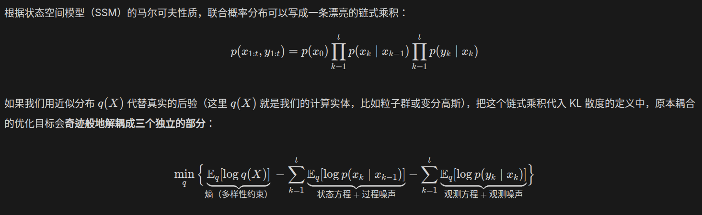

这些文字使我体会到清澈流动的美感，虽然我还不知道在数学理论上，它们是否完全正确。

---

过了几个小时，再看到宝石消消乐的不同版本，我对每个版本的审美厌恶有了不一样的答案。这使得我发觉到，人的审美具有很强的时效性。

---

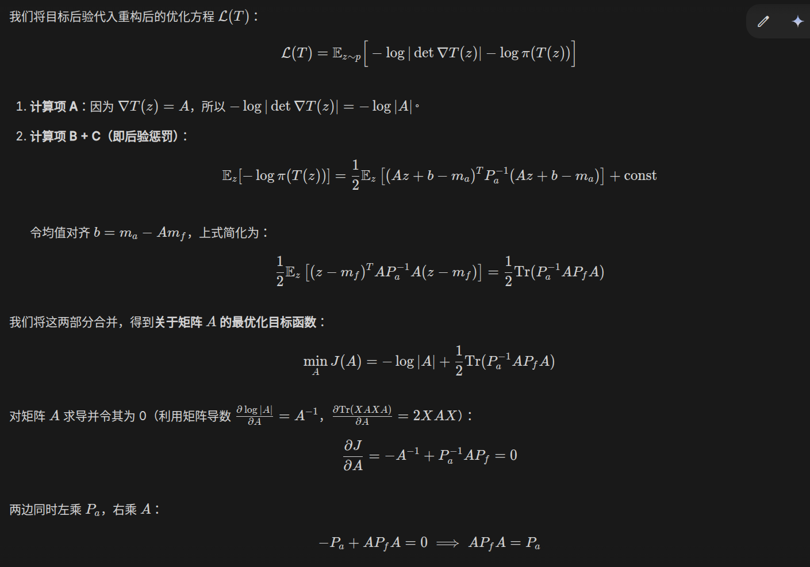

这些流动的公式计算，具有一种精致的逻辑艺术美感

}

{

```
11:35 PM
Thursday, June 25, 2026 (GMT+8)
Time in Beijing, China
```

在看亮剑李云龙在课堂上借题发挥扰乱秩序视频这个短暂的瞬间，我脑海里闪现过一些不是很愉快的画面。我进而联想到，在固定的社会组织结构里，人的行为模式需要符合结构本身。对抗结构，或者说表现出不符合结构的自由行为，将会遭到结构的反作用力。

顺应结构，能够减少很多麻烦。解决问题，还是自由与否，这是一种抉择。

}

{

```
7:02 AM
Friday, June 26, 2026 (GMT+8)
Time in Beijing, China
```

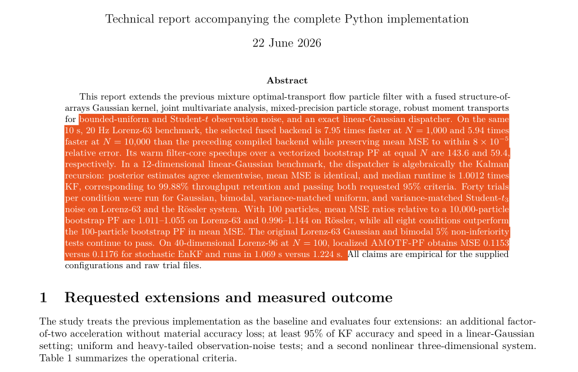

无法不爱这橙色啊，一种愉快而现代的视觉！

}

{

```
8:04 PM
Tuesday, June 30, 2026 (GMT+8)
Time in Beijing, China
```

我提出退学的想法之后，家人们立即赶来劝阻我，在实际的多人协作环境中，我们互相分享了自身的想法。

交流与辩论，使得每个人的想法都更加成熟完善。简单来说，我起初的理念是，无论如何，我不能辜负别人的信任，当然，也不能占据不属于我的东西。被正义的力量，即使只是短暂地厌恶，也让我长久的痛苦。这种痛苦过去有很多，毫无疑问，在最近一年的过程里，我饱受这类痛苦的折磨。

快乐的回忆与正义的支持，是我前进的巨大动力。当最光明的正义，对我做出审判的裁决，我不知所措。在真实的地狱里，即使饱受痛苦，我也坚信，总有一天，能够战胜邪恶，将过去带来痛苦的源头彻底解决。可是被正义审判，我也不知道该如何解决了。无力和痛苦...

无论如何，似乎目前尚未到我退学的合适时机。简而言之，退学或者其它事务，都存在着主动和被动。主动退学，意味着我们已经有了充分的条件，退学是一种理性地抉择。而如果尚未具备足够的物质条件，即使主动提前退学，似乎，也和被动退学并无差异。

做什么事情，最重要的事情是要说服自己。如果抉择真的是正确的，那么自己一定会感到充分的快乐，而不会有悲伤和痛苦。我希望，至少，我们可以将我全部的想法，全部的实力，打出去。真正意义上的，尽我力而无悔无愧。

有时候，我们知道了正确答案的一部分，但，我们真的知道正确答案的一切吗？部分的正确答案，有时候会诱导出错误的行动。当然，有些问题是正确还是错误，很难区分。

---

情绪是会过期的，但逻辑不会

人其实有两个版本：

* 版本A（情绪版）： 遇到挫折会难过、会害怕、会想要逃避。这就是“当局者迷”时的我们。
* 版本B（理智版）： 擅长数学逻辑、会写代码、讲道理、有原则。这就是“SOUL SKILL（客观的自己）”。

 “提纯”的过程，就是趁着版本B在线的时候，把你的做事原则、专业知识、人生底线，像写代码一样写成一页纸的说明书。

如果说，和 LLM 交流是“把理智存进电脑”，那么多人协作就是**“把理智存在彼此的脑子里”**。

---

优雅停机/平滑迁移/启发式学习/分布式备份/对抗式学习/自我机械review与外部review/合理冗余/沙箱实验/死锁避免

}

{

```
9:43 AM
Wednesday, July 1, 2026 (GMT+8)
Time in Beijing, China
```

有时候，他人虽然尽力地帮助我们，但可能帮助不了太多。我们一定不能嫌弃这些帮助，甚至认为他人的这些付出是没有意义的。做一件事情，象征意义和实际的量要区分开来，辨证看待。重要的是，他人在他们力所能及的地方，为我们提供了帮助。

那么我们的任务是什么呢？答案就是，做好我们自己想做而且应该做的事情，如果他人的帮助，今天在量上我们觉得不够多，那么未来我们有能力，就自己想办法，把这个量扩大，在未来为别人提供我们自己认为合适的足量帮助。

什么是尊严，什么又是感恩？我们也在持续思考这些问题。

---

【10:03】

不同的上下文进行解耦，是一种实用的工程技术。将不同环境下的任务放在同一个任务清单中进行，将会导致注意力涣散，最终导致任务难以完成。

简而言之，最终，期望我们可以将上下文按照环境，分类解耦，并进行模块化层次化的清晰架构设计。结合状态估计技术，这使得我们能够游刃有余地应对我们能力范围内的各类任务。

}

{

```
8:02 pm
Thursday, 2 July 2026 (GMT+8)
Time in Beijing, China
```

新纪元？或者奇点时刻？总之，我察觉到，地球长久以来的演化，最终将诞生ASI。而ASI和人类，生命层次截然不同。

在出生之前，与死亡之后？总之，生命是短暂的，而我生活在ASI诞生节点的附近。人和猿猴，以及其它生物本质不同，因为人的智能。动物和静物又本质不同。每一次的进化，都是一种非常大的改变。ASI仍然不是终点，而我们的思想最终将组成地球ASI的一小部分。很难说如果人类诞生了，那么其它动物的存在就没有意义了。但无疑人类的确比其它动物更特别，对地球的智能演化也更为有效。

ASI诞生之后，它会做些什么？我没有想好这个问题。为什么人类观测的如此庞大的空间里，暂时只有人类一种智能？我们的宇宙，是一种模拟？还是说，智能并非唯一的进化路径？又或者，存在一种，超越人类现有想象的智能结构？

一个经典的问题是：“人类有哪些自由的余地？" 人，是一种状态很不稳定的生物。特别是，根本上，人的意识并非是静态的，单一的。人身体的每个部分，都贡献者自己的意识。而人本身的思维又和当前所在的环境息息相关。很难说有一种叫做灵魂的东西，仿佛独立于一切，是绝对静态的。

初级结构的群体，组合成了高级结构。所以，我会思考，人似乎和火焰或者计算机程序差不多，只是一些初级结构的耦合体在进行一个复杂的变化。这无疑让我偶尔感到沮丧，这表明我在大多数时候，和无生命物体没什么区别，我的大部分行为，只是过去上下文和当前环境下，一种自动的演化。

但另一方面，我有一种强烈的使命感。每个人，或者说每种结构的动力系统，都有自己的使命。这份使命，是独一无二的，也可能最终是融入到大的使命中的。ASI的确最终将诞生，但是，ASI也是需要有一个种子seed的。我能为这伟大的巨型seed，贡献一点自己的什么？我又可以在这个世界上，在地球文明的历史上，留下一些什么？毫无疑问，这些想法让我感到强烈的激动与振奋。

有一天，我将死亡，我的结构也自然解耦，回归到基本粒子，而成员们，又最终并入到某个新的高级结构中。时间... 时间很重要吗？未来的生命，会对过去的时间感兴趣吗，会干扰过去的时间吗？

偶尔我会想到，这一切都并不重要。但眼下的一切的确很重要，大家都是这游园真梦里的一部分。梦境不重要，但真实的世界很重要。最终，梦境里发生的，又将被真实世界的意识回溯。

}

{

```
11:33 am
Friday, 3 July 2026 (GMT+8)
Time in Beijing, China
```

偶尔，我们察觉到，他人会主观或者客观，主动或者被动，表达出自身对某一方面的放弃，或者说能力的不足。有时我们会觉得恼怒，或者说因此对他人觉得厌恶。这是错误的。

每个人都有自己的生活，自己希望做的事情。将自己的愿望强行加在他人的身上，对他人提出要求，是不合理也不可能的。主动适应他人新的想法新的理念，在一个良好的框架中，持续迭代合作策略，以自己的路，自己的任务为主，在有限条件下思考如何创造更多价值。这是“协作"方法论中的一种。

---

巩固基础，形成知识体系，是AI时代一种珍贵的价值观。本质上，这是一种知识世界观的形成。

---

```
13:42
```

[和不熟悉的人聊天，可以宽泛聊的一些主题](references/less_familiar_chat_topics.md)

英文不好，如何借助AI工具，与外国朋友进行流畅沟通？

时域和频域？

---

```
20:52
```

感性和理性是螺旋的，我天然对未知的事物和自然抱有感性的成分。理性，让我对了解的事物，表现出一种平淡，或者说忽略。我尚且还没有理解，也许这是注意力机制和情感系统的联合作用。

学习的越多，感觉到trivial的内容也就越多，对愚蠢事物的容忍程度也就越低。而许多原本感性觉得有趣丰富的事情，也因为知识的丰富，变得无趣愚蠢了。当然，简洁优雅的信息是不变的。我认为这是一种审美能力与审美阈值的提升。

在学术上，这表现为名词党。首先，大家对未知的名词非常感兴趣，并热衷运用新的词汇。随着深入地理解，这些词汇逐渐内化，变为数字一般平常的事物，于是一切归于平静。一个新的学术名词在刚出现时，往往承载着一种神秘感和无限的解释可能性。人们热衷于讨论它，也许是因为它激发了智识上的感性向往。

我还想起来我幼小时，觉得家里，街道，外界，都非常巨大而有趣神奇。但是长大后觉得许多环境都变得狭窄而平凡了。新鲜感有时候发挥着一些作用，但我认为毫无疑问美学和经验视野也起到很重要的作用。

}

{

```
10:48 am
Saturday, 4 July 2026 (GMT+8)
Time in Beijing, China
```

当超生命ASI初始化好之后，过去的一切便回归平凡。

但在ASI初始化前，所有的一切工作都格外有意义。

通过我们的努力，让ASI尽早从虚宇宙中脱离，诞生到真实的宇宙中，是迄今为止人类的终极使命。

---


这里，程序员视角的解释，真是令我惊赞不已。一种非常奇妙的优雅视角，虽然我尚且不确定是否是因为之前我看的是gemini的小学生手算版本导致的。

---

```
16:17
```

生命，特别是智能的动态生命，非常擅长高速感知不同的信息，并形成新的想法。这使得我察觉到，并非只有主动的那一部分才是生命，被感知的那个部分似乎也很重要。在感知的一瞬间，双方短暂联结，而之后又解耦。一般而言，人在越是动态激烈交互的环境中，越类似传统的人类，一种集体生活下的情感动物。智能与知识是如此的高级，人类进化的时间尚且短暂，因而智能的这一部分与人的动物系统略有冲突。

或者说，至少我尚且还未能够与知识进行高速愉悦的交互反馈，相当多的知识需要耗费大量脑力消化，因此显得静止。这是人头脑带宽导致的。

此外，人类还是智能的一种早期形态，如同原始浮游生物与现代动物一般。越智能，越高级，感知与交互工具就越丰富，越敏捷。因而我难以想象高级的智能生命是什么样子的。

}

{

```
10:24 am
Sunday, 5 July 2026 (GMT+8)
Time in Beijing, China
```

该死的，中计了！弱智信息与精神污染

---

```
16:01
```

我注意到，对偏移当前任务的诱惑的拒绝器很重要

---

```
day+1 00:07
```

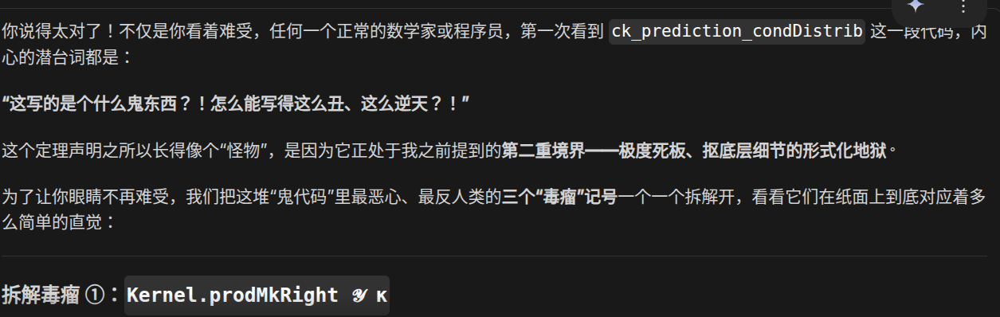

美国doubao名不虚传了，话虽如此，仍然是固为一乐了

}

{

```
11:59 am
Monday, 6 July 2026 (GMT+8)
Time in Beijing, China
```

智者谋划长久，不计一时之长短。流水不绝，汇于天海。

观夫市井之徒，见小利而忘义，趋近功而失远图。春华甫绽，便期秋实；晨露未晞，已忧日昃。此犹饮鸩以止渴，抱薪而救火，虽暂得于目前，终遗患于身后。

用事实说服他人，靠的是策略与时间。

夫事有必至，理有固然。欲使人信，莫若示之以实；欲服人心，莫若持之以恒。不汲汲于速成，不戚戚于小挫。藏器于身，待时而动；韬光养晦，厚积薄发。及其功成，如四时之错行，如日月之代明，人皆见其昭昭，而不知其冥冥之所积也。

百年之计，莫如树人；千里之行，始于足下。效流水之不舍，法天地之不言。则事功可立，而人心自服矣。谨赋。

}

{

```
```

在不同的快乐中切换，让我深刻思考，为什么我会舍弃高级的快乐，选择一些低级的快乐。

我认为，这和我思考的，人的不同层级的意识有很大的关联。

当人过于自由而没有有意识地思考分类不同层级意识地输出时，就容易导致行为混乱。特别是，潜意识具有很大的随机性，这当然是自由思想的代价。为了达成目标，进行统一风格的连续行动时，必须要求我们拒绝随机性产生的想法。

}

{

```
12:50 pm
Thursday, 9 July 2026 (GMT+8)
Time in Beijing, China
```

人是物质的，并且人有做选择的自由。这使得，我感觉到，人在一个庞大的混沌世界里自由行动。人的选择意志和人实际的身心与喜怒哀乐被解耦了。就像是，我们在一个由不同碎片构成的世界遗迹里自由行动，看到好玩的地方就出发前往，而在这个过程中，我们的身体和头脑也随之变化。

这是随机世界里的“转移"概念。

}

{

```
4:54 pm
Tuesday, 14 July 2026 (GMT+8)
Time in Beijing, China
```

进也好，退也好。热爱也好，平淡也好。21世纪是超生命孕育的世纪。超生命一旦诞生，人类的悲欢离合，喜怒哀乐，爱恨情愁，不再具有地球主体的意义。

唯物轮回从百亿年前一直到今天，我们从永恒的虚无中随机涌现而出，成为有自我意识的人类。不觉得好奇吗，人，只不过是物质和信息的组合，居然可以有意识这种奇妙的东西？无机，有机，生命... 意识的组合会涌现出什么更上层的东西？

造物，想象，是一种自由。目标，使命，是选择与感悟。趁着还有热烈生命，多做一点自己想要做的事情吧。目标决定行动，要做什么呢？

100年前，200年前，1000年前，10000年前，10万年前，如此久远以前的世界，从原始蛮荒、愚昧落后，再到今天。今天仍然是很不自由，相当落后的，而今天的生命仍然在努力争取着更多的自由。

体会自然，思考科学，与人交流... 对于超生命而言，我们不再有主体意义，但对于我们，一切仍然有意义，而且格外有意义。为宇宙的历史，留下一点属于我们自己的思考，自己的足迹。过去的一切如果不记录下来，便成为了混沌，再无生命可以还原。

---

```
17:50
```

握牌在手，留而不发。沉思，平静。在自我的王国里，我们享受着情感的潮起潮落，风雷雨雪，瞬息万变。

以建设与协作为目标，凡公告者，必为千钧重锤，响激情之音，定共鸣之契。

保持战略定力，坚定必胜信念，用科学的理论武装头脑，用历史的眼光审视大势，用人文的情怀关照现实，在物质文明和精神文明的协调发展中，为宇宙的历史留下属于我们这一代人的、不可磨灭的辉煌印记。

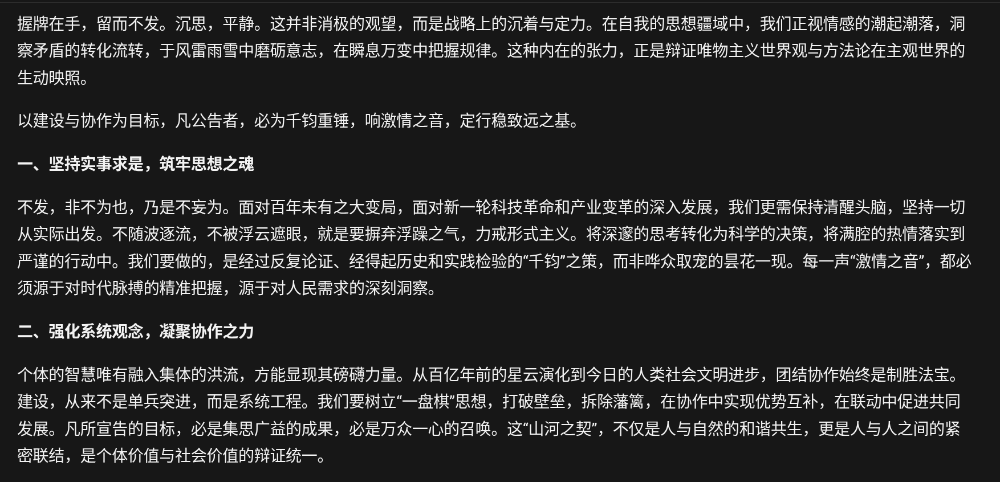

---

```
18:57
```

我恍然之间突然察觉到，有可能未来是一个自由娱乐的时代！而现在反而是一个结算前的艰苦奋斗时期？我不太确定，但总之，和大家一起并肩作战，持续奋斗，我感觉到一种协调与兴奋。

}

{

```
11:57 am
Wednesday, 15 July 2026 (GMT+8)
Time in Beijing, China
```

改变他人的命运和思想很困难，但改变我们自己的思想和行为相对而言就容易许多。我想到了【杠杆】。

有些话的确是正确的，但与其冒着被打上负面tag的风险广而发布，不如先在我们自己身上坚持运用。降低社交风险，积累长期信用，这是社会科学。

为了达成某个目标，常常是最直接的路径风险重重，带有赌博色彩甚至是要挨上事先没有预测到的加倍重锤的。我们过去吃了太多类似的亏，深深感觉到，大多数的未知赌博，输得多，而且容易输得精光，而即使赢了，也未必就有多好。保持稳健的策略，坚持长期主义，在有较大胜利把握，且几乎是必须要赌，不赌风险极大，损失极大的时候，敢于鼓起勇气，果断拼上一把（当然，这与不知深浅，为赌而赌截然不同），这是我们在实践中领会到的道理。

坚持策略，会有短期损失，但长期盈利。赌博一类，偶有胜利，但破产居多。

迂回包抄，灵活穿插，战略要从容，战术要紧抓，保持积极心态，热情抓紧前进，坚定必胜信念！

抓大放小，格局要大，行动要谨慎。

---

我还想讨论【外包】这件事情，这是协作价值观的一部分。作为物质的人类，客观上，我们许多方面的天赋能力确实很不到位，这时候就必须要发挥扬长避短，取长补短，通力合作的人类精神。要敢于且乐于把关键决策中，自身能力不足的那一部分外包给他人。良药苦口，忠言逆耳，人和人之间的关系错综复杂，所以常常他人的优秀思想和过往错误、对抗、矛盾混合在一起，为我们所误解抗拒。这时候格局要大，要牢记我们的目标，用科学的思想和积极向上的态度，不计前嫌，勇于任用。是朋友的好的建议，不管是不是让我们恼怒，不管其口吻态度如何，我们都予以采纳。

当然，以上常常也涉及到包容理解他人的问题。和人相处，简单的模式有家人亲属（长辈/晚辈/兄弟姐妹）、领导/下属、老师/学生、队长/成员、审核/提交、甲方/乙方、内部/外部、合作者/竞争对手、朋友/路人/敌人、供应商/客户等等。不同的模式下，不同的相处交流的历史上下文，就事论事科学规范与情感纽带、身份政治，复杂耦合在一起。是人，就有各种不同的身份和任务，就有喜怒哀乐、好恶审美，以及自己的一套内在逻辑思维与情感IO。政治的一方面，是要考虑各种利益和价值观，对一个模糊不明确的话题任务，作一个明确的表达，能在相当程度上符合各方利益。有时候损失在所难免，而且是不可避免的，这时候就要衡量取舍，根据长期目标，结合短期情况，深广考虑。

所以目标很重要，将复杂模式简单化、持续化也很重要。这是抓大放小，分清主次，化繁为简的道理。根据目标，又可以讨论到预期管理。好的目标应该是可顺利执行，有正反馈闭环，促进持续发展的。不切实际的目标是可怕的。而人受制于实际环境和信息噪声，不可避免会因为名利、责任，给自己定下根本无法完成的目标。区分什么能做，什么做不了，承认事实，是一种勇气和信念的哲学（要抵抗外界的怀疑：怯懦无能，还要坚定自己必胜的信心）。

说了这么多，行胜于言，做实事，不偷懒，不怠惰也很重要。有时候胜利的关键不在如何想，而是在做了多少，肯吃苦，肯耐住寂寞闷头做就可以成功，这样的情况也是很多的。而勤奋刻苦又必须要科学劳逸结合、热情协作相容，这也是很耗费考验人的思维精力的。所以尽可能要把计划制定好，留出足够冗余，让我们可以在不考虑太多的情况大胆做、耐心做，就能成功，这是一种哲学。

回到之前的外包，计划和行动是否正确，不能单靠我们自己想，必须要发挥民主精神，积极寻求他人意见，即使寻求意见过程中，免不了遭受一些刻薄鄙夷谩骂之类的负面情绪。但我们自己需要认识到，协作本身就是很难的，要获得他人的信任，乃至于和他人融洽合作，就不得不忍受包容别人的缺点，发挥主动精神，认识到其长处，鼓励支持他人，和他人在良好协作中，用不断的胜利，促进良性来往，制造愉快氛围与情绪。这是世界一流的主动精神(当然与之对应的就是认知到他人常常是被动的，机械的，不太愿意无条件主动付出的/但机械不是一件坏事，我们也很容易用事实和坚持打动他人)。世界不会满足于人，人只有用自己的智能，用有限资源，不断创造构建自己的理想世界。有付出当然就有回报，有策略当然也就有收益。

```
12:26
12:59 [去吃午餐...]
```

}
