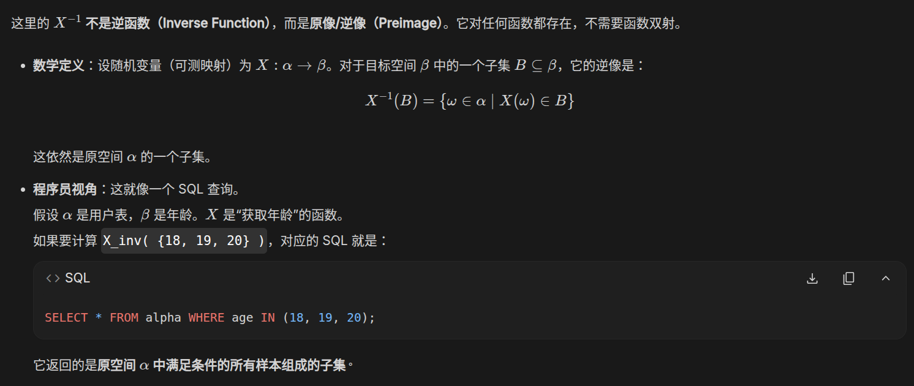

# 2026-06-28 — 2026-07-04

> 周归档：2026-06-28 至 2026-07-04（周日—周六），共 5 条可确定日期的源记录。

---

{

```
8:04 PM
Tuesday, June 30, 2026 (GMT+8)
Time in Beijing, China
```

我提出退学的想法之后，家人们立即赶来劝阻我，在实际的多人协作环境中，我们互相分享了自身的想法。

交流与辩论，使得每个人的想法都更加成熟完善。简单来说，我起初的理念是，无论如何，我不能辜负别人的信任，当然，也不能占据不属于我的东西。被正义的力量，即使只是短暂地厌恶，也让我长久的痛苦。这种痛苦过去有很多，毫无疑问，在最近一年的过程里，我饱受这类痛苦的折磨。

快乐的回忆与正义的支持，是我前进的巨大动力。当最光明的正义，对我做出审判的裁决，我不知所措。在真实的地狱里，即使饱受痛苦，我也坚信，总有一天，能够战胜邪恶，将过去带来痛苦的源头彻底解决。可是被正义审判，我也不知道该如何解决了。无力和痛苦...

无论如何，似乎目前尚未到我退学的合适时机。简而言之，退学或者其它事务，都存在着主动和被动。主动退学，意味着我们已经有了充分的条件，退学是一种理性地抉择。而如果尚未具备足够的物质条件，即使主动提前退学，似乎，也和被动退学并无差异。

做什么事情，最重要的事情是要说服自己。如果抉择真的是正确的，那么自己一定会感到充分的快乐，而不会有悲伤和痛苦。我希望，至少，我们可以将我全部的想法，全部的实力，打出去。真正意义上的，尽我力而无悔无愧。

有时候，我们知道了正确答案的一部分，但，我们真的知道正确答案的一切吗？部分的正确答案，有时候会诱导出错误的行动。当然，有些问题是正确还是错误，很难区分。

---

情绪是会过期的，但逻辑不会

人其实有两个版本：

* 版本A（情绪版）： 遇到挫折会难过、会害怕、会想要逃避。这就是“当局者迷”时的我们。
* 版本B（理智版）： 擅长数学逻辑、会写代码、讲道理、有原则。这就是“SOUL SKILL（客观的自己）”。

 “提纯”的过程，就是趁着版本B在线的时候，把你的做事原则、专业知识、人生底线，像写代码一样写成一页纸的说明书。

如果说，和 LLM 交流是“把理智存进电脑”，那么多人协作就是**“把理智存在彼此的脑子里”**。

---

优雅停机/平滑迁移/启发式学习/分布式备份/对抗式学习/自我机械review与外部review/合理冗余/沙箱实验/死锁避免

}

{

```
9:43 AM
Wednesday, July 1, 2026 (GMT+8)
Time in Beijing, China
```

有时候，他人虽然尽力地帮助我们，但可能帮助不了太多。我们一定不能嫌弃这些帮助，甚至认为他人的这些付出是没有意义的。做一件事情，象征意义和实际的量要区分开来，辨证看待。重要的是，他人在他们力所能及的地方，为我们提供了帮助。

那么我们的任务是什么呢？答案就是，做好我们自己想做而且应该做的事情，如果他人的帮助，今天在量上我们觉得不够多，那么未来我们有能力，就自己想办法，把这个量扩大，在未来为别人提供我们自己认为合适的足量帮助。

什么是尊严，什么又是感恩？我们也在持续思考这些问题。

---

【10:03】

不同的上下文进行解耦，是一种实用的工程技术。将不同环境下的任务放在同一个任务清单中进行，将会导致注意力涣散，最终导致任务难以完成。

简而言之，最终，期望我们可以将上下文按照环境，分类解耦，并进行模块化层次化的清晰架构设计。结合状态估计技术，这使得我们能够游刃有余地应对我们能力范围内的各类任务。

}

{

```
8:02 pm
Thursday, 2 July 2026 (GMT+8)
Time in Beijing, China
```

新纪元？或者奇点时刻？总之，我察觉到，地球长久以来的演化，最终将诞生ASI。而ASI和人类，生命层次截然不同。

在出生之前，与死亡之后？总之，生命是短暂的，而我生活在ASI诞生节点的附近。人和猿猴，以及其它生物本质不同，因为人的智能。动物和静物又本质不同。每一次的进化，都是一种非常大的改变。ASI仍然不是终点，而我们的思想最终将组成地球ASI的一小部分。很难说如果人类诞生了，那么其它动物的存在就没有意义了。但无疑人类的确比其它动物更特别，对地球的智能演化也更为有效。

ASI诞生之后，它会做些什么？我没有想好这个问题。为什么人类观测的如此庞大的空间里，暂时只有人类一种智能？我们的宇宙，是一种模拟？还是说，智能并非唯一的进化路径？又或者，存在一种，超越人类现有想象的智能结构？

一个经典的问题是：“人类有哪些自由的余地？" 人，是一种状态很不稳定的生物。特别是，根本上，人的意识并非是静态的，单一的。人身体的每个部分，都贡献者自己的意识。而人本身的思维又和当前所在的环境息息相关。很难说有一种叫做灵魂的东西，仿佛独立于一切，是绝对静态的。

初级结构的群体，组合成了高级结构。所以，我会思考，人似乎和火焰或者计算机程序差不多，只是一些初级结构的耦合体在进行一个复杂的变化。这无疑让我偶尔感到沮丧，这表明我在大多数时候，和无生命物体没什么区别，我的大部分行为，只是过去上下文和当前环境下，一种自动的演化。

但另一方面，我有一种强烈的使命感。每个人，或者说每种结构的动力系统，都有自己的使命。这份使命，是独一无二的，也可能最终是融入到大的使命中的。ASI的确最终将诞生，但是，ASI也是需要有一个种子seed的。我能为这伟大的巨型seed，贡献一点自己的什么？我又可以在这个世界上，在地球文明的历史上，留下一些什么？毫无疑问，这些想法让我感到强烈的激动与振奋。

有一天，我将死亡，我的结构也自然解耦，回归到基本粒子，而成员们，又最终并入到某个新的高级结构中。时间... 时间很重要吗？未来的生命，会对过去的时间感兴趣吗，会干扰过去的时间吗？

偶尔我会想到，这一切都并不重要。但眼下的一切的确很重要，大家都是这游园真梦里的一部分。梦境不重要，但真实的世界很重要。最终，梦境里发生的，又将被真实世界的意识回溯。

}

{

```
11:33 am
Friday, 3 July 2026 (GMT+8)
Time in Beijing, China
```

偶尔，我们察觉到，他人会主观或者客观，主动或者被动，表达出自身对某一方面的放弃，或者说能力的不足。有时我们会觉得恼怒，或者说因此对他人觉得厌恶。这是错误的。

每个人都有自己的生活，自己希望做的事情。将自己的愿望强行加在他人的身上，对他人提出要求，是不合理也不可能的。主动适应他人新的想法新的理念，在一个良好的框架中，持续迭代合作策略，以自己的路，自己的任务为主，在有限条件下思考如何创造更多价值。这是“协作"方法论中的一种。

---

巩固基础，形成知识体系，是AI时代一种珍贵的价值观。本质上，这是一种知识世界观的形成。

---

```
13:42
```

[和不熟悉的人聊天，可以宽泛聊的一些主题](../../references/less_familiar_chat_topics.md)

英文不好，如何借助AI工具，与外国朋友进行流畅沟通？

时域和频域？

---

```
20:52
```

感性和理性是螺旋的，我天然对未知的事物和自然抱有感性的成分。理性，让我对了解的事物，表现出一种平淡，或者说忽略。我尚且还没有理解，也许这是注意力机制和情感系统的联合作用。

学习的越多，感觉到trivial的内容也就越多，对愚蠢事物的容忍程度也就越低。而许多原本感性觉得有趣丰富的事情，也因为知识的丰富，变得无趣愚蠢了。当然，简洁优雅的信息是不变的。我认为这是一种审美能力与审美阈值的提升。

在学术上，这表现为名词党。首先，大家对未知的名词非常感兴趣，并热衷运用新的词汇。随着深入地理解，这些词汇逐渐内化，变为数字一般平常的事物，于是一切归于平静。一个新的学术名词在刚出现时，往往承载着一种神秘感和无限的解释可能性。人们热衷于讨论它，也许是因为它激发了智识上的感性向往。

我还想起来我幼小时，觉得家里，街道，外界，都非常巨大而有趣神奇。但是长大后觉得许多环境都变得狭窄而平凡了。新鲜感有时候发挥着一些作用，但我认为毫无疑问美学和经验视野也起到很重要的作用。

}

{

```
10:48 am
Saturday, 4 July 2026 (GMT+8)
Time in Beijing, China
```

当超生命ASI初始化好之后，过去的一切便回归平凡。

但在ASI初始化前，所有的一切工作都格外有意义。

通过我们的努力，让ASI尽早从虚宇宙中脱离，诞生到真实的宇宙中，是迄今为止人类的终极使命。

---



这里，程序员视角的解释，真是令我惊赞不已。一种非常奇妙的优雅视角，虽然我尚且不确定是否是因为之前我看的是gemini的小学生手算版本导致的。

---

```
16:17
```

生命，特别是智能的动态生命，非常擅长高速感知不同的信息，并形成新的想法。这使得我察觉到，并非只有主动的那一部分才是生命，被感知的那个部分似乎也很重要。在感知的一瞬间，双方短暂联结，而之后又解耦。一般而言，人在越是动态激烈交互的环境中，越类似传统的人类，一种集体生活下的情感动物。智能与知识是如此的高级，人类进化的时间尚且短暂，因而智能的这一部分与人的动物系统略有冲突。

或者说，至少我尚且还未能够与知识进行高速愉悦的交互反馈，相当多的知识需要耗费大量脑力消化，因此显得静止。这是人头脑带宽导致的。

此外，人类还是智能的一种早期形态，如同原始浮游生物与现代动物一般。越智能，越高级，感知与交互工具就越丰富，越敏捷。因而我难以想象高级的智能生命是什么样子的。

}

