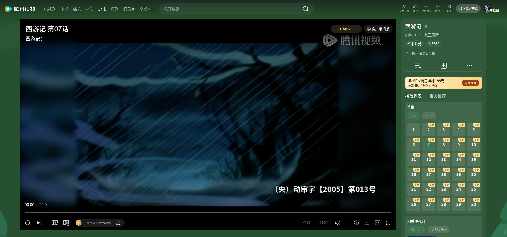
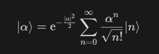

{

```
2026-08-09 11:11:55 CST
```

多数和少数...

走正义和科学的道路，就是要团结更多的人，让支持正义和科学的人变得更多。思想统一的时候，反对主流思想的逆流思潮数量上一定会多。

所以，除了反驳逆流思潮的不合理与愚蠢之处外，还需要让主流思想的人群不断扩大。

思想质量 * 支持人数 = 思想能量

对于那些狂妄魔怔的人和言语，不必理会太多。与其改变难以改变的人，不如更多地建设我们的主流思想，让更广大的人群坚定贯彻主流思想。

---

```
2026-08-09 11:43:28 CST
```

想起来今早的梦，海岛，山，桥，深海，超能力

不错的梦世界

---

```
2026-08-09 11:55:45 CST
```

心胸要开阔。解放思想，实事求是，与时俱进，求真务实。

---

```
2026-08-09 15:37:31 CST
```

千百年来，人们在二维世界里的自由度越发的高，书籍纸张笔绘画，乃至于计算机图形。

但我察觉到，对于三维绘画或者可视化，迄今为止都非常贫瘠。可以想象，即使是计算机世界，我们至少也需要创造一个能够快速显示三维sandbox世界的物理display设备。

如果认真思考一下，就可以感觉到，毫无疑问，虽然过去VR或者AR技术似乎停滞了，但是未来随着具身智能的发展，必定又将掀起新的浪潮。

硬件才是革命性的，只是计算机是如此的强大，以至于让软件同样具备的强大的改造世界的能力。

}

{

```
2026-08-10 19:21:55 CST
```

一般来讲，世界的发展是不均衡的。有的地方日新月异，迅猛发展，各种新的思想，新的技术层出不穷，人民群众的运动创作热情很高。有的地方则比较平缓，数年如一日，没有大的发展。

走到一个正处于变革前沿，发展迅速的大地区，并能有一个安定的发展环境，以及志同道合的亲朋好友，师生同学，就有更大可能发展我们自身。

}

{

```
2026-08-11 11:38:06 CST
```

测试了GPT 5.6 sol的blender 3d能力，感觉非常原始，几乎犹如o1于lean4一般.

恐怕还需要2-3年才能比较成熟，特别是，需要有规模化的3d模型应用。

持续学习（世界知识, 用户习惯）, ML Coding, 策略进化, 多模态（图文一体, 视频IO，音乐IO）,对物理世界的理解（各种力场以及复杂的力学系统, 机械系统, 生物学原理, 化学反应等）, 3d建模，更自然的思考（记忆图思考, 更好的记忆）,agent蜂群, 动态视觉与机械操控（人类的动物本能）, 对于人类社会更深刻的思考（经济政治文化的不同层次，多个方面）...

AI能否制作喜羊羊与熊出没？能否像人类一样与他人聊天，发送表情包，以及作为队友共同游戏？能否制作一台现实世界的游戏机？电动玩具遥控赛车和飞机呢？能否做出色香味俱全的饭菜呢？能否进行医学诊断呢？

即使在数学上，AI不成熟的地方也极其的多，此外，AI对于计算机系统真正了解多少，如果没有优雅的连贯理解与CRUD能力，其是否真的能胜任Coding任务，也有很大疑问。对于数据结构方面，如果不能做到极低延迟的图文一体（并且要有很强的快速edit能力），AI真的能深刻理解吗？

恐怕这些问题，不要说2年，4年，即使长远来看，15年，也要打巨大的问号。当然，AI时代，发展总体在加快，乐观估计，上述问题，30年内，应该能全面解决相当多一部分。

---

```
2026-08-11 11:55:16 CST
```

回望我们的互联网，任何时期，各类混乱的情绪输出与噪声内容居多。LLM出现后，实际上，是让高质量的数据更多了。精良，优秀的创作内容，总是高度依赖优秀的创作者。"电视剧 电影 动画 小说 漫画 程序 数学理论 各类科学内容 艺术创作 Plog Vlog"，无不如此。如果有一个环境良好的平台，以及现实生活充盈，有丰富物质精神体验的创作人群，更高质量的创作内容就可以变得更多。

---

```
2026-08-11 12:12:33 CST
```

情绪宣泄，混乱噪声很容易。但是，要静下心来，沉淀做事情，就很不容易。好的创作者，能够将生动活泼与优雅深遂很好融合，动静搭配得当。让欣赏者观赏时，可以感受到一种流动的美，发散思考的深刻。

---

现代社会，每个人都可以和更多的人关联认识，因此，保持沉默，不要散发无意义的噪声就格外重要。因为，用户很可能因为一条恶性内容，从此就屏蔽拉黑创作者本身。

---

```
2026-08-11 15:14:24 CST
```

午休结束。梦到了，嗯，课程作业，用WorkBuddy开发程序... 奇怪，我无法fetch主网页，但是agent可以fetch了。嗯，我需要排查网络漏洞。

}

{

```
2026-08-12 11:47:22 CST
```



omoshiroi!

---

```
2026-08-12 11:53:48 CST
```

一般来讲，要减少某些内容的占比，或者说强度，除了打压禁止排斥这些内容外，一种很好的方法是引入更多的期望的高质量内容。这就是“引导”的技巧。

---

```
2026-08-12 19:15:07 CST
```

我开始思考如何能够集中注意力，让思维流动起来，阅读文字（例如数学文献）并真正理解。

特别是，我发现，有时候，头脑状态不好的时候，即使努力集中注意力，将文字逐句阅读，似乎也仍然不能理解真正的意思。而头脑状态很好的时候，只是一眼扫过，立刻就能意识到文字是在说什么。我开始努力回想头脑状态良好的时候，思维是如何运转的。总之，似乎有一种神秘的力量，使得我读完之后，就自动能意识到文字是在说什么。

但，为什么，当我头脑混沌的时候，阅读就不能有这种自动理解（甚至反复阅读也不能理解）的效果呢？我认为，这其中，应该有生物学或者运动学（头脑当然也是一种器官，一种精密的仪器），也许某个部位力竭了？我不知道。

---

学习到一个酷炫的术语: "抽象概念的瞬间“合流”（Synthesis）"

}

{

```
2026-08-13 12:54:20 CST
```

欲望给人动力，同时，过多的欲望揉合在一起，会干扰影响人的判断，分散人的注意力。

朴素而言，我们需要一种思维sandbox。不同层级的sandbox享有不同的记忆上下文。这使得每一层的思维无需考虑过多的上层想法，只专注于本层内的目标。

---

```
2026-08-13 15:57:05 CST
```

将不同信息的获取媒介分离，有助于让信息的IO保持清晰

---

```
2026-08-13 16:28:54 CST
```

现代人生活在一个信息IO速度很快的时代，但是，数万年间，人类一直生活在信息更新缓慢的时代。因此，面对纷繁复杂的信息渠道，人很容易迷失其中（沉迷或者迷路）。

---

```
2026-08-13 19:46:31 CST
```

关于学习科学技术。我注意到，对于复杂学习任务而言，人需要用较大的注意力和IO速度，才能理解思考。这让我思考起“间歇方法”，简单而言，就是划定10分钟左右（不固定，较难的任务可以适当降低，感觉轻松的时候可以自由延长）的学习时间，这样，注意力在这段时间里可以集中。一些无关的思考可以留到休息时间（10分钟左右）完成。

人对于有时限的任务，往往更能激发动力。而对于漫无目的，似乎看不到尽头的任务，会缺乏兴趣，产生畏难心理。综合而言，这是“望梅止渴”的技巧。

---

此外，我还发现，让AI先生成一段内容，然后让其数行内总结，可以高效阅读防止大水漫灌冲散注意力。

---

还有“复刻”的技巧，人在用视觉阅读的时候，会不自觉忽略一些细节。而用纸笔等工具进行复刻时，可以察觉到未注意的细节，还可以因为纸笔工作节省了记忆负担，激活绘画想象力，联想到一些光凭视觉思考无法想到的精美内容或者神奇想法。

---

```
2026-08-13 19:54:48 CST
```

发呆很有用，即使我们什么都不做，头脑也会自动休息。我粗略猜想（没有严谨的生物学验证），这和人运动结束后，身体自动修复类似。

}

{

```
2026-08-14 19:20:05 CST
```



感受符号美

---

```
2026-08-14 19:23:41 CST
```

防患于未然，取舍于未定

---

```
2026-08-14 20:46:09 CST
```

阅读不同时代的历史，可以让人短暂超脱历史时空. 要思考如何能够超越时代，就必须深入学习过往时代的客观规律，以及当下时代的客观历史条件，前沿思想和科技。

用智能统御思想，用时间来创造物质。这是“万世而为”思想的一部分。

---

```
2026-08-14 21:32:22 CST
```

想到，早上旧圣的梦境。推开二楼的房门，从二楼跳下，我意识到这是梦境，大鱼塘变成了一片海。

拘泥于一隅之地，必受困于一隅之地。

感知，想象，让我们可以真实触碰到更广泛的世界。世界是什么样的，无从得知，我们只能用不同的测试感知。

---

注意力是零和的。逛平台"可能淘到好东西"的机会成本不是零，而是确定性地损失了读沉淀之作的时间

经过时间筛选的优秀思想，本来就看不完。拿确定的好东西去换概率性的碎片，期望值上是亏的。

}
