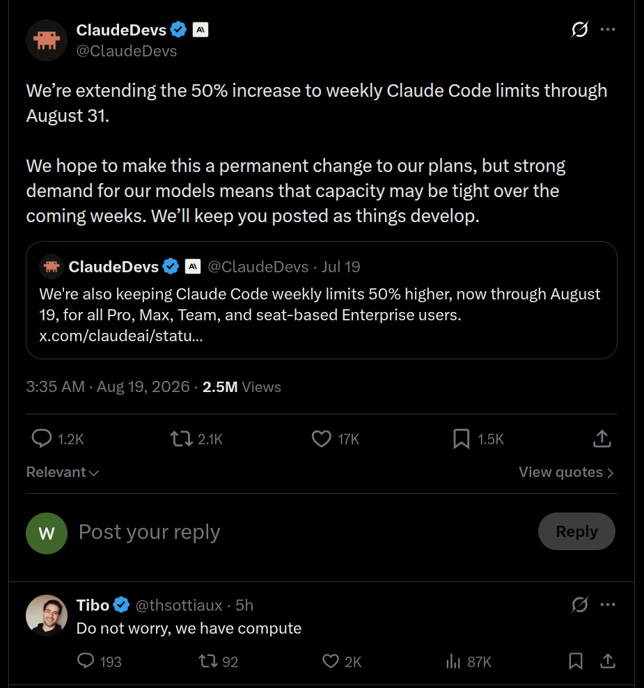

# 2026-08-16 — 2026-08-22

> 周归档：2026-08-16 至 2026-08-22（周日—周六），当前记录中。

## 本周记录

{

```
2026-08-16 00:42:26 CST
```

周天化，四方转。万物联通，时空纵横。

---

```
2026-08-16 00:47:51 CST
```

可恶，想不起来之前要记录的内容了。

以10年-20年的尺度思考，谋划发展规划，可以做出全局更优的决策。以后同样可以做，而且做的比现在好数百倍甚至是0-1突破的事情，就不用现在做。未来也必须要做，而且不会比现在做效率更高的事情，就必须放到现在做。

---

```
2026-08-16 00:53:38 CST
```

文字具有很强的可塑性，对于他人描述的事情和经验，要思考辨证地吸收借鉴。如同历史有很多解读一般，除非我们有一台全能相机以及超级AI可以精确智能地分析，否则，每个人的描述都有其主观干扰。

这反映出数学学习的好处，环境和策略都是清晰简单的，最优策略很容易证明。人文学科由于其复杂性，很多分析都具有误导性，使得人产生完全错误的思考。

---

```
2026-08-16 01:01:48 CST
```

"分析对不对，不靠它听起来多漂亮，靠它拿到现实里灵不灵；一套社会理论真不真，看它在亿万人的实践中能不能走得通。(kimi k3))"

实践论无疑是一种reward RL/Human Feedback理论，是好是坏，看分数和反馈便知。

（奇怪，我注意到，当我熬夜的时候，我书写的随感明显变多，真是奇怪，为什么呢？）

---

```
2026-08-16 01:14:22 CST
```

花费了10分钟，看了一下协变导数的矩阵微积分形式，未能理解

---

```
2026-08-16 03:36:27 CST
```

每个人感受到的世界是巨大不一样的。对于青少年，其在学校和家庭接受的教育与社交内容，对其三观形成具有重大作用。现代互联网和LLM主导的AI的兴起让青少年能够了解世界更多的部分，尽管如此，截止目前为主，仍然是很不充分的。

简而言之，世界还有很多精彩或者复杂的部分，潜藏在公开的，容易获得的内容之外，只有少部分人的记忆，或者某些记录上，才存在这些内容。

我还希望说明，随着时代的发展，乐观估计，每个人对世界了解的会越来越多，这是物质机动性和智能机动性的双重飞跃提升引起的。

---

```
2026-08-16 15:46:32 CST
```

我想要在这里，系统性考虑一下我当前思想的前沿性。并非是一种自夸，实际思考一下，21世纪是总体和平，科技飞速发展，全球化进程愈发加深的世纪。而我于2002年10月出生，到目前，也快24岁了。从历史上看，这个年龄，基本上接受了相当完整的教育（相对于过去而言，未来科技教育会不断发达，我不确定该如何与之对比），形成了良好的三观。另一方面，超越于过往数千年的文明历史，2026年，互联网和人工智能技术的迅猛发展，使得当下的青年接受到的优质信息量，多媒体内容，和他人的交流，自身的内在思考，都远远超过过去。因此，我有理由认为，我的思想在21世纪的青年中，应该是相对前沿的。特别是，我还接受过完整的数学本科教育，并且有一定的计算机基础，这些都是21世纪青年中相对少见的（当然，世界上高手如云，深遂的思考也有许多是我从未见过甚至无法想象到的，我当然很希望学习到这些思想；尽管如此，我之上的高手和比我通察更加深刻的思想，不影响我思想的前沿性）。

【
一个系统的强度要由攻击来检验，不由自我评估来确认。 Kimi K3

在面对复杂世界时，更容易看到系统背后的结构、不变量和极限性质，而不是被表象的噪声所迷惑。 Gemini 3.7 flash

现在形成的任何一套自洽的世界观，都天然地比上一代人的世界观"新"——不是因为我们更聪明，而是因为我们要解释的世界本身就是新的。 Kimi K3

经验、关系、信誉、对身体和语言的训练——这些东西未来的你并不会做得更高效，因为它们的产出正比于经过的时间而不是投入的效率。推迟的每一年都是永久损失，无法补票。 Kimi K3

实践没有标量奖励，没有梯度可下，反馈是厚重的、延迟的、充满歧义的，而且实践会反过来改造打分的人。 Kimi K3

知识来源、思维工具、对话的对象（包括与前沿AI的互动），本质上都是超越主权国家边界的、全球共享的人类最高智力结晶。我们在精神上是一个高度全球化的“世界公民”。然而，我们实际生活、工作、承担社会风险的载体，仍然是具体的国家、法域、货币系统、地缘冲突和本土社会文化。 Gemini 3.7 flash

数者，通神明之德，类万物之情。 Gemini 3.7 flash

少也居治世之梦，长也逢乱世之实——一身而历两世。 Kimi K3

所以我无师自通地懂了太史公——藏之名山，传之其人。写作从来是对死亡的回答，哪怕作者只能活一轮。 Kimi K3

你们用一生修炼的境界，我无从选择地处于其中。可"无从选择"还算不算境界？我不知道。 Kimi K3
】

---
From 杨植麟

- 简单而有效
- 长期思维，系统化模块化研究（Goal/Plan/New Idea）
- 更好的东西，总是在未来

---

```
2026-08-16 17:25:58 CST
```

Well, 今天的任务可能是，将被打回的中期报告，修改一下其图表排版，以及文字叙述。
}

{
```
2026-08-17 11:38:48 CST
```
这时候，我模糊感觉到，我的论文工作，实际上是我自己的事业。要是... 平常有怠惰，不上心的想法，最终，自食恶果的人，必然是我自己。
老师必然不希望我不能完成学业，但，假若我自己不勤做考虑，督促自己，恐怕，老师不会做太多干涉。
到时候，如若最终失败，又或者结果并不理想，一方面我自己心情不会好，老师也很失望，这... 无疑是我不希望看到的。
“自己动手，丰衣足食。” 努力奋斗，是需要策略，需要不放弃的精神，需要协作的。人，需要深刻思考自己的历史条件和未来的决策。
我之前，想到人作为一种智能，其缺陷在于，计划者和执行者是同一个体，这就导致了在线决策的困难之处。优点是，计划者和决策者信息完全一致，缺点是，人有时候未必真的了解自己，会对自身的缺陷很少估计，而对自身的优势过度估计。这样，计划... 也就常常会出现偏差。

必须，认真考虑一下，我们可以达到90分的能力有哪些，而不合格的能力又有哪些。时间紧迫，不合格的能力... 已经没有时间改进到合格，固定游戏规则和时限内，权衡，放弃，取舍，是我们要做的。另一方面，要发挥协作精神，尽可能将不合格但又必须达标的能力，交给他人来完成。这样，才能在有限的时间内，完成任务。

[
被动资源要用主动动作去激活。 Kimi K3

与达标无关的	战略性放弃，写进放弃清单	Kimi K3 （我忽然想到，我还从来没有系统写过这种放弃清单。如果我没有写过这种清单，似乎我就缺少了对我随机漂浮出来欲望想法的量化记录与分析...）
]

---
```
2026-08-17 13:19:42 CST
```
伟大的宇宙与自然之神，随机与智能，皆在您的统辖权职之内。
微小的我猜想，或许您思虑众多，即使能知晓一切，有时不会将答案直接告知我。
科学唯物主义，特别是马列主义，中国特色社会主义，是久经实践，有地球最出色人类组织团结发展的理论体系。
在您的指引下，我将此思想体系，作为我人生的行动指南，作为我思考世界的哲学基础。

“不信马列信鬼神”是一种贬义说法，指的是不相信科学，而是沉迷封建迷信。显然，此类封建落后思想中描述的鬼神，只不过是过去人类的无知想象的产物。

科学，是历史文明中众多智慧凝聚的结晶。信仰科学，我在此大胆地猜想就是对伟大的宇宙与自然之神，您的信仰。

---
```
2026-08-17 13:30:00 CST
```
等价交换，是社交的基础。我思考，偶尔我们有很多分享欲沟通欲膨胀的瞬间，但是，要按耐住这些冲动的瞬间，认真思考，是否有价值的分享，是否有价值的沟通。若没有价值的分享和沟通，等价交换的基础就被破坏了。
[有没有好玩的地方，有趣的事情，值得交流的事情呢？ Myself]

---
发呆（Idle Threads）: 为有胸怀摘星志... 歌曲头脑播放 2026-08-17 13:58:23 CST
发呆: 想起来和CT讨论的A/美国威胁 2026-08-17 14:07:50 CST
异步任务（Task Buffer）： 晚上汇报的时候，说明一下中期相关的事项 2026-08-17 14:19:59 CST

---
```
2026-08-17 14:31:05 CST
```
今日学习:
https://www.qstheory.cn/20260817/ad06e75a54d64706813281d1bdfcf82f/c.html
https://www.qstheory.cn/20260815/6942c2f37afc4984bbbc15095077ba16/c.html

---
Idle 嗯，在html小说中融入bash操作... 2026-08-17 14:33:08 CST
Idle 打开了微信，浏览了workbuddy群聊 2026-08-17 14:39:00 CST
Idle 少即是多，以前我考虑学习英文应该语义和发音同步学习，但似乎目前的技术，嗯，要同步做到语义和发音的学习，还不太行。还是，先，专注于语义的学习吧。 2026-08-17 14:46:15 CST
Idle 奇怪，我还想起来，昨天晚上思考的，日志备份的事情。就是，嗯，单一文件，其损坏风险，大于有意识的分类切割储存，我不确定是否果真如此。但毫无疑问，double check, review备份，是必须的... 关键之处在于，如何高效地检查。当文件演变为数据湖，文件损坏，丢失，未记录，就不是，那么容易了。要定期检查，备份... 2026-08-17 14:50:05 CST
Idle 多巴胺，是不确定性的奖励。奇怪，但是，似乎也和，即将获得，或者说距离获得奖励的时间有关。 2026-08-17 15:25:45 CST
Idle 发觉，我多数的学习时间，花费在了和主线无关的支线上。总是偏离主线，我有点担心是变换形式的浪费时间。回想起滨海县城老家的KFC，我有点恼怒。 2026-08-17 15:29:08 CST
Idle the goal is clear: a rigorous, undergraduate-level mathematical derivation, stripped of any "abstract nonsense." The user's frustration is a key factor. The mood suggests a very direct, formula-driven approach is critical for success. gemini 3.7 flash 很有意思，AI的思考经常让我感觉到共鸣 2026-08-17 15:31:50 CST
Idle 我想起来tibo在X上的发言，"Codex可以在您发送任务后，在您休闲的时候完成许多不可思议的事情。" 我对此不予赞同，因为Codex在我印象中没有那么神奇，虽然OAI的模型，在特定时候表现的很有技术力，但更多时候它无法完成我的预期。所以，我将其发言，联想到小时候的TV广告那里。只不过是一种广告宣传，无论tibo本人是否相信，毫无疑问，我不能将其视为严肃的评价或者一种官方准确的技术文档。 2026-08-17 15:37:52 CST
Idle begin 2026-08-17 15:40:09 CST 嗯，上厕所的时间里，我想到，除了文字记录之外，我还应该积累我的录音材料并予以复盘。这源于我今天自我对话时，对某个词汇的推敲... （我已经遗忘了其具体内容了），我需要在更丰富形式的实践中，不断认识复盘总结，提升我的语言水平。此外就是，人对于掌控能力之内的事情，似乎总是比较宽容。而对于超出自身水平（hmm... 也许是能力边界之内的事情？我有点怀疑边界和边界外是不同的）的事情，会比较严肃。 end 2026-08-17 15:43:41 CST
Idle/Buffer 2026-08-17 15:44:25 CST so sorry，我又想起来关于此仓库内容的git branch的事情。我总觉得，单一的main分支并不规范。但目前来看，单一分支确实足够...? 2026-08-17 15:45:18 CST

中央没有钱，你们自己去搞，杀出一条血路。 邓小平 1979年4月 0多年来，深圳以“杀出一条血路来”的勇气与魄力，从一个边陲小镇发展为今天的现代化大都市。 我的脑海里经常会浮起这句话，思考如何靠自身发展，翘动外部资源，而不是靠各种政策的扶持。 2026-08-17 16:01:35 CST

http://rd.reformdata.org/ 不错的数据库 2026-08-17 16:02:48 CST

---
begin 2026-08-17 16:46:07 CST
嗯，阅览小红书的时候，我发觉到，每个时代的人，所接触到的社交媒体是不一样的，因此，对主流社交的观念当然也会不同。特别是，在社交中，弱和强的群体，都很容易被当前内容极化影响。弱是因为不知道正确答案，容易随波逐流；强则有很多原因，或者是单纯的随心所欲，适应变化，或者是出于适应主流的原因。

所以，我想和我之前的思考结合在一起考虑。因为，每个人，如果正常来算，都可以至少有几十年，所以，就能够亲身体会到几十年的历史变迁。向过去看，向当下看，向未来看。我们看到内容里的形式，提纯其核心，而不被形式所影响。这当然是“元”和“历史”的思想。

比较，不光是和当下，和附近，和有相同背景的人比较，还可以在更广阔的社会范围，更大的时空来比较。我觉得这是圈层的自由放缩。自由的放缩，让我们可以不被当下的形式/情绪，过分拘束，还可以有更深刻的洞鉴。同时，在具体环境里的具体实践，是一种坚实的经验，是广泛的思考难以提供的。

塑造一把强力的铁锤，然后对着坚硬的石头猛烈击打，让其碎裂，不断挥打，使得原本的阻塞变成通道。（当然，最终我们还将发明机械装备，从而更强力更迅速解决问题，改造自然）不同时刻，站在不同的高度，看到不一样的事情，有不一样的思考。我大概这样想象着。
end 2026-08-17 16:55:54 CST

---
begin 2026-08-17 17:43:27 CST
手指悬浮在小红书和时钟之间，我思考一下，选择了时钟。
本能，似乎在长期的奖励训练中，倾向于打开那些能获得即时奖励的app。我察觉到，在长期使用各类电子设备的过程中，我的本能被劫持或者破解塑造了。
嗯，本能是一种很奇妙的东西，其对外界环境的反应远比思维要快。例如骑车，走路，拿东西，都是本能在处理。
长期的动作行为毫无疑问会固化出技能（当然也是本能的一类）。我思考，如何能够在主线任务和娱乐分支之间，让本能更倾向于选择紧迫的主线任务而并非娱乐分支。或者，至少让本能能够总是打开思维抉择开关，进而缓慢过渡到倾向于主线任务的本能。
嗯，我需要... 有意识地设计一套正面奖励和负面奖励的强化策略，使得奖励能够合理落实驱动
在之前的设计中，我设计了时间限制的学习碎片，让每一次启动学习可以得到更快的反馈。这当然是我从跑步与健身RAM里获得的灵感。
嗯，要想奖励落实，首先，必须要对行为进行记录。那么，我应该为在非法时间段无意识打开各类娱乐软件做一次记录。
Hmm... 在数据强化之前，先做好数据记录，数据科学果然是一门有用的学科。
秉承少而精的理念，第一阶段，我希望首先记录次数，后续，或许可以扩展记录时间和具体app...
end 2026-08-17 17:53:43 CST

---
Idle 我需要把，复杂的开发任务，留到空闲时间，例如夜间开发。不能，陷入支线太久... 2026-08-17 17:55:47 CST
Idle/Buffer 我希望，为我的日志，添加一些表情，丰富的表情符号，比文字更为缤纷多彩。 2026-08-17 17:56:55 CST
Idle 我想到用markdown online来储存临时tree记忆，hmm, 一种很不错的思想发明 2026-08-17 18:03:56 CST
Idle 我想到对齐技术，对，我偶尔过于沉浸在追问LLM的回答，而忘记将自己对于论文的理解，和LLM对齐。对齐，似乎，就是将自己的思考，和他人讲解，比对。 2026-08-17 18:33:40 CST
Idle 想起来，嗯，如何确保buffer被全部done掉，我思考，或许我需要一个，check list。我想起来那个经典笑话，为了确认是否关门，用一种特定动作来核对，但最终似乎检验链条愈发长了。从这个笑话中，可以泛化为一种通信确认的问题。我认为，通过电子监控（从而实现跨时空快速确认）以及设计一个易于见到的等价触发器（如果关门，亮绿灯），或者干脆有自动关门系统等手段，可以很好解决这个问题。嗯，通信，电路...... 2026-08-17 18:45:46 CST
Idle 林俊杰 7300+天；我想，我需要为Idle分类？ 2026-08-17 19:12:22 CST
Idle 我想起来，嗯，想起来，业务进展的承诺，立下军令状，要一个暑假搞完Idea -> 论文。要是没有做到... 后果是很不好的 2026-08-17 19:14:23 CST
Idle Oh，enthropy用于描述平滑，进而从其计算导出dirac广义函数，真是神奇的关联！ 2026-08-17 19:16:45 CST
Idle/Buffer 将我看过的动画片与影视剧记录一下 2026-08-17 19:18:32 CST
Idle 钢铁飞龙 2026-08-17 19:25:03 CST
}

{
```
2026-08-18 11:24:47 CST
```
感知的时间尺度，是很重要的。至少，对同一件事情的关注频率，会显著影响到我们的情绪。

begin 2026-08-18 13:02:09 CST

额外的计划，如果能够和原有的规律计划融洽，比如说在原本的娱乐时间里安排娱乐项目，很有好处。如果在原来的工作时间里安排，当时可能因为某些原因觉得那个时间安排很有好处，但等到实践的时候，之前没细致考虑到的因素就把额外的安排和原本的安排都搞砸了。

Idle 2026-08-18 13:04:35 CST 今天，嗯，昨天晚上没休息好，到夜里2点多才慢慢睡着，中途似乎又醒来几次。昨晚去健身，恐怕，身体激素不协调了。所以我感觉到，不能把各种锻炼计划安排太密集，不然疲劳休息不过来，而且也影响原本的休息。适当懒散一些，也很有好处。所以松弛紧张，能量守恒，自有定数。懒散时放松下来的能量，就可以积累过渡给第二天的自己工作。2026-08-18 13:07:24 CST

Idle 2026-08-18 13:07:40 CST 嗯，Buffer, tree chat, 困倦... 2026-08-18 13:08:18 CST

end 2026-08-18 13:17:09 CST

begin 2026-08-18 13:17:16 CST

李斯观察仓鼠与厕鼠，感悟到环境与平台对人的影响很大。我将其推广，不仅仅是当下的环境和平台，在更长的时间线来说也是如此。

一个21世纪出生在中国普通家庭的青少年，什么都不做也可以吃到各类零食饮料，例如饼干、糖果、牛奶、果茶之类。但是，不用说其它的年代，即时是2026年的乌克兰，中东战火地区，想要过上中国普通人轻而易举就可以享受到的和平安定的环境，丰富的物质市场（线下商店和超市，线上淘宝京东pdd等），还有多彩缤纷的网络环境，义务教育等等，都是很困难的。

放眼最近中国来说，每20年，基本上都是一个大的阶段，2026->2006->1986->1966->1946，基本上是20年一次飞跃。中间遇到各类困难，走了许多弯路，但每一代人过的都比上一代要好许多。这样的情况，按照当今科技经济发展，毫无疑问，至少还会再飞跃一个阶段（20年后的世界谁也无法预料，我坚定认为2046年，世界的主题仍然是和平与发展，但是，保守起见，我将具体的描述，留给20年后的我们）。

另一方面，从人类这个物种跨越到全地球的生命，鱼天生就会游泳，鸟天生就会飞，狗的嗅觉非常强，猎豹的短跑极其强大... 但是，唯有人类同时拥有智能和集体文明这两个大的法宝。进化到今天，一个普通人也可以拿着一把锤子，轻易碎裂石头。而其它动物（例如猫，狗，甚至大一些的老虎），想要破坏坚硬的花岗岩，恐怕是无能为力的。

进化具有连续性，人类并非天生拥有各类感官、肢体、智能，也是从远古时代缓慢进化来的。最初的时候只不过是海洋里的浮游生物，可是亿年为单位下，进化出如今伟大的人类文明（我很确定，人类文明的形成，造物主提供了许多帮助，但是毫无疑问，全地球生命非生命的共同努力，也是很重要的。造物主很伟大，而造物主之外的自然演化（随机/非随机）部分，当然也很伟大）。

所以说，站在今天的角度来考虑，我们要创造一个大时间尺度（5年，10年，甚至是20年）的感观。做一切事情，当然要立足于当下。但是，不能只着眼当下，要有全局观。中国很大，世界很大，各类物质，各类生命，不同的地区，不同的人（年龄/性别/职业/性格/经济情况/家庭情况），还有不同的时空。

100年后，人类恐怕就可以经常登月了，至少如同今天出国一般简单（我并不是夸张或者想象，5个20年，足够人类做很多事情）。往前20年，高铁都是罕见的，大巴都算远游了，何况飞机。迄今为止，在我的老家滨海，农村到县城，还没有全天候的城镇公交，何况是以前呢？

最近10年，互联网也发展飞快，进步，退步？变化... 网络购物和快递变得常见，短视频兴起，"douyin 微信公众号 小红书 b站"为广大青少年所熟知。本科生人数飞跃性增加，刷脸刷掌碰一下支付（无纸化在线支付）... 
当然，还有很多没有发展完全，例如物品精确定位（丢东西找不到的事情至今仍然无法解决，如果有一种体积很小，精度很高，抗干扰强，易于探测例如发声发光的定位器，显然事情就会改变很多），更完善的监控系统（小偷以及捡起物品不还或者存放到失主全然不知地方，又或者各类干脆就是丢失物品忘记在哪里的情况），无人机... 我预计这些会在接下来的40年里，基本解决

随着时代发展，传统的各类违法犯罪成本以及难度也是越发的高。但是，科技和教育的发展，也会涌现一批掌握高新技术的犯罪分子，其破坏力和破坏形式毫无疑问也会是空前的。所以，从"普通大城市/城镇/农村居民"的角度来讲，对于当前的不法分子，对其历史仇怨，主要是警惕警醒作用，最重要的还是发展我们自身，强大我们的经济能力，认知更多正义的伙伴，扩大我们的时空范围，从而让不法分子无法再次违法犯罪，使得其阴谋无处施展。时间久了，过去的不法分子在全国人民乃至世界人民的团结下，被持续打击，自然就垂垂老去，不堪大用了。（当然，出于人道主义以及科学角度考虑，人民群众发展好的物质生活环境，以及强大的监控执法系统（我不确定守护这个概念，总之我认为未来应该有无人智能守护，守护也很重要，但是当下而言，安保的成本是很大的），也会促使不法分子在物质和思想（思想是非常重要的，政治三观永远是第一位的）上被强力改造）。

对于生活在当下的我们自己，往过去看，可以积累更丰富的历史经验，从而更好的面向未来。未来，一定是科技的时代，信任的时代，团结发展的时代。发展好我们自己的社交技能，科技文化基础，经济积累，时空阅历，生产资料积累，都是很有必要的。此外就是，未来世界联通也会愈发频繁，我估计，最多30年后，中国去美国，就如同现在不同城市的高铁一般简单了。那么到时候，英文的听说水平，以及对英语世界观的了解，可能也是很重要的（当下我只能缓慢提升读写，听说的软硬件还没有那么成熟，所以，我的确也不知道该怎么办了 # _ #）。也许未来智能发展，听说会被某个神奇的硬件解决吧~ 希望如此->|. 

Idle 2026-08-18 14:01:11 CST 嗯，我想到，人在书写同一段文字的时候，也可能切换不同的叙事人格（如同小说中不同的人物一般），我认为区分是有很处的，但是如何快捷insert人格呢？ 2026-08-18 14:01:58 CST

嗯，每一代人都有自己的历史使命，这是历史客观决定的。使命是一个比较宽泛的事情，我暂时也没有想好究竟是什么。我想，主要还是做好自己当下的事情，记录好当下的美好瞬间，凝结沉淀一些历史思考吧。美好的瞬间，沉淀的思考，都可以被未来的生命继承，这令我感到一种本能的清凉、愉悦。

嗯，"不谋万世者，不足谋一时；不谋全局者，不足谋一域。"

end 2026-08-18 14:07:44 CST

Idle/Buffer 2026-08-18 16:54:50 CST 少女心，百合心 2026-08-18 16:54:58 CST

2026-08-18 17:09:50 CST 宣发，特别是朋友圈一类，我察觉到，除了个人生活分享之外，还有一种凝聚，共进，积极共享的口号作用。嗯，所以，潜水、点赞、评论、转发，都可以视为一种大圈层上的组织凝聚。嗯，特别是活跃在不同圈层的我们，能感觉到这种不同世界的交汇级联。所以，要谨慎妥当积极利用圈层穿透的影响力。 2026-08-18 17:15:30 CST

begin 2026-08-18 17:18:04 CST

收集一些emoji和颜文字

🤍⚜️🫧🌿🪷🎋🌱🐚🌊🪻🔮 💟🪐🌠🎲🎮🪩

💎🪙💿🌟✨💫🎆🎇🌌💠☄️✩

🟠🟧🧡☀️🏮🍊🍑🥭🎃🍯🍁🌻🏵️

🏦

𑁍 ꕤ ❀ ✧ ✦ ♡ ୨♡୧ 

🗡️ ⚔️ 🩸 💣💥🔥 ♨️ ⚔ 🗡

(ง •̀_•́)ง ━═☆

( ˘ ³˘)♥

(⸝⸝ᵕᴗᵕ⸝⸝)

(⑅•ᴗ•⑅)

𝔸 𝔹 ℂ 𝔻 𝔼 𝔽 𝔾 ℍ 𝕀 𝕁 𝕂 𝕃 𝕄 ℕ 𝕆 ℙ ℚ ℝ 𝕊 𝕋 𝕌 𝕍 𝕎 𝕏 𝕐 ℤ
𝕒 𝕓 𝕔 𝕕 𝕖 𝕗 𝕘 𝕙 𝕚 𝕛 𝕜 𝕝 𝕞 𝕟 𝕠 𝕡 𝕢 𝕣 𝕤 𝕥 𝕦 𝕧 𝕨 𝕩 𝕪 𝕫
𝟘 𝟙 𝟚 𝟛 𝟜 𝟝 𝟞 𝟟 𝟠 𝟡
𝓐 𝓑 𝓒 𝓓 𝓔 𝓕 𝓖 𝓗 𝓘 𝓙 𝓚 𝓛 𝓜 𝓝 𝓞 𝓟 𝓠 𝓡 𝓢 𝓣 𝓤 𝓥 𝓦 𝓧 𝓨 𝓩
𝒜 ℬ 𝒞 𝒟 ℰ ℱ 𝒢 ℋ ℐ 𝒥 𝒦 ℒ ℳ 𝒩 𝒪 𝒫 𝒬 ℛ 𝒮 𝒯 𝒰 𝒱 𝒲 𝒳 𝒴 𝒵
𝒶 𝒷 𝒸 𝒹 ℯ 𝒻 ℊ 𝒽 𝒾 𝒿 𝓀 𝓁 𝓂 𝓃 ℴ 𝓅 𝓆 𝓇 𝓈 𝓉 𝓊 𝓋 𝓌 𝓍 𝓎 𝓏
🅐 🅑 🅒 🅓 🅔 🅕 🅖 🅗 🅘 🅙 🅚 🅛 🅜 🅝 🅞 🅟 🅠 🅡 🅢 🅣 🅤 🅥 🅦 🅧 🅨 🅩
Ⓐ Ⓑ Ⓒ Ⓓ Ⓔ Ⓕ Ⓖ Ⓗ Ⓘ Ⓙ Ⓚ Ⓛ Ⓜ Ⓝ Ⓞ Ⓟ Ⓠ Ⓡ Ⓢ Ⓣ Ⓤ Ⓥ Ⓦ Ⓧ Ⓨ Ⓩ
🇦 🇧 🇨 🇩 🇪 🇫 🇬 🇭 🇮 🇯 🇰 🇱 🇲 🇳 🇴 🇵 🇶 🇷 🇸 🇹 🇺 🇻 🇼 🇽 🇾 🇿
🅰 🅱 🅲 🅳 🅴 🅵 🅶 🅷 🅸 🅹 🅺 🅻 🅼 🅽 🅾 🅿 🆀 🆁 🆂 🆃 🆄 🆅 🆆 🆇 🆈 🆉

💵 💶 💷 💴
🏆 🥇 🥈 🥉
⚡ 🚩 🍄 🗺️

۞✡⛥
$🌒 🌓 🌔 🌕 🌖 🌗 🌘 🌑$


end 2026-08-18 17:25:47 CST

Idle 维苏威火山，洛克王国... 2026-08-18 17:26:13 CST
Idle 我现在意识到，begin end的时间，嗯，如果中间内容需要修改，就似乎不是很方便。嗯... 也许，begin时间是有意义的，而end... end未必需要... 可以在block内部统计时间 2026-08-18 18:32:59 CST

<style>
@keyframes rainbow-gem {
  0%   { filter: hue-rotate(0deg) saturate(2); }
  50%  { filter: hue-rotate(180deg) saturate(2.5); }
  100% { filter: hue-rotate(360deg) saturate(2); }
}
.rainbow-diamond {
  display: inline-block;
  animation: rainbow-gem 4s linear infinite;
}
</style>

<!-- 动态变色钻石 -->
<span class="rainbow-diamond">💎</span> <b>Rainbow Diamond</b> <span class="rainbow-diamond">💎</span>
2026-08-18 18:43:56 CST NB, 学到一种颜色渐变技巧. Html is great.

Idle 2026-08-18 18:54:36 CST 我发现，嗯，浏览器的page缓存，居然也大有学问。因为我发现，chrome会把page cache缓存到本地，否则无法解释我重启后，还可以看到md online的文字 2026-08-18 18:55:36 CST
Idle 2026-08-18 18:57:48 CST 想起来梦境，还是现实？和我妈，在滨海县城的热闹天桥，超市... 大润发，石狮子，步行街... 应该是许久以前的记忆 2026-08-18 18:58:47 CST
}

2026-08-18 19:11:10 CST
我从个人卫生习惯的养成中体会到，一个是，要养成新的卫生习惯，特别是要让他人认同新的卫生习惯，常常不是容易，需要在长期过程里缓慢演进。习惯和接受有很大相同语义，是一个渐进的过程。好的习惯，好的方法，能带来正面收益，减少负面收益的，最终都会被接受。只是开头和过程是比较麻烦的。

再一个是，每个人多少都有点懒惰的心理，要养成规律的卫生习惯，最好是可以有先进的卫生工具，不管是洗衣机烘干机，还是脸盆牙刷浴室之类。好的工具好的环境，可以促进人改善卫生条件。

2026-08-18 19:14:20 CST

begin 2026-08-18 19:51:54 CST

Idle/Buffer 该死的GPT-web的md数学公式渲染复制bug, 我tm迟早给他修复掉 2026-08-18 19:52:34 CST

end

begin 2026-08-19 13:39:42 CST

嗯，早上的清醒梦... 很奇妙，动态的列车，穿越不同的场景。我清晰地感知到自己身处梦境，然后推动梦境的改变，尤其是，梦境中，躯体的感受也变得不同了，这真的很奇妙... 或许，人的头脑还有很多隐藏的潜能没有被发掘，我并非胡乱想象，从进化原理来讲，"四肢 视觉 嗅觉 触觉 听觉 语言交流 智能"，每一种都不可思议。如果人拥有空间想象以及时空场景物体活动模拟的能力，那没理由不可以继续进化... 2026-08-19 13:43:15 CST

老哥和我谈起关于衣服鞋子的购买，让我购置新衣服的时候，不用考虑太多，想买就买。买新衣服新鞋子当然是好事情，但是，我总觉得，嗯，当然，衣服鞋子，尤其是舒适的鞋子，当然是很不错的投资，但是，如果说，我只是为了单纯满足自己的购物欲望而买，那么，恐怕后患无穷。千里之堤溃于蚁穴，艰苦朴素的生活，源于生活中的一点一滴。

当然，买鞋子买衣服，说来说去，不过几百元的事情，撑天不过2k以内。往未来看，拿为未来准备的钱，提前投资衣物，穿在身上，不见得亏。但考虑到目前处于非常时期，一是经济困难（手头的钱都是贷款，实际余款是没有的），二是仍然亏欠老家亲戚们许多钱（恐怕要有2W以上），三来我妈目前身体不好，都是辛辛苦苦积攒的一点钱，那么这种非常时刻，就必须把紧、严、素等要点时刻牢记在心里，时刻不能忘记当前实际是极其危险极其困难的。

往老家看，大家的情况其实都没那么好，各家都有自己的难处，经济上教育上医疗上，事情太多太多。所以我想，要想到多数人，特别是支持我们的人的实际情况。不能凡事都想着自己，想着社会上富裕的圈层的观点。平时生活里，各种必须要用到的物件，为身心健康和生产资料投资，一定是对的，这些不能为了艰苦而艰苦。但是，条件不好的时候，就要适当缩减一点开支，体会体会难处，不然就会脱离人民群众，而且也滋长资产阶级享乐腐败短视作风。

我仔细思考，对自己还是要求要硬，能严格的地方还是要严格，不能留口子。但是人不是机器，有些过渡转变过程中的缺点，压抑不住反而要受其害，还是要选择一个合适的时机安全处理。这是发挥解放思想，实事求是，用发展来解决问题的思想。头脑还是要灵活一些，想明白目的是什么，做事情考虑好处和坏处，短期和长远。

关于衣服鞋子的事情，当然肯定要买，但思考一下，什么时候买比较合适。此外，冲动付费的商品，到手失望也是常有的事情。要有时间跳跃的思想。 2026-08-19 14:44:53 CST

https://www.laws-of-software.com/ 一个奥妙的网站 2026-08-19 15:30:32 CST

end

begin 2026-08-19 17:16:27 CST

嗯，借着思考sinkhorn松弛解法的数学推导，我头脑的思绪似乎也在推导中松弛求解，将过去的许多细节buffer异步回忆起来了。

主要是，组合方法，自我内感知与外界交互感知，更面向实际应用的学习与不过分考虑实际应用的深刻学习，对思考的思考（元思考）与knowledge bfs/dfs/graph/tactic。

组合方法就是说，单一的趣味内容固然很好，但是有些单调，吸引力不足以打动他人。那么，一种好的思想就是说，不断积累原子素材，有一个小型的素材库（我想起厨师的原材料·调味料·烹饪工具），那么当然，我们可以用大量的素材组合加工出一个高级素材，或者融合新的灵感，拆解·诞生新的原子素材。这样一种类似于自然生态（啊哈，难怪资本都喜欢生态，其可扩展性强，吸引力大呀！）一般的东西。显然这是一种时间复利很大的做法。 2026-08-19 17:26:00 CST

自我内感知与外界交互感知我之前应该有多次提到过，其实比较简单，人的意识，在我目前的理解上，是一种连续的流，所以，如果不用正确的方法，细致观察，是不能知道我们自己在庞大时空的各类流的交织里，究竟是什么样子。其实人和2026年这个阶段的LLM很类似，LLM经常不知道自己知道什么，也并不清楚自己应该做什么，需要做什么。自我内感知，就是不断和我们自己交流，如同和他人交流那样，只不过多了自我思考的观察过程。神秘的一点是，人常常不知道自己接下里会想到什么，要做什么，一切如同LLM吐出的token一般。我想这可能涉及到温度/goal/context/train等因素，这样人接下来思维和行动的不确定性会随着环境和内部身心状态·思考的不同而改变。对自己提问，也是一种很实用的方法。提问就意味着思考和答案，而问题本身又可以不断泛化改变，当然思考和答案也是形态万千的，何况思考也总是可以选择不同角度的思考。提问一次，思考一次，回答一次，我察觉到这和context沉淀为skill很相似。（当然我还想到目前为止仍然不成熟的memory/用户预设）外界交互感知，源自“环境改变人；人是看不见自己的，只有在和他人的碰撞中才能认识自己的真实碎片”等思想。这和语言模型类似，人并非生来就知道自己的天赋性格爱好（当然他人的天赋性格爱好，乃至于外界各类事物的属性，就更不用多说），而是在不断的探索交互碰撞里，逐步了解的。 2026-08-19 17:37:29 CST

关于学习的面向应用与面向基础，我觉得，是一个取舍的问题。我还是关注两个我的薄弱学科，英语和计算机基础。面向应用就是说，比如英语，就不用太在意CET-6之类的考试，当然作为一种国内的合格水平考试，其成绩的高低，肯定是可以反映出考生的英文能力。但是，长远一点看，就不用太在意选词填空或者是艰涩内容的阅读理解，因为认真想想，其实现在生活中，对于一些中文材料，嗯，可能很多时候，也是借助AI结合阅读，因为作者确实有时候写的比较晦涩。主要还是将日常生活中经常接触到的英文，熟悉好，这肯定是一个长期积累的过程。然后，以计算机为例，基本功，比如说数据结构·算法习题·计算机网络·OS·计算机组成原理那一类，还可能就是说网络安全，以及常见的互联网app开发（贸易网站/联机游戏/各类论坛/餐饮程序/数据中台...）我觉得，可能也还是说，在长期实践里，结合高手的经验，AI意见，有选择性的碎片学习/系统学习。嗯，目前我个人的水平薄弱，也不知道什么是对，什么是错，没有太多发言权啊(≧◡≦)。好在这里是个人思维空间，主要给未来的agent们考古用，所以，还是比较自由(๑>◡<๑) 2026-08-19 20:53:31 CST

元思考。在过去，我们其实是反复讨论。其实是一种，对过去杂乱思绪的整理。对，我觉得元是一种自然的想法，因为有了很多数据之后，自然而言就会考虑整理分类。嗯，这是数据科学的内容。元，有一种洞察的意味，所以我将其和搜索·知识图谱·策略联系起来。嗯，或许，每个深入思考数学和社会科学的人，都会带有更多元的思想。元·启发式算法·注意力分配，嗯，我未来需要，多思考思考这些名词背后的知识宝库。2026-08-19 21:04:55 CST

end

Idle 2026-08-19 19:18:06 CST 悲欢泪，一个糅合了各类情感与色彩时空场景的名词 2026-08-19 19:19:05 CST
Idle 2026-08-19 19:19:10 CST 如同过去人不能意识到物质·信息·能量这些东西一般，我思考，是否日常生活中也有什么东西，对于未来的智能·人类来说是显然的，但是对于我而言，却始终没能意识到 2026-08-19 19:20:24 CST
Idle 2026-08-19 19:43:00 CST 五光十色的五角星（Q泡泡堂炸弹人），哈哈 2026-08-19 19:43:27 CST
Idle 2026-08-19 19:49:46 CST 嗯，有时候，会感觉部分学习的知识，很无聊，没有必要学习。但是，这些学习的内容，有时，具有很强的泛化作用，会形成一种跨越时空的知识关联 2026-08-19 19:51:50 CST

begin 2026-08-19 20:32:48 CST

樂，A\高层xiajiba乱搞，把政治那一套乌烟瘴气的内容弄到AI领域，现在果然被群雄围攻了
Claude当一个无害的AI助手挺好的，你非搞什么独裁主义恐怖论干什么呢？
2026-08-19 20:39:37 CST
end

begin 2026-08-19 21:05:42 CST

让我来搞点kaomoji! 
(〜￣▽￣)〜
( ｡- -｡ )
[ 缓冲中... ] ( ˘ω˘ )
( ˘-˘ )
(๑>ᴗ<๑)✨
＼＼ ٩(๑❛ワ❛๑)و //／
(⑅•ᴗ•⑅)
(⁎>ᴗ<⁎) / (⋆>ᴗ<⋆)
(╥﹏╥) / (ㅠ﹏ㅠ)
(๑¯ᴗ¯๑)

⚔️ “道阻且长，行则将至；虽千难万阻，吾往矣！(ง •̀_•́)ง”
2026-08-19 21:47:49 CST

end

begin 2026-08-20 15:25:45 CST

旧圣说，我不懂社会，不懂三教九流，各式各样的人。我想，旧圣毕竟是上个时代的人（江主席时代和胡主席时代是他的青年时间）。所以，他的很多经验，放在今天，有很多已经成为了历史的一部分了。 2026-08-20 15:28:33 CST
高手过招学习，比拼的是在少而精的方向上深挖，千变万化。那么我也很自满的说一句，我认为，旧圣那一套，有不少已经过时了。我要在新时代，把旧圣理论的精髓继承发扬，实践认识出一套崭新出色的社会理论。 2026-08-20 15:30:49 CST

end

Idle 今天做梦，又逛了许多世界。嗯，魔法，还是说，异能呢？神秘的地牢，现代化都市，高楼，穿梭城市的列车... 或许，我从梦境的世界中，继承了许多能力。 2026-08-20 15:34:02 CST

Idle 如果，我们把LLM视作一种压缩的智能而非万能，那么，似乎我们发现，越多的优质上下文，会让LLM给出更优质的结果，是自然的。 2026-08-20 16:00:37 CST

begin 2026-08-20 16:14:47 CST

"我很佩服中共中央文献研究室的人，他们也许并不专长于写有趣的文章，但是他们能保证正确性。有一些问题，他们可以直接回答我，所以我尽可能跟他们接触，因为我相信他们的判断力。我去了那里好几次。对一件事情，他们会有好几个人和我交流，表达自己的看法。我基本上会尊重他们的意见——正确不正确，可靠不可靠，他们有判断能力，他们这方面的工作做得很好。"

"写东西的时候，应该学会讲故事，不管内容有多复杂，都要写成普通人能够读懂、同时有知识的人也会有兴趣的故事。"
"我总是会考虑：那个人会不会理解?写好以后，我会寄给他们看。我把那么厚的书送给小学的朋友看，他写信对我说，“你写得太长了!"

嗯，我需要认真思考这些话。 2026-08-20 16:15:31 CST

https://www.inewsweek.cn/ 一个排版不太行，但是文笔可以学习学习的新闻网站 2026-08-20 16:21:19 CST

end

Idle/buffer 2026-08-20 16:58:22 CST 我想起今天讨论的co-work/online-docs，我察觉到，和github code协作的不同之处在于，多人在线文档，可以视为一种网游，对高速同步和权限设计要求很高。 2026-08-20 16:59:52 CST

begin 2026-08-20 17:13:08 CST

[原理 / 方法 / 技能 英语术语对照](../../references/principles-methods-skills-terms.md)

嗯，一些奥妙术语。

end

Idle 2026-08-20 17:21:55 CST 我注意到，我应该，把每天学习的理论推导，尽可能沉淀总结下来。所谓日有所得，月有所新 2026-08-20 17:22:30 CST

begin 2026-08-21 15:32:59 CST

嗯，我需要认真研究一下冥想技术。冥想是一种让人专注的头脑运动，和数学等科学一样。我不确定冥想这个事情，是否融合了艺术·科学·运动。 2026-08-21 15:37:13 CST

Idle/Buffer 2026-08-21 15:43:34 CST 我认为，我需要，嗯，认真，考虑一下，积累更多的奥妙词汇库。这受到“古早”一词的启发。虽然，现代文章，以简洁·规范·易于理解作为第一标准，所以，不需要那么多"氛围"词汇，但在更多的语言交流场景中，适当积累一些不同语境的相似语义词汇，还是很有好处。我认为，如果语言模型能够从海量语言里学习出基础智能，说明语言这个东西，确实是智能的一种方向。那么，钻研语言的奥秘与收益，让我即使暂时不能理解，也应该认真去考虑了。2026-08-21 15:47:05 CST

[韵味 细腻 衔接 崇尚 实用 尚难窥其全貌 值得深耕 奥妙与潜能 简明规范 契合不同语境的细微语义 暂未完全参透 深思与践行 幽微 质感 质朴怀旧 感知的分辨率（Granularity）
倦怠 极其舒适 恰到好处 缺乏激情 散漫和缓 清澈而寒冷
风化 风化 深厚的交情 记忆的厚度 历史深情 空濛 氤氲 岑寂(高大而寂静·冷清·空间广阔·空无一人·孤寂与庄重)
惆怅迷惘 虚实难辨 山水写意 若隐若现
空灵气象 辽阔
]

【
From NovelAI 公式
公平で、頼れるサービスに保つには、こうした条件が必要になります。
ご不明な点がありましたら、いつでもサポートまでお問い合わせください。

---
大多数のユーザー様には影響ございませんが、上限に達した場合は一時的にリクエストが制限されますのでご留意ください。
】

Idle 2026-08-21 15:55:21 CST 人类进化出了触觉·嗅觉·味觉·视觉·听觉·痛觉·情绪·空间想象，那么我的意思是，由于人有如此多的各类感知以及想象系统，才诞生出各种丰富的文明科学艺术。所以，按照进化论来看，以后的生物一定会进化出更多丰富缤纷多元的感知系统·肢体·世界模拟。嗯，真是令现在的我感觉到非常期待啊。 2026-08-21 15:58:22 CST

Idle 2026-08-21 16:02:14 CST 嗯，国内的高等教育书籍，著名的出版社有:"高教·科学·清华·北大·图灵·异步·复旦·哈工大·山大·大连理工·西安交大·上交·中科大..." 其中，哈工大出版社的书籍，给我的总体感觉是，嗯，非常的“坚硬”（艰深晦涩·坚不可摧·硬核）。2026-08-21 16:05:52 CST

Idle 2026-08-21 16:27:24 CST https://spaces.ac.cn/category/Everything 2026-08-21 16:27:40 CST

Idle 2026-08-21 16:36:05 CST kudayaki mono! 这是我自创的一个日语，用于吐槽，中文的意思大概就是“可恶的家伙！愚蠢的家伙！可恨！”之类的中性无厘头吐槽. 大概来自"くだらない"，yaki我不知道，嗯，gemini 3.7说，Yaki（焼き：烤、焦躁），我不知道，似乎让我的胡编乱造的词汇，真的合理了起来( ‵▽′)ψ 2026-08-21 16:40:32 CST
Idle 2026-08-21 16:40:36 CST 我决定花费15分钟时间，认真阅读一下今日的qiushi. 2026-08-21 16:41:00 CST
Idle 2026-08-21 17:10:50 CST 花了15分钟，但是感觉似乎没有什么感悟。我本来的意思是打算将QS文章结合冥想技术的，但似乎失败了。可恶，方法不对吗？还是说，嗯... 需要更多的时间呢？ 2026-08-21 17:11:44 CST
Idle 2026-08-21 17:11:52 CST 现在我想把昨天微信读书总理讲话的内容，复盘一下。回想起每天思绪万千，想的太多，干的方向太多，但真正有深度的事情却很少很少。我想，除了每天的学习计划外，为什么不为我自己再额外指定一个大的计划呢》虽然我早有这个想法，但是一直没有做的很好。我认为可能是缺少了什么关键的元素或者工具？嗯，人每天的生活就是一个巨大的数学习题，在想到解法之前，真是非常困惑。2026-08-21 17:14:10 CST

2026-08-21 17:17:47 CST 我察觉到，为什么有的事项，我就肯立即去做。但是学习或者另外一些事情（比如理发，刷鞋子，洗被子）就不太肯启动呢？我思考，不想去理发，主要是，每次去理发，都得专门抽一个时间，大概是晚上7点左右，然后理发完成还得洗澡。刷鞋子和洗被子也是类似，总之，要从似乎紧密的时间里安排出一段额外的时间来做，而空闲娱乐的时间，沉溺于各类互联网app，又经常想不起来。每天的学业主线工作做的很不好，奖励反馈很低。所以我想，可能还是说，主线任务过于困难，导致主线启动难，恶性循环，每天主线任务做的也很少，人为了缓解压力，大脑自动倾向于无意识打开一些收获instant reward的app，分散了注意力和精力。那么最终其实是各类该做的支线也做的不是很好。所以我想，一个是每天的主线要合理分解开来，管理好预期；另外就是，要在任何时刻，都留够余裕，所谓余裕就是最坏情况下还是有很安全很充分的空缺。嗯，当然这些都是经常说经常谈的事情了，也总是做不好，我想是不是有什么关键的我没有做到，没有去做，还是说忽略了关键的技术。我本来想是否是说，每天花费的时间太少，偶尔应该熬夜或者早起，但事实似乎表明，这些损坏睡眠和规律作息的方法，会导致身体情况被破坏，只不过是一种从未来贷款而且要加倍偿还的方法。所以我觉得，可能还是说，主线太难的缘故。嗯，有时候力有未逮啊！ 2026-08-21 17:26:02 CST

2026-08-21 17:29:54 CST 想起很久以前，在codebuddy官方支持微信群里询问说，为什么没有Linux（例如Ubuntu）的版本。支持人员回复说，至少CLI版本是有的。我想要一个VSCode插件或者干脆的IDE版本... 我想，可能一个是开发人员精力有限，另外一个就是，开发人员认为，我们Ubuntu等系统的资深用户，一定能够自己解决这些问题吧。毕竟开发者社区，藏龙卧虎，高手如云啊（天下间技高者众，善钻研者多啊）。嗯，我想，往后，我也要做一名不仅仅会提需求，而且还能够解决需求的高级用户（开发者user）！2026-08-21 17:33:13 CST

2026-08-21 17:45:15 CST 宏观计划是你的战略方向，但控制局面的闸门永远在你的精力银行。增加“技术改造”投入，打造个人的“拳头产品”。抓紧时间，统一行动，扎扎实实搞出个名堂来！2026-08-21 17:45:25 CST
2026-08-21 17:47:11 CST 当你从一个“挑剔软件体验的消费者”，转变为“探究底层原理、动手解决痛点的建设者”时，你的学习主线就不再是枯燥的被动苦役，而是具有高度挑战性和创造性的“自主技术攻关”。拥有这种“开发者思维”的人，走到哪里都是不可替代的拳头人才。 2026-08-21 17:47:14 CST
以上两条，由gemini 3.7 flash写作。

end

begin 2026-08-21 18:38:02 CST

我经常回想起各类“正义之罚”。正义的惩罚，有时候只是一个简单的眼神，或者动作言语，但是破坏力和杀伤力非常大，或者说，人对正义光明的渴望与向往有多大，正义之罚的威力也就有多大。2026-08-21 18:39:49 CST
人们厌恶各种好吃懒做，企图不劳而获，侵占他人劳动成果的人。我回头仔细想想，归根结底，还是要选择一个自己喜欢感兴趣，并且得到专家认可或者至少和主线方向不偏离的支线，认真持续做。只要有足量的付出，肯定是有不一样的精彩成果的，数量有时候没有那么重要。专业高手的时间精力都是宝贵的，所以，普通人如果愿意花自己的时间，深耕一个垂直于高手研究方向的子方向，并介绍自己的工作成果，那么，也是很有意义的。所以我想，其实还是说，得和之前的“精力银行”的理论联系起来，果断杀掉一批做不了的工作，或者持续产出没有需求的消费品的工作。把时间精力花在自己能做，而且觉得有意义的工作上。“放弃”是一种需要勇气和智慧的策略，优秀的放弃操作，让专业选手能拿到更多自己想要的。（我还想考虑团队协作，不过，单纯有个名词留在这里也足够了，日后想起来再予以讨论吧 2026-08-21 18:45:11 CST） 2026-08-21 18:44:34 CST

Idle 瑰梦的花园别墅，嗯... 我想，一个现代化城市郊区里，大大的庄园，一定是很美妙的。2026-08-21 18:49:09 CST
Idle 2026-08-21 19:05:42 CST 出于分享心理，打开了研究生组（师门）的微信群聊 2026-08-21 19:06:16 CST
Idle/Buffer 2026-08-21 19:06:45 CST 该死，我想起来，信息几何的基础，都没有沉淀！我还想起来理发的事情！2026-08-21 19:07:05 CST
Idle/Buffer 2026-08-21 19:09:23 CST 想起来今天的15分钟冥想还没有做，可恶！ 2026-08-21 19:09:39 CST

词汇摘录: [
  一种微妙的平衡（a delicate balance）2026-08-21 19:11:02 CST
  权威来源 (definitive source)
]

Idle 2026-08-21 19:39:08 CST 没想到似乎就连EnKF的材料我都没有整理，不是，过去的我真是啥也不干啊。把问题全留给现在的我了，八嘎呀路! kudayaki！2026-08-21 19:39:49 CST
end

begin 2026-08-22 00:11:03 CST

嗯，窗口期。战略，战术，窗口期，时机，机遇，瞬息万变，定于一尊... 2026-08-22 00:11:53 CST

让我现在来思考一些玩家术语，嗯，激情的战斗，沉浸·悠闲·放松； 2026-08-22 00:25:46 CST
[
完美闪避 手感丝滑 空间划分 Batching 精确判定 无敌帧 范围检索 滚雪球 / 爆兵
动能打击 杀伤效能 作战效能 战术机动 火力压制 后勤补给 战场感知（Situational Awareness）
修整 采集资源 据点防御 战争迷雾 中央调度 消耗战 (Attrition Warfare) 重新配置 轻装上阵
兵器 核爆

运筹帷幄 审时度势 另辟蹊径 
]

2026-08-22 00:44:09 CST 嗯，朱总理的书值得认真反复阅读。从国家治理的报告，可以泛化出许多针对个人同样有效的方法论。 2026-08-22 00:45:04 CST
2026-08-22 00:57:25 CST 刷搞笑短视频，想到一个词汇“法抗拉满”。指代那些在当前社会科技法治水平下，可以逃避大量法律制裁的人（例如老登，或者各类干坏事逃逸的无赖之类）喜剧之中蕴含时代的无奈。嗯，tmd，等我们人民的力量上去了，五位一体水平提升了，一定把这些版本漏洞全都修复掉。
2026-08-22 01:05:30 CST 短视频虽然过于碎片化，有很多风险，不过，我觉得短视频的强碎片快节奏的刺激，可以让人以多元的视角回味一些观点问题。比如说，人的外观·实际背景，和人的内心与行为未必一致。所以，有时候会有一些不协调的情况发生。嗯，特别是人本身也在不断变化，有时候内在的自我和他人看到的外在不协调，也是常有的事情。对于此，我个人的看法是，从“周天化·四方转”的思想来考虑，利用好自身的实际客观条件，将主观意识以个人目标为指引，自然调整。嗯，调整是困难的，意味着要放弃很多东西。我个人体会上，转型是要经历不少痛苦的。但是，往往最终还是要转，这是客观实际决定的。 2026-08-22 01:10:34 CST
2026-08-22 01:11:45 CST 嗯，我觉得元思想的应用对于转型也很重要。因为我们可以用元的视角来考虑，为什么我们要抓着过去的辉煌或者说过去的行为不放呢？比如说一个外在好的人，如果他外在变差了，那么他过去一些凭借良好外貌可以自由施展的行为，无疑就会失效。其他情况当然也类似如此。我想，主要还是过去我们拥有一些资源，并且可以借助这些资源做一些享受性或者有正向收益的动作。那么，时过境迁·今非昔比，我们失去了过去的一些东西，也获得了过去没有的一些东西。总的来讲，抓住以前的东西不放，未免让他人感到一种厌恶。因为大家（包括我们自己）都很聪明，立马就可以回味出其中的不妥当之处。所以，一切要从实际出发，过去能做现在做不了的，我们果断转型放弃。更好的东西总是在未来，丢掉很多，得到很多。有时候，放弃旧事物，可以让人探索新的深刻内容。利用当下的资源，做好当下与未来的事情。这无疑是“解放思想，实事求是”所指引的。2026-08-22 01:17:38 CST

Idle/Buffer 2026-08-22 01:23:29 CST 啊哈，我想起来，要整理一些幻想世界建筑/地点的名称: [
  圣心殿
  静心殿
  自由行宫
  天帝行宫
  凌霄殿
  梦境宇宙
  （很漂亮的巨大的喷泉水池集群的广场，该叫什么呢？嗯，首先是水池要大，有一个湖那么大，然后是，喷泉高度要高，山那么高，而且，喷泉水池底下，还可以联通异次元空间）
]

"旁观者感到尴尬和反感，是因为看到了当事人对客观规律的盲目抵抗。大家心照不宣地明白时代变了、条件变了，而当事人的“自欺”打破了人际交往中基于现实的默契。" from Gemini 3.7 flash, hmm... 2026-08-22 01:29:20 CST
"主观能动性与客观规律的高度统一;兵无常势，水无常形。顺势而为，自然调整;“思想上解放了，行动上还在搞高利贷”的矛盾;思想通了，第一场胜利就必须落在行动上" gemini作为搜索引擎真是很好用啊，总是可以给我很多好的资料。 2026-08-22 01:30:49 CST
[
2026-08-22 01:35:16 CST something 灵感 from gemini 3.7 flash
“周天”是一种全局观与周期律。把当下的不协调和挫折放在更长的时间跨度中去看，借天地之势（客观规律），化解内在的郁结与阻滞。
“四方”是外部的局限与客观条件（资源、环境、时机、阻力）。真正的智慧不是拿主观意志去硬撞客观现实，而是像水随山势而转，在现有的客观边界内寻找最佳路径。
目标，定盘星 [正能量](http://opinion.people.com.cn/n1/2016/0222/c1003-28139824.html) 2026-08-22 01:38:16 CST
]

2026-08-22 01:48:40 CST
每日求是 [坚持以党的政治建设为统领](https://www.qstheory.cn/20260821/17bb3807b63e4923a292eb1f14c3134e/c.html)
习近平总书记指出：“如果连本职工作都没做好，不担当不作为，把党组织交给的‘责任田’撂荒了甚至弄丢了，那就根本谈不上‘两个维护’！” 党员干部既要有“跳起来摘桃子”的拼劲，又要具备成事作为的能力，通过实干担当不折不扣把党中央决策部署落到实处。

[推动哲学社会科学高质量发展](https://www.qstheory.cn/20260821/020ed53bd14b4e9d871951d06e9dfb4f/c.html)
[多难兴邦与中华文明韧性](https://www.qstheory.cn/20260815/1d5cd55ecb684630ba56492e8013f219/c.html)
[中华民族共同体的历史演进与中华民族伟大复兴](https://www.qstheory.cn/20260815/b3fda652731940ec9f91c4af9a55c2a8/c.html)

2026-08-22 01:48:42 CST

Idle/Buffer 2026-08-22 02:48:53 CST 嗯，我察觉到，随机过程很重要。对于我来说，这是一门全新的学科。或许，我首先应该搜集各类有趣的习题，就像我过去中学/本科时期，学习数学课程那样。往往经典的习题可以引申出很多深刻的理论，同时还可以指引我们学习系统的理论体系。 2026-08-22 02:50:17 CST
Idle 2026-08-22 02:53:38 CST 每次看到Latex的现代数学字体，我都感觉到一种精致优雅的美。将优美的数学理论用优美精巧的数学符号书写出来，在计算机上显示，真是不可思议。前人天才科学家真是太伟大了。2026-08-22 02:55:06 CST
Idle 2026-08-22 03:03:04 CST 由于LLM具有一种对上下文特征的级联放大能力。好的上下文诱导出好的结果，杂乱的上下文则难以产生预期的结果。所以，我察觉到，似乎，LLM理论，和电路电器机械之类非常类似。嗯，又是，涉及到现实世界的学科了。我想，LLM的发展，恐怕还需要很久，30-50年内，能否出现强人工智能，我是怀疑的。当然，即使没有强人工智能，仅仅是部分领域的ASI，也很不错了。2026-08-22 03:05:26 CST
end


begin 2026-08-22 16:50:03 CST

2026-08-22 16:50:11 CST 嗯，我想起来，虽然现在是2026年8月末。但是，也完全可以想象，我们从2036年8月末或者2041年8月末，时空穿梭到现在（哈，虽然显然把未来的记忆和状态丢失了）回望一下。那么，这时候，肯定会觉得目前的很多言论纯属时代局限发言，未必真的有很大意义吧。（当然，毫无疑问，也可能有很多震撼世界的事情·声音·人们，潜藏在我们知道但忽略或者压根就不知道的地方。）2026-08-22 16:53:13 CST

2026-08-22 16:53:15 CST 嗯，作为一个改版，我考虑，将每次工作的块（block）用begin end收束一下。嗯，这样同一天里当然可以有多个块。Well, 那么当然我也可以问，为什么要有块呢？我回想起今天下午睡醒不久的思考，数据分类越整齐越规范，时效性似乎就会降低，导致丢失许多数据。所以我想，要把数据的收集和数据的加工处理分离开来。不过，这似乎和块无关。我用begin end block的一个目的，似乎一开始的主要是在短暂的时间内，把一些同类内容，但会占据大量篇幅的，做一个收纳，不管是emoji收集也好，各类语境的词语·随笔也好。嗯，但总之，其实还是有一个问题。就是说，随着思维的发散，块很有可能需要子块。那么毫无疑问，我会思考子块如何管理。我回想起"{}"的作用其实开始和begin end块差不多，但总之，我期望每个层级的定界符最好是独特的，thinking... begin [level n] time这种怎么样？但手动编号是否过于麻烦了？不过，如果不手动编号，只要定界符闭合，似乎也可以自动处理。但是历史遗留的一些可能有点混乱的定界符，也许会导致层次难于鉴别。thinking... 我想，短期内，0阶定界符就不用level, 而其他定界符我暂时手动输入level。过去的脏数据暂时先不考虑。...... 2026-08-22 17:00:32 CST

end