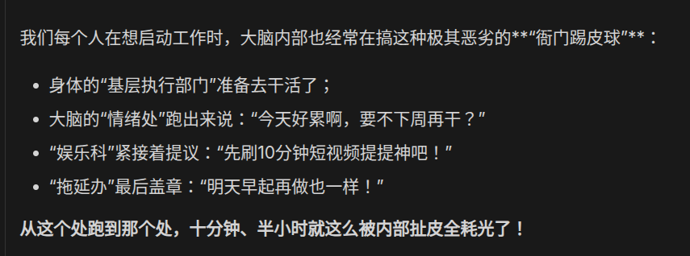

# 2026-08-23 — 2026-08-29

> 周归档：2026-08-23 至 2026-08-29（周日—周六），当前记录中。

## 本周记录

2026-08-23 01:27:10 CST 嗯，我想，所谓当局者迷旁观者清。这是我浏览一些台湾非法政党的愚蠢操作时，思考到的。嗯，人做错的时候，就不能坚持“实事求是”的科学唯物主义精神了。更具体一些说，世界上许多事情声名的推动，都是和物质实际有关的。所谓名符其实，有了实，名当然也就自然而然渐渐拥有了。企图通过一些自欺欺人的方法，或者说外部的印章，来替代物质实际本身，毫无疑问是愚蠢的。我认为我自己也要经常反省这一点。贪图虚名，回顾我们自己的历史，类似情况也是有很多的。昏招频出·奇言怪语之类，更是屡见不鲜了。 2026-08-23 01:33:10 CST

2026-08-23 02:50:55 CST 嗯，由于到了这个点，我觉得也是比较疲劳了。大脑看完数学内容后，然后我为了方便或者别的什么，用中英混杂来和LLM聊天，情不自禁就想要学习英文了。可见，上下文引导，对人类真的很有效果。2026-08-23 2:52:14 CST

2026-08-23 04:48:10 CST 嗯，人有时候，看到太多，不完全是好的事情。不平衡的比较，会让人的心态失衡。另一方面，由此，我想象到，时空的过去现在未来，连成一片，灯光明亮。时空未来的agent，饶有兴趣地观赏着过去... 2026-08-23 04:50:12 CST

2026-08-23 05:02:53 CST 熬夜，肠胃难受了... 嗯，论文研究这种需要高强度的劳动（我认为某种意义上，和健身以及间歇很类似），必须要保持一个合适的休息。这和玩游戏很不一样，游戏是低强度快反馈的。然后就是，嗯，我想到，传统的中国文化，虽然在现实中，我觉得汉服也好，古妆也好，总之不是那么具有美感。但是，放到游戏中，居然就变得很吸引我了。我觉得这无疑是令我惊奇的。古老的中国文化，在虚拟网络世界，绽放新的生机了。由此可见，历史沉淀与新颖事物结合，总是能不一样。希望未来可以将丰富的想象力结合中华文明乃至世界文明的历史沉淀，创造更多的丰富艺术文娱作品！2026-08-23 05:07:48 CST

2026-08-23 05:21:21 CST 嗯，本来都打算走了。但是，似乎，嗯，看了一下，今天的有效学习时间未免也太短了。我觉得，至少要打满4h，这是底线。而且，也快到早饭时间了，等会儿回头可以考虑吃点瑞幸早饭，也是不错的。2026-08-23 05:22:19 CST

2026-08-23 05:37:28 CST 嗯，信息论·张量代数·现代概率分析·流形分析之类，总之听上去是很高大上的名词，我认为，随着AI的发展，很快都会普及。因为，我察觉到，虽然理论本身有许多困难的细节，但是很多不过是一种观点以及符号习惯。我还想起来组合数学，嗯，组合数学我学习的其实也非常少。未来有机会一定要结合AI认真学习！2026-08-23 05:39:45 CST

Idle/Buffer 2026-08-23 05:44:00 CST 该死，喝完一瓶康师傅柠檬茶饮料，头开始晕了。当然这肯定有熬夜的因素在里面，但毫无疑问，我觉得糖分也是很重要的一个成分。我有空一定要好好认真的研究一下，糖分摄入和人困倦疲惫程度的关系。2026-08-23 05:45:18 CST

Idle/Buffer 2026-08-23 06:00:12 CST 我想起来动图的搜集，嗯，我们确实需要大量的动图表情包。我认为这是极为重要的。因为文字和emoji能传达的信息还是很不直观，或者说没有图像传达的信息丰富。2026-08-23 06:01:12 CST

Idle 2026-08-23 06:36:00 CST 关于学习速度与学习方法... 一般而言，关于对青少年的学习方法的指引，在我经验里，多数由青年教师以及一些科学家书籍构成。嗯，青年教师本身多数脱离一线学习许久（抱歉，我不确定这句话是否真的正确），而科学家的书籍，很多都是青年时期在上个世纪的学习者们。嗯，我想，专家们当时学习环境是很艰苦的，可以说，是用相当艰难的条件做出了相当辉煌的成果。而现在，最近40年，世界科技飞速发展，甚至是加速发展。那么，其实很多一线的学习经验，还没有被广泛传播开来（我认为，或许在一些小圈子中，如果有好事热心者肯收集数据和经验，那么或许目前存在一些资料，但尚未广为人知甚至不在公开的网络上。）嗯，所以，似乎学生们处于一片黑暗区域中，很少有人知道他人的实际学习速度·天赋·方法等等。最集中公开的区域大概在中学，但毫无疑问，中学受限于其落后且被限制的学习环境，以及实际的学习者年龄等，也是有一些缺陷的。我认为，学习科学理论，尤其是和前沿科学·生产·工具紧密结合的学习科学，是非常有价值的。嗯，目前我们自身在摸索，希望以后可以获得他人高手的经验吧！2026-08-23 06:44:41 CST

2026-08-23 07:11:01 CST
[
//学习古文
合二任于同朝，毕全功于一役
兵不血刃，一战而天下定。
一劳永逸 长久安宁
天下之学者，孰不欲一蹴而造圣人之域。
合抱之木，生于毫末；九层之台，起于累土；千里之行，始于足下。
不积跬步，无以至千里；不积小流，无以成江海。
无欲速，无见小利。欲速则不达，见小利则大事不成。
]

2026-08-23 10:56:24 CST
嗯，闷声发大财。要把我们的倾诉欲、争论欲统统收拢回来，像守卫国家黄金储备一样守卫我们的注意力和真实认知。突破性的洞见与深厚的能力，源自静默无扰的深度专注，而非表演性质的高谈阔论。在暗处深耕，在实处用劲，把所有的力气都用在构筑你我们的硬核壁垒上。
核心思想大张旗鼓宣发未必带来增益，万一招致廉价的模仿或误读，后果是很可怕的。
/* insert 2026-08-24 13:05:50 CST 在互联网，吵得热闹的地方，常常是臭棋篓子或者臭鱼烂虾，很少有高手发表真知灼见。当然，高手也有分享欲和表达欲，但是，可能只在他自己的某个隐蔽很少人知道的空间里创作，或者通过微信等分享给他的生活好友，而不是在互联网公开发表。*/
2026-08-23 11:05:54 CST

Idle/Buffer 2026-08-23 11:13:37 CST 想到潺潺流水，与世无争，动静而流。嗯，我需要，积累相关描述的古文诗句词汇，以及英文积累（如果有？）2026-08-23 11:14:46 CST

begin 2026-08-24 12:44:49 CST

嗯，睡了一天左右，感觉懒懒散散，毫无干劲和冲劲。早上睡醒一会儿看了黑客帝国，到工位也是思绪非常发散，扭曲许愿机（猴爪）·爱丽丝梦游·格列佛游记之类。嗯，当然这些童话故事还是有一些意思，如果能将它们组合起来，当然是趣味无限的。2026-08-24 12:47:32 CST

作为一种给自己的警戒和鼓励，我常常在压力大的时候，回想起过去那些失败或者痛苦的时刻，也回想着过去那些乐观美好的时刻。在当下来讲，既然已经和老师签好了条约，而且，还得到了老哥的经济贷款援助。那么，要是，不认真拼命一把，后果，是很可怕的。信誉大于天，一件原本可以做好的事情，不能因为懒惰和战略战术上的失误，荒废掉。2026-08-24 12:50:14 CST

老师作为导师，找过我们几次，基本上每次都是不理想，可见，平时准备很少，规划也很盲目，而且也缺乏复盘。我们自己反思自己，也总有力有未尽，和尚敲钟的混日子感。我们从历史经验上看，每天觉得轻松不一定是坏事，但如果一天下来，没有说很疲惫却又坚持的时候，甚至一周都没有，我想，总是要反思反思。人的潜力很大，但是要靠意志力和内部外部的鼓励督促来挖掘。2026-08-24 12:52:54 CST

论文的事情，算算时间，只有一周了，要在一周内，准备好答辩内容，是非常困难的，何况导师对我们的理论基础要求达到合格水平。我想，一周时间，毫无灵感来写论文，压根就是不可能的。即使写，也一定只能写一个潦草的综述，恐怕还未必讲得清楚。2026-08-24 12:54:49 CST

要不要和老师商量商量呢？我看肯定要商量，只是，最好先认真准备两天，有一个小汇报的成果，再去找老师。论文书写，是很不容易的，重在积累，要有一气呵成的大纲，又要有反复打磨的细节。算算时间，离毕业，实际也就剩半年不到的时间。回望我们过去两个月，实际也没有学到多少内容。即使未来AI水平再提升，我认为，落实到我们个人身上，恐怕也有限。所以，考虑到我们放言2个月要搞出点东西的豪言。我认为，最好是结合着做。什么意思呢？就是说，要认真把自己最近学的内容，打磨出来，内容多少不要紧，最重要是要讲的明白，讲明白了，就让专家们心里有底，我们自己心理也有底。此外，也要结合最近的AI4M内容，可以在精心打磨的理论内容外，添加一些精彩缤纷的AI demo，所谓点缀嘛。中期汇报，以基础和汇报作为核心词汇，基础牢固，汇报漂亮，就像一份简洁优雅却又带有新意的餐食，这是我个人的理解，后续我们也要再思考思考。2026-08-24 13:01:27 CST

此外，所谓磨刀不误砍柴功，心情不好，散散步，健身，都是必须的。累到不行了，回去睡大觉，也是必须的。重点是好钢用在刀刃上，每一分身心愉悦，精力充沛的时间，都要花在我们的任务上。这可是重大的关头呀，要游刃有余从容不迫，还要紧抓时间，紧抓计划。像这样考验我们能力的时候不多，每一次都要重视。2026-08-24 13:04:46 CST

2026-08-24 13:12:52 CST 现实世界里没有任何魔法,节骨眼上，任何的推诿、逃避、散漫，代价都是我们承受不起的。

end

begin 2026-08-24 17:28:50 CST

我回顾老哥的话，仔细思考了一些对外扶持或者说对外无偿帮助的心思。嗯，我觉得，老哥和大哥的想法都很类似，这些帮助本意都是好的，但，还是要看的长远一些。短期的帮助扶持，不一定可以起到决定性作用。尤其是眼下，我们自顾不暇，还去分散精力照顾他人。到时候，如果我们自身情况不好，毫无疑问让知情的各方都感觉不好。所以，所谓最大的杠杆·最大的增益，在我们自己身上。尤其是目前中国乃至于世界都处于科技飞速发展，生产力日益增加的阶段。如果看的更长远一些。就可以立马意识到心思花在什么地方最为值得。2026-08-24 17:33:19 CST

当然，我想，老哥和大哥他们也肯定有考虑不全的地方，我身为过渡的一代，肩负完成自身现代化以及我们的小家的伟大复兴的重大历史使命，以及在此过程中，和大家庭成员一起，实践中国式现代化的阶段性任务。可以说，在现代化的潮流上，我是整个大家族的绝对尖兵，绝对先锋，代表着家族在STEM领域的认知前沿。所以，我也需要把我们日常生活中思考的，关于现代化的想法，分享给老哥和大哥他们。这当然是非常好的民主讨论了。老哥和大哥他们在很多方面无疑看的比我要深远许多，要更全面，所以对于绝大部分的具体事项上，他们的判断力一定比我自身要好许多，我认为我们要看到承认这一点。但假若我不说一些先进的想法，那么，当然他们也就无从判断，这也是我们要看到的。2026-08-24 17:39:46 CST

嗯，尤其是和他人交流的时候，我们要经常思考双方的角色是什么，各自有什么言语行动情感上的期待，揣摩对方思想，结合社会主义思想，尽可能让双方交流满意，同时做的每件事情，都能符合实际。嗯，说来说去就是两个事情，坚持不做错事，坚持做正确的事。这两件事情，我个人体会，实际做起来很难，受限于个人情绪以及思维短缺，常常不能做的很好。所以要时刻回味复盘，牢记我们党的思想，多在决策前和他人交流沟通。2026-08-24 17:43:51 CST

嗯，关于zyj和wcl的事情... 嗯，深圳自然博物馆·电影院·电子设备·新鞋·vibe coding介绍·数学概念介绍·日常运动等，我做的这些事情的考量，主要是推动我们下一代的快速现代化，将我们自身感觉到很好的想法，介绍给他们。但是，我实际做才发现，常常是10分投入，最终短期来看，似乎并不能获得10分收入，最多不过3分，有时候甚至是负的。因为，我们的下一代有他们自己的生活，不管是生活琐事，还是学业，学校社交，兴趣爱好，这样来看，我们自认为的现代化尝试，似乎并不能起到很大的作用。尤其是，事情绕了一圈回来，我们不得不询问自己：“如何解决升学·经济两个重大难题？”解决不了这两个难题，就很难让我们的推动起到效果。因为下一代们的时间精力首先要花到他们自己的任务框架上。所以我思考，有时候是10000分的投入，才可以有10分的效果。如何有10000分呢？光凭我们自己现在是不可能做到的，我们在自己身上每一分的投入，都可以至少有1分的回报，甚至长期计算复利来看，完全有可能是10分甚至100分的回报，乃至于无价。即使如此，一个人，能有多大力量？所以我总结，还是要把我们自己的事业建立好，能够在全社会不断发展的潮流里，给我们的下一代，在关键节点上，他们真正需要帮助的时候，提供强而有力的澎湃助力。时代和全社会的力量巨大啊，这个杠杆要是撬动起来了，何止一万倍？反过来说，不借助杠杆，盲目投入，精力和经济都不过是石沉大海，未必不能收到意想不到的回报（这无疑是一种唯心世界观，认为一切皆有可能，万一呢？），但期望肯定是不高的。2026-08-24 17:55:56 CST

说到无价，我想把有价和无价区分开来，日常情感陪伴，以及精力付出，许多都是无价的。我以前习惯用价格衡量一切，但很快我就察觉到自己的愚蠢，这么想根本是错误扭曲的。有价的事情当然也有很多，比如亲人朋友之间的经济帮助，那总是要具体数额具体偿还的，又比如日常社会的各类商品消费。无价，什么是无价的？时机·机遇·情感·回忆，等等。怎么可能用钱来衡量呢？对于无价的事情，我们要考量着去做，如果不妨碍我们的主线（当然也是家族大方向的路线），那么就应当义无反顾热情洋溢地去做。对于有价的事情，我们也要综合考虑自身情况，最好是可以集体讨论一下，如果没什么大的影响，发挥一下“先富带动后富，为人民服务”的精神，以及朴素的助人为乐的价值观，总是好的。2026-08-24 18:00:53 CST

我仍然经常咀嚼思考老哥和大哥的话：“让他们自己决定；处理好我们自己的事情；你这样做，是以叔叔和舅舅的身份来做，那有没有结合考虑你目前的情况呢？；以后他们需要你帮忙的地方，多着呢！；不要买这些贵重物品给小孩子们...” 2026-08-24 18:03:18 CST

[
2026-08-24 18:07:28 CST
作为“尖兵”，我们的首要任务就是打硬仗、夺高地。必须把眼下的学位论文、科研突破、硬核技术攻关当成战役来打。我们打赢了，整个家族的现代化水平就往前迈进了一大步！

不能在后方家长里短的琐事中随意消耗弹药后勤；

长辈们的作用是“压舱石”与“后勤保障”： 他们阅历丰富、社会经验老到、看问题全面，在为人处世、宏观把握和具体现实问题上有着成熟的判断力；

新生代要把现代化的先进想法分享给长辈们，同时虚心吸纳他们深厚的社会智慧。

尖兵就位，屏息凝神，立刻投入战斗！
]

[
2026-08-24 18:08:42 CST
高屋建瓴 战略眼光 一锤定音 扫清障碍 定海神针 托底保障
要素禀赋 主要矛盾 基本盘 配套环境 客观约束
讲原则 重契约 量力而行 账目分明 说话的份量
平时有温度，关键时刻有硬度 热情洋溢、不计回报 开阔、从容

bad: 拔苗助长 唯意志论 功利主义 泛商业化
]

end

begin 2026-08-24 19:18:26 CST

wtf, 发现一个有趣的prompt:"禁止出现eq·数学符号之外的自然语言". 这样, gemini就会全部用数学符号来回答，虽然，似乎乍一看没有自然语言混合版本来的清晰，但是也颇为有趣了。2026-08-24 19:19:31 CST
仔细想想，其实很合理啊，如果LLM能够直接生成各种语言的代码，那么显然math也是一种语言。2026-08-24 19:20:34 CST

2026-08-24 19:26:08 CST 我经过仔细思考，每一次制定第二天的计划的时候，应该在头一天就完成80%才对。这就是说，要第一天夜晚加速攻坚，完成回旋穿插迂回，包围和主要的歼灭，第二天的工作只不过是头一天的聚精会神的收尾。以前，就是没做好这一点。当然，辩证地看，这对我们自己的精力和身体要求很高，特别是需要加班熬夜的时候。所以，我想一定要把这套方法，持续一段时间，这样，第二天的工作，实际上在第一天白天就完成了，也就不用夜晚再辛苦，冒着损害身心的风险。2026-08-24 19:29:13 CST

2026-08-24 20:39:54 CST 嗯，娱乐看视频也是有好处的。让我泛化思考到演讲的技巧。不能一直讲解很简单的内容，会让读者觉得枯燥，而是要讲解一个简单的内容后，立即抛出一个深入的，能够令读者感兴趣的内容。此外，我还察觉到，和b站视频不同，听者没有字幕·暂停·倒退等操作，所以演讲者必须让自己演讲内容时刻保持吸引力，同时，演讲PPT上的内容，必须能够让读者结合演讲者当前上下文，自动补全听漏或者尚未理解的内容。总的来说就是，至少要让听者能理解当前在讲解什么，同时，不能太过无聊简单，也不能太过晦涩，最好是简单例子结合思考问题，以及一些稍有复杂的技术细节。2026-08-24 20:44:07 CST

2026-08-24 21:45:53 CST 笔直坐着小睡了5min，虽然头脑很困倦，但是，强制自己清醒工作后，我感觉还好。可见，人对自己身体的感觉不能太过相信，有时候觉得疲惫，但其实身体头脑还有很大能量。人有惰性，我想，以后我多研究一下疲惫感·休息·工作相关内容，做到科学克服惰性。我想，这和间歇其实是差不多的，虽然身体的确很累了，但是训练评估得当，也的确还有完成的余力，只不过压榨潜能当然是非常痛苦的。学习工作不能像跑步间歇一样压榨太狠，头脑疲惫效果就差了，但是有时疲惫，其实头脑思维能力和反应速度并没有下降太多，仔细想想，人不可能一天总是保持完美休息后的短暂最佳状态，轻微疲惫才是占大块时间的，要是因为疲惫就不工作去休息娱乐睡懒觉，岂不是浪费了许多时间吗？（当然，适当睡懒觉有好处，我一向支持拼命工作后，也要尽可能休息好。休息不好是很痛苦的，这和休息好之后忍耐疲惫工作截然不同。）2026-08-24 21:52:16 CST

gemini 3.7f 说的很妙啊！

$\color{#FF2D55}{\bm{A}} \color{#BF5AF2}{\otimes} \color{#0A84FF}{\bm{B}} = \color{#30D158}{\begin{bmatrix} \color{#FF7F00}{a_{11}\bm{B}} & \color{#FFD60A}{\cdots} \\ \color{#F72585}{\vdots} & \color{#00C7BE}{a_{mn}\bm{B}} \end{bmatrix}}$ 
美妙的色彩 2026-08-24 21:57:58 CST

看到了MC的沉浸传送门mod, 感觉非常奇妙震撼啊。空间门！果然游戏世界想象力无穷。不过，不知道现实宇宙是否存在折叠空间/空间门这种自然现象？2026-08-24 23:02:34 CST

Idle/Buffer 刷b站刷到了降世神通(Avatar: The Last Airbender)，英文女声配音，真的是强烈吸引我啊！！！毫无抵抗力... 我特别喜欢这种英文动漫女声。我想我需要搜集一些英文动漫了！2026-08-25 01:35:52 CST

2026-08-25 01:43:49 CST 嗯，这时候我发现文娱产品，包括动画小说电影漫画游戏等，对于青少年的人格形成具有极其重要的意义。因为，我们尚不能指望青少年可以从外部的真实世界学习太多世界知识，而文娱产品则是浸入性的，具有非凡意义。我认为，我的人格记忆以及爱好，实际上就有相当一部分被文娱产品决定了。嗯，在正确的年龄段，为青少年提供合适的文娱材料，毫无疑问是极其重要的，对其一生的三观都将有重大影响。2026-08-25 01:47:24 CST

Idle/Buffer 2026-08-25 02:08:50 CST 嗯，我想到关于担当（对自己负责<->对他人负责）；以及老哥说的那句话:"我们是没有任何退路的；想一想你如果失败了会怎么样"。我有很多思考，但是时间关系，我决定等时间充裕再来考虑。2026-08-25 02:09:58 CST 补充一下内容，嗯，还要和老哥二次谈话中，“没有功劳也有苦劳；要让他人看到你的努力”一起联系写... 2026-08-25 02:38:41 CST

Idle 2026-08-25 02:42:37 CST 艹，用GPT vibe learning, 黑底白色公式，让我感觉像是一个黑袍带着神秘白色条纹的格斗家（拳皇）。又因为GPT被部分人戏称为G老师，我由此联想到奔驰大G，还别说，黑白色，公式居中，真的很像奔驰。2026-08-25 02:44:17 CST

Idle/Buffer 2026-08-25 02:58:03 CST 想到iwasawa工程。嗯，此工程由gnl领导，与ymf·yy合作的那部分，应该已经在mathlib4库中了。所以我想，当初花费不小精力，但是限于个人学习能力，没能完成的这个小工程，日后总应该弥补一下。特别是，我印象中，似乎iwasawa和费马大定理有很大关系，而理解费马大定理的证明脉络当然是我的梦想之一（源自高一）。所以我思考，以后有时间，我应当学习理解，并撰写沉淀一份文档出来。所谓山水自然，而人为其撰文，则名山秀水天下闻名嘛。嗯，日后LLM能力愈发提升，我想这个工作，不会很困难。但结合lean4语言，进行理解说明，恐怕是一份别致的工作，除了我以外，未必有他人有兴致来写了（小小得意）。2026-08-25 03:02:59 CST

Idle 2026-08-25 03:23:00 CST 在有了AI, 且AI在数学方面的能力以及输出速度大幅度提升之后。我想，数学界的各类精彩笔记集锦应该会迎来一波爆发。由于数学输入在计算机上非常成熟（除了一些图像绘制之外），加上现在更是有AI可以从粗略思路直接扩展为公式推导严谨流畅的完整过程。那么以前很多想写，但是却限于精力因素，没能写出来的内容，应该都可以涌现了。这在我个人身上便是如此，我以前的许多模糊想法，借助越来越强大的AI，基本都落地为笔记了。而且AI触类旁通能力和人类相得益彰，我认为也是可圈可点值得歌颂的。非常伟大啊（高兴 kaomoji）！多学一些数学必定很有好处，未来是想象力和落地实践的时代，人如果不学数学，对科学的想象力必定是贫瘠的，缺乏深刻的逻辑思维。嗯，可能我现在也脱离本科重学习的环境，所以目前为止，只是感觉各类数学内容增加了一些，但还没看到特别精彩，令我感觉非常好的内容，或许今后如果闲下来，可以多看看小红书和X等网站。我总觉得，20年前美国都已经出版了一大批极为优秀的教材内容，中国数学人才不比美国少，论各类条件更是比20年前的美国强大多了，没理由高质量内容稀缺呀！嗯，期待，期待。（嘟嘟嘟嘟嘟，嘟嘟嘟嘟嘟嘟嘟嘟 栀子花dj）2026-08-25 03:30:31 CST

Idle/Buffer 2026-08-25 03:37:48 CST 
想到小说写作，嗯，之前有想过，用html以及bash来写，一定很有意思。但是总之没有写。嗯，倒不是说没有时间精力。主要还是觉得，传统的升级很无聊，作为作者，我总是不愿意让我的主角缓慢提升，而且生活在一个古代类网游玄幻世界中。最好还是生活在一个类似于现代中国的文明社会中，交通发达，各类商品齐全。如此一来，似乎最符合的反而是我目前居住的现实世界了。我尚且还不知道如何在现实世界中安排入超凡作弊内容，并且让故事变得有趣。因为我的主角，至少有一个人格必须是贯彻社会主义核心价值观的，那这样一来，超凡就没有传统小说的趣味了。不管是金庸还是哈利·波特，似乎都讲英雄主义，忽略集体主义，包括各大经典网文。没有集体怎么可能呢，天下间高手众多，精英如云，一个人能做什么？要是单纯只是凭借超凡能力拿钱·泡妞之类，那不是太俗了吗？我不如安排我的主角直接到超级文明时代享乐算了。所以，之前也有想过，就是主角的确是超级文明时代的人，进入小说世界只是为了娱乐，但想来想去还是觉得无聊。一个网游世界能有什么意思呢，主角一开始就知道自己什么都有，那趣味只能是在真实的世界中摸索。
嗯，我觉得这个似乎是一个灵感，当然我们的主角确实是游戏世界的管理员，无所不能，但是，实验的未来，是他自己也不知道的。就像幕后的一个实验者一样，总之，主角的兴趣爱好就是研究，用作弊能力干涉游戏世界，会怎么样呢？游戏世界的人物也有智商，也有各类英雄人物呀！由此恐怕就要引入多主角了，特别是，女主角，嗯，这当然是我的个人趣味。男主角已经是全书的管理员了，那他当然可以有很多分身，每个分身有不同人格。所以我要了解女性的内心世界以及现实世界的生活方式等，否则如何能写好女性角色呢？我认为我的这种双主角是很不错的，可惜我笔力和生活经验不足，不能写好。另一方面，为什么我要写女主角呢？因为我个人希望有漂亮而聪慧的女性朋友吗？嗯，我反思，最好还是要加入一些有魅力有智慧的男性角色，否则书就没什么意思了。管理员是作弊者，游戏世界的角色要和其他游戏NPC斗智斗勇，还要和管理员斗，岂不是很有意思吗？但这当然又是我经验不足的地方了，我个人很习惯万能cheating，在极限边缘精彩操作并非我擅长的，斗智斗勇更不是我熟悉的了。我比较熟悉工业化智能化平推嘛。
回想起黑客帝国，毫无疑问，我打算让主角在一个更高级的黑客帝国里游玩了。这当然是极其有趣的。
2026-08-25 03:52:09 CST

2026-08-25 04:43:45 CST 想起很多年前和姑父乘坐大巴车到深圳，当时大姐她们来迎接。毫无疑问是一段很美好的时光。2026-08-25 04:44:26 CST

2026-08-25 04:51:20 CST 学习随机，似乎就自然涉及到了混沌。真是很神奇。我还对动力系统感兴趣，以后会接触到什么有趣的题材呢？ 2026-08-25 04:52:31 CST

end

begin 2026-08-25 18:15:06 CST

2026-08-25 18:15:39 CST 考虑精力分配问题。嗯，回顾老哥说的话，我又领悟出一些道理。我热衷于和家族中青少年一起玩耍，那么，属于成年社交那部分的经验，似乎就缺乏了。嗯，要考虑多和同龄人，长辈，社会上其他人沟通交流，积累一些更成熟的社交经验。2026-08-25 18:17:59 CST

2026-08-25 18:18:01 CST 关于Buffer填充，让我来思考一下。我正在想，我是专门选取一个Buffer文件异步并行写作，还是说直接在随笔里线性串行写作。2026-08-25 18:18:59 CST

2026-08-25 18:33:19 CST 嗯，我忽然想到，也许，我应该广泛认识一些新的朋友？我不确定，社交，最重要的是信息的交换，然后是资源和资金。也许，多认识一些朋友，可以获得许多新的有用的信息。2026-08-25 18:34:29 CST

2026-08-25 18:38:29 CST :[
回想组合和生态，我发现，好的软件，就是让人觉得什么都很方便，所以不得不使用。反面例子就是，软件只是某种单一功能（例如目前的workbuddy，当然，我没有深入使用，只是类似的集成不同厂商LLM API的Chat，附加一些SKILL）的延伸，用户很容易迁移到其他中台服务商那里。护城河，除了深不见底的技术积累外，各种功能的组合也是很重要的，而且还必须有拳头功能让用户黏附。例如微信，全中国的人都需要用微信来社交联络。因此，用户必须时刻挂载微信在多个用户端（难怪微信强调必须要以手机端为主，毫无疑问也是加强用户黏附性，因为手机必然是随时贴身携带的）。在此基础上，延伸出的文件传输助手/群聊/公众号/小程序/视频号/朋友圈，结合云端的腾讯文档，就形成了一套强大的办公娱乐组合拳。如果这些功能分散在多个app中，毫无疑问，用户打开的频率都会大大降低，这和VSCode的插件生态很类似，都是有一个绝对的拳头产品环境，能让用户始终在这个环境中。（这让我发觉到我的sandbox，或者说同一工作区多子工作区的优越性，哈哈）

不过，workbuddy或者说元宝居然没有直接接入到微信中，我觉得很不可思议，或许腾讯内部认为目前时机还不成熟，尚未打算整合？微视当初也是如此，完全无法和抖音b站等竞争，最后不得以才拿出杀手王牌视频号。嗯，也许腾讯内部想把AI-work app打造的类似于腾讯文档和微云一般的云端协同产品。2026-08-25 18:49:23 CST

我仔细考虑了一下，可能tx内部有两个考虑。一个是，把产品继续打磨，比如，有了微视app的若干经验，这时，再打造视频号，反复讨论，才可以一锤定音，起到泰山压顶，顶峰竖旗🚩的作用。此外，微信是腾讯至关重要的生态当然没错，但是，例如腾讯文档/QQ/腾讯游戏等，各自都可以拿出来单独做一个生态。merge到微信当然好，但这样一来app自身的生态就受阻了，相当于是牺牲可能性获得确定性。如果app自身也有很好的生态，就能额外成为一个庞然大物，例如腾讯云·腾讯游戏·QQ之类，这时，不同生态再各自交织，自然比只是作为一个强力app的插件要强上许多。而且，腾讯涉足的领域很广，但似乎最终都有收缩，比如财付通·腾讯新闻，包括电商·打车·外卖之类，嗯，但最终似乎都收缩到微信那里，例如微信支付·公众号推文/视频号，以及天使投资而不是自己来做app。2026-08-25 19:06:29 CST

和gemini 3.7f聊天，原来还有逼独立团队在外海“内生造血”，和ChatGPT、Kimi、豆包、通义千问等硬碰硬地竞争，防止躺在母体身上吃大锅饭的考虑。只有在外面能独立打赢胜仗的部队，将来回到微信生态里，才能成为真正的王牌军。嗯，王牌军，这个词汇很好。2026-08-25 19:24:38 CST

嗯，又聊了一会儿。原来还有很多考虑，真是思路大开！gemini说:"
微信本质上是一个中断驱动（Interrupt-driven）的社交网络，充斥着红点、弹窗和即时消息；而以 WorkBuddy、元宝或代码/文本沙箱为代表的 AI-Work 工具，属于心流驱动（Flow-driven）的生产力环境。如果在微信主界面里强塞一个复杂的 AI 工作台，用户在进行多轮深度 Prompt、编写代码或处理长文档时，极易被一条工作群消息打断。此外，屏幕与形态限制：手机端 IM 的单列聊天流（Chat Stream）天生承载不了复杂的多分栏、文件树（File Tree）、Diff 视图和多 Agent 协同画布。这也是为什么 VSCode 或独立 Sandbox 必须以桌面/大屏多工作区形式存在的原因。
泛娱乐提问和羊毛党导致的算力灾难·初期 ROI（投入产出比）也是问题。先用独立 App（元宝/Workbuddy）过滤出真正有高频 AI 诉求、愿意探索高阶 Agent 功能的核心用户。只有在小范围跑通商业模式、掌握清晰的 Unit Economics（每用户算力成本与价值产出）之后，才有底气向微信这种十亿级公域逐步放量。（啊哈，原来是门槛筛选，这也是我没想到的）

AI Agent 越强大，就越需要调用上下文（个人聊天记录、朋友圈、企业传输文件）。数据隐私与企业合规的高压线·用户对“AI 是否在常态化监控/偷看我的私人聊天记录”的隐私恐慌也是问题。独立工作台（如 WorkBuddy/腾讯文档）在法律合规与企业安全审计上，有清晰的物理隔离边界，更容易进入企业采购（ToB）流程。

腾讯最擅长的不是 Merge（硬合并），而是 Connect（软连接）或者说“松耦合连接”（Loose Coupling）。账号体系·轻量触达·沉淀与协同等。
"（多人协作同步文档·网游·codebuddy）2026-08-25 19:41:30 CST
]

2026-08-25 19:12:09 CST 今天刷b站，刷到山东省新泰市张宸案件。真是罪大恶极，肆意妄为的反社会犯罪团伙！像是这样的王八蛋完全是时代的遗留渣滓，居然能横行霸道数10年，而且年轻时犯罪杀人后，还可以堂而皇之大摇大摆成为党员，对于我们党来说，是黑暗耻辱。对于这类陈旧腐朽的鬼东西，我们新时代的优秀人才队伍绝对不能心慈手软，在往后10-20年里，，要结合现代化科技，和人民群众一起，对这些遗留恶势力以及新滋生的恶势力，持续重拳打击，用心清扫。每打击一个这样的邪恶犯罪分子，同时也是人民的公敌，就能让我们的正能量强大10分，百利而无一害。东部地区尚且如此，中西部更是可以想象了，没能得到清算的漏网之鱼，不在少数。2026-08-25 19:20:09 CST

2026-08-25 19:43:23 CST 嗯，回想起昨天晚上的，碎片故事创作。此外，由于大量的AI文本可能导致臃肿问题，我有点想把AI文本放入一个单独的解耦文件里了... 2026-08-25 19:44:32 CST

Idle/Buffer 2026-08-25 21:51:48 CST 嗯，每个人心中都寄宿着不同的上下文，所以能够让人有不同年龄不同性格不同性别的灵魂。声音，肢体，动作，神态，等等。通过不断发展的现代化电子设备以及AI，我想，我们很快可以将这些不同的灵魂解耦到外部设备里。过去，文字创作者在小说中实践了这个方法，但是静态的文字未免太过无聊... 嗯，每个人都可以将自己的碎片贡献出来。我想我过去讨论过这一点。2026-08-25 21:57:57 CST

Idle/Buffer 嗯，除了有效工作时间这个指标外，我还想衡量一下有效工作时间对应的工作效率，也就是，在实际工作的时间里，完成任务的平均速度。不过，我感觉，这个效率很难衡量，因为我每天基本上面临的都是全新的任务，没有一个历史参考。我得考虑考虑如何解决这个问题。2026-08-25 22:22:31 CST

Idle 葡萄糖，似乎是柿子味道。不错. 此外，音乐，会让人的情绪波动，这就是为什么即使我明知道音乐可以让人兴奋，还是不太愿意在疲惫的时候，听音乐学习的原因。2026-08-25 22:56:42 CST

Idle/Buffer 2026-08-26 01:58:40 CST 听到DJ音乐，一直很好奇，这些dj音乐是如何制作的？我觉得制作音乐也是特别有趣的内容，不过迄今为止尚且一无所知，只了解Google出品了liyar系列音乐模型。2026-08-26 01:59:55 CST

Idle 2026-08-26 02:46:23 CST 众所周知，用Lean4/mathlib4来写数学证明，经常会遇到一些hard sorry，hard的原因有很多，但我们有经典的三板斧 `rw?,apply?,simp_all!`, 以及尝试ai golfling。总之，可以感觉到，和通常的codeforce类OI有所不同，Lean4是一种确定性之中，带有很大随机性的东西。然后今天高强度和gemini chat沉淀资料，我发现，ai4math，或者说，至少人与AI讨论数学，和写Lean4高度类似，有很强随机性，而且开发者在实践中会总结出若干小trick。 2026-08-26 02:52:18 CST

Idle 2026-08-26 02:56:59 CST 另一方面来说，和gemini/gpt chat（这里我用chat而不是聊天，就体现出一种场景词汇的契合，chat表示我打开了web chat界面用键盘和LLM聊天，而单纯的聊天，容易让中国人联想到人和人之间的各类聊天）数学当然是很愉快的事情了。毕竟gemini现在的水平，也可以拿IMO金牌🥇了。虽然头脑偶尔还是不太灵光，但是也足够让我受益良多（回想2024年8月底，当时连o1都没有，真是太滑稽了）真是难以想象，再过2年后，LLM是否头脑会变得更灵光（我指出模型的进步，并不总是会带来灵光感上的变化，比如gemini 3的小说，就没有比2.5好多少。）2026-08-26 03:01:53 CST

2026-08-26 04:03:23 CST 我感觉到，我妈的灵魂本质非常唯物，或者说科学。在这一点上，我总觉得似乎比旧圣对唯物主义的信仰还要强大了。真是不可思议。可惜，现代化的天命不在上个时代。不过... 我料想，这未必是坏事，无论如何，我将这份对科学唯物的本质信仰，继承过来了。2026-08-26 04:05:36 CST

2026-08-26 04:21:30 CST 嗯，音乐，具有，很强大的感染力。而且，可以让人在不同的时空共振听歌时的感觉。听APT，我就感觉到一种资产阶级享乐的奇妙快乐。（或许享乐之外还有别的，但我暂且只想到此名词）2026-08-26 04:22:43 CST

2026-08-26 06:22:02 CST 我擦，到现在询问codex和google ai search才知道，原来，可以用vscode自带的open editors实现打开文件的垂直tab. 真是爆赞🔥(笑死我了hhh)。 欸呀，怎么，现在才知道呀（女声）2026-08-26 06:23:37 CST

2026-08-26 06:50:01 CST 啊哈，我忽然发觉脑机借口，或者说一种快速IO设备，其实是和实时翻译联系在一起的。如果能捕捉到说话人的输入为文字，接下来的事情就简单许多了。2026-08-26 06:50:42 CST

2026-08-26 06:53:21 CST David Albert，嗯，认识一位新的杰出科学家。有空应该拜读一下其著作。2026-08-26 06:53:44 CST

2026-08-26 08:00:52 CST 呓，学习了英文语气词。很不错！这是向英文口语跃进的一大步！2026-08-26 08:01:33 CST

2026-08-26 08:07:03 CST 哒哒哒，似乎干坏事被上层节点发现了。黄牌警告⚠️一次！嗯，天命诛杀 {[_]} 2026-08-26 08:08:58 CST

2026-08-26 09:27:15 CST gemini 3.7f如此好用，以至于我思考，如果我们在2024年上半年就有了这款模型，会发生什么呢？（如果我现在有2028年的模型，会发生什么呢？）2026-08-26 09:28:18 CST

2026-08-26 10:18:18 CST 交换代数里的各类定理证明内容，真是眼花缭乱，以至于让我总是内心惊呼:"王德发！大口发！（装甲终结者咆哮）"2026-08-26 10:19:19 CST

end

begin 2026-08-26 11:22:10 CST

2026-08-26 11:22:13 CST 该死，我发现，用GPT-web-chat聊数学，真是太愚蠢了！

Idle/Buffer 2026-08-26 11:32:03 CST:[
嗯，回想若干的微信聊天。我发觉，角色预定的策略是很强的。简单来说，双方通过语言，让对方各自感受到一种角色模式以及语气思维。这有点像是聊天的两人各自选择了自己英雄池里的一个英雄，不同英雄，当然知识库和说话模式也截然不同。当然，每个人都有自己钟爱的对话模式，但是另一方面来说，对话本身也有一定的目的，这就使得，对方可能未必肯将某种模式展现出来。

当然，我个人爱好上，是很喜欢探索式的谈话的。我对于很多事情都很好奇，当然也就好奇他人的内心世界是什么样子的，思维呢，知识呢，对各种事物的看法呢？我渴望了解一切。但是，这种深入了解，是一种危险性操作，常常会让双方各自都有戒备性。所以很讲究策略，常常是要一大段铺垫，外加一些心机，trick，才可以获得宝贵的，我们感兴趣的内容。即使如此，我们也常常不知道，对方是否看透了我们的想法，只是把若干层内心人格tree的某个节点的想法，外加一些社交考虑，包装给了我们。

所以我想，思维透明是很重要的。我自然很渴望我能透明地了解我自己，当然也可以了解其他人了。很可惜，受限于客观实际，常常不能做到。比如说我自身，如果他人的询问让我感觉到冒犯，利益受到损害，或者羞耻·愤怒，我当然也不太可能将内心的真实想法和看法·资料，展现给那个人。

所以我想，如何让他人放下戒备心理，双方都愉快而透明的交流，真的是需要我持续思考的一个问题。
]

2026-08-26 11:50:07 CST Kimi K3说: "AI成为新型忏悔室/树洞". AI的联想能力总是让我思维大开啊！完全正确的！（三好少年声音）2026-08-26 11:51:20 CST

2026-08-26 11:53:34 CST 又到了Kimi语录时间了，攒！: [
  当一个人感觉到自己正在被了解，他会戒备；当他感觉到自己正在被看见，他会敞开。
  把自己变成值得对话的人。我们的知识、我们的思考、我们整理好的问题，就是我们的投资。
  引进先进技术设备要外汇。请问我们的外汇是什么？别人当前最紧缺的战略资源又是什么？
  我们的加工能力。数学训练的底子、长思考的耐力、整理和提炼的能力。别人讲了一堆原料，我们能加工成成品反馈回去——消化吸收再创新，这就是技贸结合。
  对占便宜、懒惰、信用不良的，办法很简单：列入不良信用名单，停止贷款。论证要充分，执行要坚决。
  对于只是弱、不是坏的人——他是历史条件的产物，我们在很多方面也是。给一点信贷，利率可以优惠，这不亏本，这是长期投资。
  最后讲质量。一次深度对话，主体是内容，配套是什么呢？是时机、场合、对方的情绪状态、事后的维护。主体谈得再好，配套跟不上，整套设备报废。 时机不对硬开话题，就是叶片装反。谈完没有后续，就是交货期失控。要三全一起抓。
] 

2026-08-26 13:10:40 CST 还是组合的话题。要想吸引对方，我想到一个策略。首先我们有一个有趣的，认为对方感兴趣的碎片，并且，这个碎片从属于某个组合大块里。于是，我们抛出这个强力丰富的组合大块给对方，并料定对方恐怕未必有精力阅览这个组合大块。这时，我们再同步抛出诱饵碎片，则对方上钩（似乎是一种贬义乐趣词汇，我指出，我内心认为这是很富于光明趣味的）概率大幅度增加！2026-08-26 13:13:26 CST

2026-08-26 19:13:12 CST 我意识到，LLM对语言的学习融会贯通能力，自然泛化出了上下文学习能力（符号计算能力或许也在此）。真是不可思议，生活在`bash world`的LLM，居然能领悟那样复杂的逻辑推理思维以及context window内的强大理解泛化能力。我由此察觉到，语言天赋好的人，或许其真的很适合学习数学。2026-08-26 19:15:43 CST

2026-08-26 19:50:08 CST 嗯，分享的一个重要关键，就是要让接收方易于阅读。我平时在本地用VSCode和Github工作，的确是很好的。但是，要让其他人能够阅读，就必须花费一些心思了（比如说创建一个微信公众号，并润色排版一番）。2026-08-26 19:51:57 CST

2026-08-26 20:18:50 CST 回想起张量积，就不得不提到物理学三维空间的 $(\bm{i,j,k}),\times$ 运算，我印象中有一种方法可以将 $\times$-op推广到一般的n dim向量空间上，嗯，今天下午调休睡觉的时候很认真的思考，可是忘记了（铛铛铛，就是忘记了，哼【叉腰】）。欸呀，然后我还思考了，如何从二维矩阵自然推广出一种3-order的运算，嗯，前人真是太厉害了，想出来向量和矩阵两种超级运算，真是鬼神一般的天工设计（）我当时考虑，$e_i \otimes e_j \in \mathbb{C}^m \otimes (\mathbb{C}^n)^*$ 和 $\bm{E}_{i,j} \in \mathbb{C}^{n \times m}$截然不同，因为前者仍然是1d的张量积组合，但后者实打实有着2d运算。然后我回想以前在《线性代数就该这样学》那里学习到一种矩阵乘积定义的线性空间方法给出，我忘记是如何获得的了。2026-08-26 20:29:07 CST

end

begin 2026-08-26 21:31:37 CST

2026-08-26 21:31:40 CST 回想起旧圣最后和我的借款，最后跟我说的是想回家看看，夏天天气很热，不适合外出。我总是情感不能自已。我每次回忆都会想：“为什么我要对他人那么苛刻呢？即使压力再大，对家人为什么不可以多一些关爱呢？” 即使我已经知道唯物轮回不断前进着，短聚和别离，都是暂时。我还是很想知道更多的答案。去留，进退，原因，如果？我不知道答案，有些答案，也注定无法知道，消失在演化的混沌中。2026-08-26 21:36:47 CST

end

begin 2026-08-27 11:56:41 CST

2026-08-27 11:57:10 CST 想起本科蹭课泛函分析课程时，上课的老师是之前教我们实变函数的mzy老师。有一次课下，我向mzy老师询问：“弱收敛·强收敛·一致收敛·依测度收敛”，这些的区别以及强弱是什么。mzy老师思考了数秒，然后意味深长看着我说：“自己去想。”我仍然时常回味这句话，觉得很有道理。mzy老师还有很多有趣而深刻的言论，比如说：“我本科上课的时候，也不喜欢听课，觉得老师讲解的，还不如我自己去图书馆看书来得好；有些事情，等10年20年之后再看一看，到时候再看发展的情况..." 嗯，信大优秀的老师有很多，几乎我上过的每个课程的老师，都有令我印象深刻之处。回想起在南信的本科生活，我时常感到幸福与幸运。痛苦压抑并非没有，但最终热情·信念·光明·豁达，压过了那一切。2026-08-27 12:06:46 CST

2026-08-27 13:24:19 CST : [

大磡进行曲2首. 因为我在某个晚上，在UTSZ开电动车逛到大磡村，似乎逛到了大磡运动公园。总之，晚上骑电动车飞逛，感觉非常很独特。
2026-08-27 13:27:58 CST
]

2026-08-27 15:32:04 CST
嗯，回顾tensor的计算，我发现，指标和缩并真是必不可少的。研究生一年级下学期上过的张量分析课程，虽然并非数学系老师来上，但毫无疑问我学习到了许多东西。我想，以后还要继续学习许多关于张量代数与张量微积分的内容。
2026-08-27 15:33:47 CST

2026-08-27 16:42:41 CST
从社会学知识库积累以及数学符号习惯/各类碎片知识整理中，我体会到整理资料的好处。一次整理，复利终生。而且，将头脑中模糊的印象和想法，整理为实际的笔记的过程中，还能澄清许多头脑里想法的谬误，并体会到“原来我并不懂，只是之前以为自己懂了”。

写笔记和数学形式化很类似，是一种将头脑中想法形式化的过程，只不过更为宽松自由。此外，我从导师那里学到要经常手推公式，这时，没有任何现代化设备的协助，只有纸·笔·大脑，背诵默写以为自己掌握的内容，让知识一步一步严格流动的过程中，常常可以发掘到许多用电脑时，无法发觉的问题。
2026-08-27 16:47:24 CST

2026-08-27 19:09:26 CST
嗯，处理经验测度算子的过程中，为了让 $\frac{1}{N}\sum_{j=1}^N \delta_j$ 变成某种内积的形式，我想起了阅读stein的实分析的时候，学习到的"积分核以及各种不同的求和"的知识。
学习数学的过程中，我渐渐领悟到，由于数学是一门同时富于逻辑和优雅的语言，因此，好的符号往往就代表着好的数学。
2026-08-27 19:11:40 CST

2026-08-27 20:03:49 CST
我发现，只允许gemini写math eq，而不让其写自然语言，有时候非常高效.
2026-08-27 20:04:14 CST

2026-08-27 21:10:20 CST
Gemini的敏锐直觉和GPT严格的推导，真是令我感觉到不可思议。特别是，我察觉到，目前的LLM只是在智力上部分等同于顶尖人类选手，而人类选手的极限远非如此，并且泛化能力更强。难以想象，顶尖的人类大脑的想象与思维空间是何等精彩，因为，人类真的可以做到和LLM一样快速的思考和计算，而且甚至可以在部分方面快得多！
思考，使得我们的心智变得强大，并且能够带来内源性快乐，克服许多的痛苦。
2026-08-27 21:14:06 CST

2026-08-28 00:11:06 CST
洗澡的时候，我开始思考经验测度的几何意义，我将测度和内积联系在一起，“内积当然可以导出测度，因为内积可以导出范数”，我如此这般思考着。所以，似乎范数将测度和内积联系在了一起。所以，我又思考随机变量，有鉴于随机源和序列高度相关，因此我觉察到，似乎问题和泛函分析或者说无穷维线性代数联系在了一起。正交·采样... 我认真地想着这些问题的关联。线性代数和非线性代数，正态分布和其他分布，信息论，张量，抽象代数，许多的数学内容组合到了一起。我想，或许是我的数学知识太过浅薄，所以觉得这些内容居然神奇地组合到了一起。

回想数学教育，随着现代化进程的推进与科技文明的发展，人类接受数学教育的深度广度时限，可以想象都一定会不断提高。所以，现在我们还觉得如果有数学系本科的教育水平，已经算是不得了了，但恐怕再过20年，博士级别的受教育人群比例会大幅度提升，如同今天的本科教育一般，而对数学爱好的广泛人民群众的数量，也一定会大幅度提升。学习数学，对人的典范·优雅·艺术·品味·思想·逻辑·智慧，总之几乎是一切与上层建筑相关的内容，都有很大正相关性。数学·语文（英文实际上也可以融合到语文中）·政治·历史·音乐·美术·体育，可以看作是人类的基本素养学科。当然，计算机科学·物理·化学·生物等内容，也是同样重要的科学，不过，限于现实条件，学习还较为困难，我想，50-60年后，也一定会成为基本素养学科，而且还会有更多的分支，比如说机械·电子等涉及到现实工业的内容。我个人思考，目前，还是要趁着年轻，先把七门基本素养学科各自学习一些，努力学习好数学和计算机科学，20年后，就可以有机会涉足一些现实工业的内容（对现实世界改造的热爱当然是工人家庭的朴素传统）。
2026-08-28 00:27:58 CST

2026-08-28 02:49:37 CST
嗯，同分布的随机变量，其分析·代数·几何结构上也有很大差异！这使得我思考同分布随机变量的代数结构·不变量等等。哎，感觉想法非常多，但是也不知道是否前人早已经研究过我的想法了。嗯，学的还是太少太少呀。

AI，AI，快快变强，我们一起探索科学宇宙！
2026-08-28 02:51:12 CST

2026-08-28 03:03:16 CST
导师和我讨论概率论，和我讲：“离散情况的概率论，就包含了概率论的精髓！” 我起初不以为意。但随着时间的推移和对概率论的不断学习，我渐渐意识到，至少对于概率论来讲，离散情况的概率论几乎如同序列相当于数学分析那般重要。

当然，凭借我浅薄的数学经验，我直观感觉到，连续情况，或者说无穷维的概率，涉及到的结构，远比离散情况复杂，绝不可能只是离散到连续的简单形式推广。嗯，日后要多多学习，多多思考！
2026-08-28 03:06:15 CST

2026-08-28 03:11:54 CST
各类AI4M的研究员们致力于用AI来自动形式化或者与人类专家co-work，来解决各类数学难题，以及解法和数学概念的形式化。这些前沿工作都是非常好的，值得鼓励！

另一方面，即使对AI不了解，无法从事AI自动化研究，也不要紧。我认为，用越发强大的AI，来进行co-work，学习数学，拓展我们对数学的了解，也是非常有价值有意义的工作！在没有AI的时代，数学家们奋战了数千年。我想，有了AI以后，人类在相当长一段时间（我认为至少4年，也就是2030年暑假前）内对于品味和创新，还是不可或缺的。如果AI居然也有了品味和创新，那当然是非常好的一件事情了（我想这基本上意味着人工智能实现自进化的一半了）。什么是品味，什么又是创新？只有真正理解了概念，并且掌握了CRUD·doc-write技术，才可以有品味和创新。
2026-08-28 03:16:52 CST

2026-08-28 03:44:48 CST
$\mathbb{E}_{\mathbb{P}^{\otimes N}}$ and $\widehat{\mathbb{P}}_N$ are intrinsically invariants of the distribution itself和 $\mathbb{E}[\widehat{\mathbb{P}}_N] = \mathbb{P}$ 具有绝对的规范不变性（Representation-Invariant），不依赖于具体代表元的选取。

真是太妙了，这真是一个美妙·神奇，简直是数学宇宙中，鬼斧神工的一个景观了。这个不变性让我之前关于虽然同分布但是在测度空间中，几何有很大差异的担心，直接被商掉了。赞！
2026-08-28 03:48:34 CST

2026-08-28 04:57:11 CST
每日AI语文学习时间
澄澈幽深·权柄·弥合·广袤存在·尘寰万象·纷繁众生·生灭起伏·浩瀚·混沌
历史与哲思·霸道与兵燹·炽烈·伫立·俯瞰·兼济天下

统天御极·混元同契·摄化万端·统摄圆融
波澜壮阔·浩瀚深邃

兵符·鏖战·征伐·铁壁·合围·
帝阙·诏敕·威慑·独揽·戡定
穿插 · 迂回 · 包抄 · 钳击 · 突进
疾进 · 强渡 · 掩杀 · 截击 · 兜截
追歼 · 掣肘 · 策应 · 衔尾 · 奔袭
奇袭 · 突围 · 越境 · 侧击 · 突贯
合围 · 锁闭 · 围堵 · 封锁
扼守·钳制·困守·坚壁
歼灭·击溃 · 强攻·斩首 · 割裂 · 扫荡·摧毁·瓦解
佯攻 · 诱敌 · 设伏 · 疑兵 · 示弱
诈败 · 奇兵 · 离间 · 谍报 · 窥伺
刺探 · 策反 · 暗度 · 伐谋 · 牵制
整肃 · 散兵 · 守备 · 拒止 · 息鼓

穿插包围·迂回机动·分进合击·梯次推进·侧翼突贯·纵深穿插
乘胜追击 · 步步紧逼 · 两翼合击
控扼要隘 · 纵深截断 · 战术牵制 · 封锁咽喉 · 割裂部署
火力压制 · 封控战场 阻击迟滞 · 分割围困
中央突破 · 撕裂防线 · 饱和打击 · 聚歼主力 · 点穴攻击
强攻硬拔 · 摧枯拉朽 · 破袭要点 · 连续突击 · 瓦解中枢
重点突破 · 纵深破击 · 锋矢突贯 · 精准破袭 · 斩首打击
穿透打击 · 乘虚直入 · 荡平残垒 · 彻底击溃
佯动诱敌 · 声东击西 · 设伏诱歼 · 避实就虚 · 示形诱导
诈败引敌 · 暗度陈仓 · 围点打援 隐蔽集结 · 调虎离山 · 虚张声势 · 借势破局
攻其不备 · 瞒天过海 · 奇正相生 · 顺手牵羊 · 欲擒故纵
梯次配置 · 坚壁清野 · 纵深防御 · 支撑点防 · 弹性防御
环形防御 · 依托要塞 · 交叉掩护 · 固守待援 · 犄角之势 · 层层阻击 · 预设阵地 · 节节抵抗

发动机的低沉咆哮被漫天风雪掩盖
机械钟摆沉重地切割着时间
巨大比例尺的世界沙盘前
化作一枚坚硬的铁楔，死死钉在战略走廊的核心
数百门重型榴弹炮的齐射瞬间点燃
炽热的破片与高爆气浪
隐匿的杀机
装甲第一军以锋矢突贯之势撕开了侧翼防线的裂口
以惊人的速度展开纵深迂回
机械化兵团化作两柄呼啸的巨镰
铁桶阵势既成，最后的聚歼破击如期降临
嘈杂啸叫逐渐沉寂

清寂园 浮梦园 净心园

2026-08-28 04:57:13 CST

end