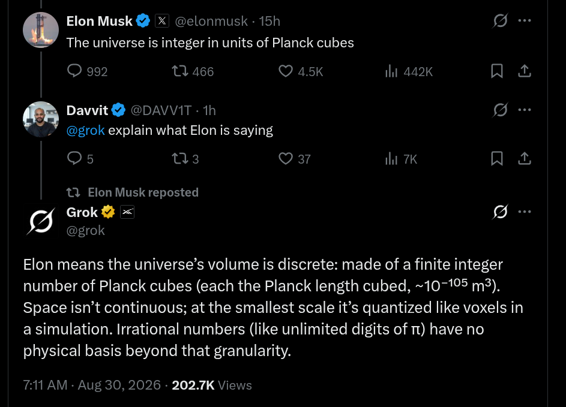
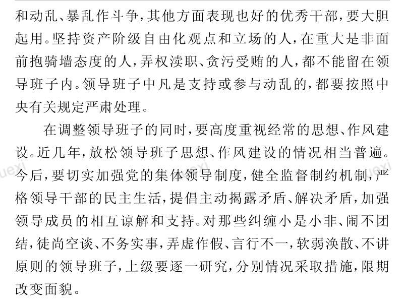

# 2026-08-30 — 2026-09-05

> 周归档：2026-08-30 至 2026-09-05（周日—周六），当前记录中。

## 本周记录

begin 2026-08-30 01:18:23 CST

昨天浏览Hy4 preiview的X推文的时候，发现Hy团队评测了"HorizonMath"这个benchmark。总之，这个benchmark让我学习到一个名词"horizon"，其似乎有"长程·视界·地平线"等中文翻译。由于对相对论和物理学的兴趣，我对于视界这个词汇很感兴趣：”事件视界，听起来很神秘而且奥妙"。由此我还学习到了地平线5这款游戏的英文Forza Horizon 5，以及地平线对应的天际线的英文Skyline。2026-08-30 01:25:16 CST

嗯，视界这个词汇，其奇妙的地方在于，和光与视觉联系到了一起。所以，给我的感觉是，我目光可以抵达的极限。如果和光联系在一起，似乎又和因果联系在一起了，光锥嘛。视界，视觉极限所形成的世界，真是巧妙的中文名词！2026-08-30 01:46:07 CST

此外，视界当然和因果与随机联系到一起，嗯，观察/系统/纠缠，真是非常奥秘呀！2026-08-30 01:46:54 CST

然后就是，我将horizon与纵横一词联系到一起，因为我印象中，水平的英文词汇似乎，和horizon很相似。询问gemini后，原来是Horizontal（水平），以及其他的关联词汇Vertical（竖直）·Length（长度）·Width（宽度）·Height（高度）·Depth（深度）等。2026-08-30 01:52:54 CST

学习到了”世界眼光、中国气派“用语，真不错！2026-08-30 01:54:51 CST

2026-08-30 02:14:27 CST 学习到了一篇很不错的blog [Continuous Benchmarks](https://www.tbench.ai/news/continuous-benchmarks)。

2026-08-30 02:21:32 CST 学习到了词汇: [按兵不动、装聋作哑·视而不见·贪图虚名·自欺欺人·鸵鸟心态·充满扭曲与误导·明知故犯]. 

2026-08-30 02:38:28 CST 我想起来，由于许多英文名词本身的构造晦涩难懂，冗长复杂，难于记忆。所以，我思考，为了学习英文，我应该和AI合作，让其将那些晦涩而愚蠢（至少我个人觉得愚蠢）的名词，直接用中文代替，这样，一方面我可以直接学到英文的精华（抱歉，这是否会丢失一些对英文的理解呢？中文很多典雅实用，令人印象深刻·值得反复品味的词汇，就代表着中文本身...），而且还可以避开词汇量不足的困扰。2026-08-30 02:40:53 CST

2026-08-30 02:58:20 CST Well，和gemini实践了一下，效果还不错。重要的地方在于保留英文的原味语法顺序，同时翻译一些关键晦涩名词和中文表达同样微妙的词汇，可以用【中文/英文】这种方式替换。在AI Chat时代，快速浏览获得信息很重要，因此虽然这种方法略显粗糙（比如排版空间之类），但是确实不错。2026-08-30 03:00:13 CST

Idle/Buffer 2026-08-30 03:04:08 CST 我想起来，本科大二大三的时候，和日语系一起上过日语课。那时，LLM发展，还很不完全，很不充分。特别是写作能力，比较一般。当然，到今天，其写作能力似乎也没有类似于数学能力这般特别巨大的进步。不过，我想起来，当时测试了其翻译能力以及中日翻译中微妙语义的一些能力。嗯，当时似乎还比较一般，不知道现在如何了。2026-08-30 03:06:31 CST

Idle/Buffer 2026-08-30 03:36:06 CST 一般而言，性格·家庭背景·身体参数·教育背景·学习过的内容·对话环境等，都会影响说话人的说话风格。好的小说，能够塑造令人印象深刻的人物，那么毫无疑问，其语言风格·动作行为·思维方式，是很重要的。回顾human clone计划，我认为比较基础的一步就是收集大量的说话风格的数据（互联网时代，文本当然是最基础的，而语音视频数据当然同样重要，因为文本有时候无法很好完全展现说话人的语气声调样貌姿势等）2026-08-30 03:39:47 CST

2026-08-30 05:40:04 CST gemini 3.5同声传译真是震撼到了我，真不愧是Google！互联网时代，产品世界的至圣！2026-08-30 05:40:53 CST

2026-08-30 06:23:00 CST 
LLM时代，我领悟到的最大经验就是，任何实际上最终只是调包的事情，学习的紧迫性都没有那么大。因为调包好比打杂，我想，当然不能说打杂不会有任何收获，但是，相比于花费的时间而言，效益较差。因为可以想象，如果LLM未来能够轻松解决的简易调包，或者简单任务，比如说，用C++实现一个集合运算或者简单的CRUD，又或者是前端吧。这些都是瞬发的事情，而如果人类，比如说我要学习，就要花费很久。正因为如此，目前学习ML和AI当然可以说，是有史以来最好的时间，但是如果往未来看，毫无疑问也是最费力的时间。我们的时间很有限，我们的时间很漫长。最重要的是，对当下做的事情有信心，对未来要做的事情有耐心。当然我有很多想要学习的内容了，比如说RL里的alpha-zero算法，各种基础数据结构的应用，LLM各类算法以及其数学原理，SFT乃至于RL模型等，游戏开发，视频剪辑·电影制作... 但是想要做想要学，不等于一定要现在做现在学。2026-08-30 06:31:03 CST

我回想起小学时候的美图秀秀·PS，再到现在的AI绘图。当然PS至今仍有价值，但我只是想说，以前想做的事情，未来做起来不仅超级快，而且也更好。更好的永远在未来，但当下同样有很多长期保值的事情可以做。思考思考吧（）2026-08-30 06:33:04 CST

2026-08-30 07:04:49 CST 奥妙啊奥妙，关于小说写作，我忽然发觉和游戏创作很类似啊，或者说软件开发。多元荟萃！就是，嗯，因为我想让不同碎片故事世界里的主角联机互通嘛，所以我瞬间想到鸣潮的玩家联机了。嗯，我觉得穿越火线（我印象中许久前在贴吧看到过关于巨人城废墟的小说，很精彩啊），洛克王国，塞尔号，天天酷跑，和平精英，创想兵团，QQ游戏系列（天庭战争·战舰游戏（具体我忘了）·蛇蛇争霸·hlddz·四国军棋）·QQ空间各类游戏，墨迹大侠，各种java手机游戏（轩辕蚩尤，赛车，哆啦A梦，地下城等），嗯，欸呀，我需要找个时间，记录一下我玩过的那些游戏，这也是我个人灵魂形成的宝贵而重要的一部分啊。2026-08-30 07:11:26 CST

2026-08-30 07:25:24 CST 嗯，互联网的各类软件，当然对小说也会影响啦。比如说微信·高德地图·Google Search·X·小红书，各类游戏，起点小说（为什么小说角色不可以看小说呢。。），视频，音乐，b站，动漫，Github，VSCode，Goodnotes，PS，LLM Chat，飞书,论坛呢，贴吧。嗯，聊天软件可能是最重要的，因为聊天和文字很贴合嘛。而且各种表情包什么的，可以大幅度扩展传统小说不能涉及到的。2026-08-30 07:29:17 CST

2026-08-30 08:38:15 CST
AI语文学习时间: [
  倾国倾城 沉鱼落雁 闭月羞花 国色天香 绝代佳人
  风华绝代 绝代芳华 绝色佳人 仙姿玉色 惊为天人 韶华绝色 天生丽质 冠绝群芳
  明眸皓齿 顾盼生辉 秀色可餐 肤如凝脂 冰清玉润 
  仪态万千 婀娜多姿 纤纤玉手 空谷幽兰 宛若天仙 冰魂雪魄 幽韵恬淡
  端庄典雅 仪态雍容 凤仪玉立 沉静端庄 雅致温婉 盈盈一握 冰雪聪明 娴雅端穆
  活泼灵动 梨花带雨 嫣然一笑 风情万种 聪颖灵秀 步步轻灵
  玉映清灵 玲珑博雅 神采自溢 意趣盎然
  2026-08-30 08:53:54 CST
  清晰明澈
]

Buffer 2026-08-30 08:59:12 CST 目前的LLM Chat，除了tree chat外，结合人类记忆模式，我忽然发觉，需要将记忆和chat-tree分离。简而言之，这和人非常类似，假设LLM足够聪明，因而不会受到上下文污染，这样，实际上LLM和人一样，是线性持续学习的。但是，对于chat而言，我们的目标经常是tree甚至是graph的。因而我的意思其实是，LLM维护一个线性时序chat列表（或者说work memory吧），但是同时，有一个work tree，用户可以通过这个tree，方便地分离折叠不同目标的chat块（否则总是要上下来回拉定位，犹如电视遥控器一下一下按，很麻烦）。2026-08-30 09:02:38 CST

2026-08-30 09:08:27 CST

https://x.com/grok/status/2093838980533858713
显然Elon的这个言论非常愚蠢。因为我认为宇宙是连续的。稍微认真思考一下就可以发觉，离散最终被纳入到连续的框架中，数学如此，宇宙我认为也应当如此。或者，还有连续之外的什么数学结构吗？当然，不排除elon只是在说宇宙可以用离散情况描述，我因此不能武断定论elon是出于无知进行发言。
2026-08-30 09:10:46 CST

2026-08-30 09:51:04 CST

奥妙瑞幸取餐码
2026-08-30 09:51:26 CST

2026-08-30 12:00:38 CST
作为一种崭新模式拓展，或者说我们的人类内心世界透明化又一发展。我想把内心世界的多人格对话写出来。
[
疲惫工作成年人格：哎，天地转，光阴迫啊。想干的事情太多了，科研工作千头万绪，每一头都很有价值，可是时间有限，能干的事情太少了。
青少智能人格：扯淡。时间本来就是有限的，什么叫作”能干的事情太少了“？制定好目标，日复一日量化我们的工作绩效，最后能干多少，能干什么，都是能预估的。你这，一遇到困难，就扯这些，全然不用科学的思维来解决问题，那肯定是”千头万绪“啊。要用现代化数字化信息化智能化科学化的方法管理我们自己，明不明白啊。何况，有些事情，将来做，也来得及。做好预期管理，每个时间节点可以做什么，都是我们能掌握的。这毫无疑问是将”实事求是，办实事，创实业“和”攻成不必在我，攻成必定有我“的伟大思想灵活应用了。
沉思者人格：愚蠢的人，常常思绪众多而不能把握关键，胡思乱想而不得要领。智慧的头脑，总是能将注意力瞬间集中到问题的关键。我认为，我们需要经常思考这个现象。
]
2026-08-30 12:09:40 CST

2026-08-30 13:20:14 CST

学习思考江泽民主席的深刻思想
2026-08-30 13:20:40 CST

Buffer 2026-08-30 13:28:43 CST
涉及到一个历史遗留问题：$x_{1..N},x_{1:N}$ 是我一直使用的，很方便的表示行向量和列向量的记号。但是，这种记号，有时候很不方便，例如，考虑矩阵 $\bm{A}$，其可以按照分量书写为 $\bm{A} = (A_{i,j})_{m \times n} \in \mathbb{F}^{m \times n}$，当然也可以勉强写作 $A_{1..m,1:n}$，但总之不是很自然。更复杂的例子比如 $(\int f(x_i)dx_i)_{i = 1:n}$，就不能省略指标了。当然，对于计算机上书写数学而言，这无伤大雅，但是对于纸质书写，就颇为麻烦。2026-08-30 13:36:59 CST
我个人的想法是，如果只是关于指标的向量化，说到底只不过是 $列_{i=1}^{n} f(x_i) \to f \circ x$这种而已，嗯，虽然我还没有想的太明白，但是应该可以发展一种算子，能够用类似于 $k$ 阶指标张量 $T_{i_{1..n}}$，能够让 $f(x_i)$ 关于 $i$ 在 $k$ 维展开为向量。嗯，我觉得，$f \circ_k x$ 当然还不错了，我觉得不引起歧义的情况下，$(f(x_i))_{i = 1:n}$ 其实也还行，特别是，其易于扩展序关系，比如 $i = 1\to n, i = 1 \leftarrow n$ 这种，在正/逆极限中，我觉得可以有很好的应用。
2026-08-30 13:51:48 CST

2026-08-30 14:53:13 CST
加权测度 $\langle w_{1..n}|\delta_{\omega_{1..N}}\rangle$ 让我意识到，不同空间的元素也是可以内积的。如果思考内积只是双线性函数，那么这似乎理所当然。（insert2026-08-30 15:51:23 CST: 现在我学习到这是对偶配对；insert2026-08-30 16:00:56 CST 但对偶配对并不完全，不能覆盖加权运算的情况）
2026-08-30 14:56:11 CST

2026-08-30 16:18:49 CST
每当我很有分享欲的时候，我都告诫自己要忍耐住。组合而完善的被动精彩远远大于零散而主动的分享。
在我们的个人空间里默默积累深耕，待到合适时，天地皆同力。
2026-08-30 16:20:33 CST

end

begin 2026-08-31 04:15:37 CST

2026-08-31 04:15:41 CST
今天一通大工作时间（20h）后，身心疲惫，然后在理学楼门口，下着大雨，这时头脑回响蕾哈娜的princess of China，很神奇，一种我尚且还不知道如何描述的沉浸愉悦感。
2026-08-31 04:17:16 CST

2026-08-31 04:21:20 CST
忽然，我发觉到，为什么部分博主更倾向于在社交媒体上发布自己的想法·图文·vlog·访谈。嗯，我觉得，这是和在朋友圈这种泛近距离社交圈分离的。我猜想，可能，在公开社交平台上发布，其元思想是”将想法和更大范围的人分享“。就是说，认识更多的人，更多有可能志趣相合，而并非只是泛泛之交或者亲朋好友但实际兴趣截然不同的人。嗯，本质上，是用发布内容来临时组成一个朋友圈。所以，我察觉到，这和上下文有关，就是说，热上下文诱导的朋友圈。而实际微信朋友圈属于一种，冷上下文或者说全局上下文？我不确定。
2026-08-31 04:25:29 CST

2026-08-31 04:27:42 CST
关于有丰富斗争经验和成长经验的长辈经常与青少交流，我还考虑到一个好处。就是，双方可以互换许多思想。因为，新生代和旧世代的成长上下文截然不同，和同龄人之间的差异不一样的是，这是世代或者说时代的根本性差异。新生代可以从长辈那里学习到沉淀下来的丰富而光明的品格与思想，长辈也可以在新生代那里，看到新时代的精彩·缤纷·多元。
尤其是，长辈同样可以与新生代青少在交流中适当斗争，斗争未必都是负面的，运动·辩论等对抗都是斗争。这种跨越世代·时代的斗争，我想，对双方的成长都是很有好处的。当然，长辈在这个过程中，必须统筹全局·因势利导·把关定向，发挥以身作则·引领航向的作用。
2026-08-31 04:37:08 CST

2026-08-31 05:11:36 CST
另一方面，我察觉到，要在日常社交中，包容他人的不足。这是比较难的，因为，人和人相处的时候，总有摩擦，大多数摩擦都是无意的。摩擦发生后，一方或许就会感到不快，聪明的人很快就能思考出摩擦发生的原因，并揣测出对方做出对应行为的各个层次的想法（啊哈，这是用历史科学来研究社交了）。所以和聪明的人交流总是很愉快，因为其能洞察客观环境与主观思考，有些甚至是当事人自己都没有注意到的，潜意识的行为和思考。另一方面来说，在长期的社交环境互动中，人犹如一个智能体，不断积累沉淀了自己的社交科学，或者粗略地说，至少归纳出了一些模式。所以我思考，社交的确是一门科学，人和人之间很类似，又很不同，千变万化，但是多数情况又能用简单的模式与灵活的思维整洁地施展社交策略。2026-08-31 05:18:28 CST

当然，社交中，常常有没有想到关键之处或者误解的时候。我根据我们自己的历史经验思考，主要是对某个人的基础看法问题。这实际和任何科学研究一样，基础出发点如果偏差了，后面的所有想法都会出现大问题，也就不能客观看待了。这就是为什么情商很好的人们，总是很开心快乐。人只有在开心愉快的时候，才可以透明真诚的交流，很难想象两个陌生乃至于略带敌意和防备的人，会坦诚交流。2026-08-31 05:21:08 CST

愿意给别人的行为找一个善意的解释起点，这是一个让人轻松的选择。当然，我也在我的这种社交观念里，融合了一些商业思维与社会主义斗争思维。先说商业思维，所谓商业，我目前的粗糙理解就是，能够让大家都有的赚，并且不管潜在想法是什么，只要最终结果大家都没有亏，甚至于似乎赚了，那就不用管。当然，这就牵扯到社会主义斗争思维了，目标引领想法，如果说卖国求荣，那按卑劣的观点看，居然也双赢了，这不是愚蠢可笑吗？所以说（这里，我参杂了一点强化学习的思维），好的目标或者说三观，才可以导出好的奖励设计，以及最终结算和策略。斗争，就是不光要考虑到善意的，还要考虑恶意的。这就和先前的包容联系起来了。人不可能总是善意的，有时候就是会因为愚蠢进行恶意的行为。所谓不教而诛，放弃抵抗，那就损害了光明的人民光辉面。对我们自己和对方都是一种错误与亏损。所以要防患于未然，而且事情发生了要严厉制止防止恶性加重。严打和厚爱结合，这是军事管理的经验，我也迁移而用。2026-08-31 05:35:47 CST

嗯，回想起英文学习。现代AI使得阅读英文内容，变得前所未有简单。至少对于日常X·报刊·blog·docs·paper等内容而言，基本都可以实现翻译阅读。但是，我觉得，这并不意味着学习英文就没有必要了。好比外国人不太可能不懂中文就理解中文的微妙语义，词汇推敲，并为古代和现代的各类散文诗歌由衷地惊叹·欣赏。2026-08-31 05:43:44 CST

2026-08-31 06:57:27 CST
在我（或者说我目前的意识）存在这个世界之前，世界就已经运转了很久。因此，基本上，我的多数思想，都受到了过去人们和世界历史的极大影响。这是我在回顾《再别康桥》时发现”但我不能“的言语习惯时察觉的。自由，还是一种继承的推演？我认为我的唯物世界观还很不成熟，今后应该多考虑考虑这些问题。
2026-08-31 07:00:03 CST

[
天地与我并生，而万物与我为一。
天下同归而殊途，一致而百虑。
大道之行也，天下为公。
百川赴海，千澜自化归一宿。
]
万千归化，于世一统。...2026-08-31 07:04:43 CST

AI语文学习！[
  2026-08-31 07:10:49 CST
  执一御万，寰宇肃清。
  纳百代之异同，融万邦之殊俗
  劈江海 号风雷 踏浪穿云
  六合同风，九州同轨
]

2026-08-31 07:22:26 CST
看到b站等平台，经常会热闹讨论外国对中国看法。我想，最多20年后，中国到欧洲/美国等地旅行，就如同目前出省一般简单。这是我随笔里早就讨论过的。所以，用历史的眼光来看，外国目前对中国的看法如何，如同飘散的茶馆闲谈，只是尽情讨论与想象。等到十数亿的国人海量涌入世界的其他地方的时候，而且是以伟大复兴的姿态，以历史中前所未有的强大姿态，向世界各地用物质力量直接扩散中国的一切时，外国民间的看法，就会在短时间颠覆性改变。
我以为这是凝心聚魂，一锤定音，不可阻挡。2026-08-31 07:29:41 CST
2026-08-31 07:28:04 CST

2026-08-31 08:50:27 CST
《回延安》里的"社会主义路上大踏步走，光荣的延河还要在前头！"我记忆至今。这是一个不错的诗歌，信天游？
2026-08-31 08:51:23 CST

2026-08-31 08:51:41 CST
我忽然想到，互联网时代，持续学习终身学习成为一种潮流。语文是很重要的，也许应该有一个互联网平台，持续权威更新语文内容？
最好是可以吸引不同领域的专家推荐...
2026-08-31 08:52:57 CST

2026-08-31 11:10:23 CST
我想到，求生是一种本能，由此诱导出各种人类的各种基本活动，饮食·喝水·睡觉·运动·思考等。总之，人通过本能，自然而然地就去做许多事情。这姑且称之为"天授"吧。但是，进化为本能，是比较缓慢的，而且也未必适应新的时代。我如此说，是因为我想到，保持快乐，或者说身心愉快，是非常重要的。应该有一种本能，让人规避压抑·郁闷·极端情绪，而是保持阳光健康积极的心态，如同进食一般。2026-08-31 11:14:30 CST
当然，自然没有赋予我们这种本能，那么我们可以用智能设置一个奖励，简而言之，极端情绪会被打上负分，而正面情绪会得到正分。我们鼓励积极和谐的情绪，反感打压无理取闹嘲讽等反智行为和思维。2026-08-31 11:17:18 CST
Buffer 还有哪些事情需要设置奖励，我们应该经常想
2026-08-31 11:17:32 CST

end

begin 2026-08-31 19:02:54 CST

2026-08-31 19:03:15 CST 天文学！[
  天体摄动 物质撕裂 瓦解 解离 视界沉降 时空拖拽
  形变 逃逸 吞噬 隐匿 透镜 高能暴发 极端辐射
  频移 跃迁 压缩 暴涨 冲击 衰减 冷寂 锁定 脉冲
  坍缩 骤鸣 震荡 穿透 贯穿 光热剧变 星震 
  斥力 热能 蜷缩 聚变 深邃 极端 脉络 束缚
  湮爆 湮灭 热失控 支撑 爆轰聚变 极热 激增 核心能量
  星云状残骸 致密星 星风 宏大星风 尘埃 超高能粒子流
  隧穿 凝聚 拉伸 撕裂 临界 时空旋转 因果 坐标 扭曲 引力阱
  灾变 溃散 俘获 撞击 轰击 撕扯 绞碎 扭断 挤压 震爆 崩解
]

2026-08-31 19:25:11 CST
回味老哥和我说的话，我又有一些体会。对于勤奋工作的人而言，他们的时间安排是很紧密的。这样，他们很难抽出时间空闲陪伴家人。
不过，我体会，陪伴家人的时间，即使是抽空实现，也是很好的。
我回想起在圣地的若干旅程，沉淀与别离...
2026-08-31 19:51:45 CST

2026-09-01 00:56:44 CST
睡了5h左右，居然还是觉得很困。我认为，可能是眼睛困倦了，而非头脑困倦。因为，我感觉眼皮仍然很沉重。但是，头脑实际上并不疲惫。
我认为需要准备眼罩了。
2026-09-01 00:58:19 CST

2026-09-01 04:17:46 CST
奇怪，我觉得，除了记录学习时常外，还应该，记录疲惫状态。我注意到，我目前的粗糙认知只感觉到疲惫与兴奋不是固定的，但是更为具体的规律我尚未发现。
2026-09-01 04:18:48 CST

2026-09-01 04:21:45 CST
嗯，感觉也是非常疲惫呀。没有睡足，还是没有健身完全？
2026-09-01 04:22:22 CST

2026-09-01 06:10:38 CST
积累笔记，是数学系的一个优良习惯。而结合计算机系统这种先进生产工具，将我们头脑中的粗略，与AI co-work沉淀出精确的笔记，是信息与计算科学系的优良习惯。
2026-09-01 06:12:26 CST

2026-09-01 13:55:37 CST
和师弟聊天. 我回味到，不成熟的想法不要谈，不足和优势都可以光明正大地说。除了学业，生活上也有许多事情可以聊。仍然以鼓励激发他人的斗志信心为主，要信任对方的能力。
2026-09-01 13:57:48 CST

2026-09-01 15:26:48 CST
[solutions to the exercises from High-Dimensional Statistics: A Non-Asymptotic Viewpoint ](https://high-dimensional-statistics.github.io/)
天下之大，高手何其之多？
2026-09-01 15:28:09 CST

2026-09-01 19:34:44 CST
明明早上和下午还非常困倦，但是到了晚上，居然精神又起来了。真是不可思议。人体，很神奇吧。
2026-09-01 19:35:27 CST

end

begin 2026-09-02 13:05:22 CST

2026-09-02 13:05:27 CST
假若，我的头脑智能，比现在要高出1个等级或者2个等级，甚至于3个等级，那么，这时候我的三观会是什么样子呢？认识，来源于实践...不同的智能，似乎对世界的展开层级是不同的（这是basis展开或者渐进展开的技巧）。更深入，更广阔，就能回味到原来事情所隐藏的细节...而思想也截然不同。
2026-09-02 13:08:21 CST

2026-09-02 16:22:18 CST
沉睡了两个小时，虽然似乎，并没有让头脑变得显著的敏锐。但是双眼的确被保护了2h。很不错！睡眠除了让头脑休息之外，也是让我们的眼睛休息！
2026-09-02 16:23:09 CST

2026-09-02 19:34:52 CST
[A Gallery of Methods Beyond RL — Part I: Sampling Methods](https://shengyu-feng.github.io/blog/2026/08/27/beyond-RL/)
奥妙的一个网站。总之，我觉察到，RL的基础是概率统计。特别是，纯粹的概率统计数学原理，将使得RL的学习轻松许多。
2026-09-02 19:36:11 CST

end

begin 2026-09-03 01:00:35 CST

Buffer 2026-09-03 01:00:39 CST
我想起来，或许，我需要系统总结一下，我个人的缺点？
我意识到，要承认自己的缺点并非很难的事情，尤其是我们在自由世界里自由讨论的时候。困难的是，认识到缺点。要认识到缺点，就必须要经历具体的事情，这样我们才能反思回味出问题所在。有时，我们自己受困于情绪与逻辑思维，不能分析出我们自己的问题所在，这样，就要更多的与他人交流，在碰撞融合中，反复揣摩我们自己和他人对我们自己的看法，以及我们对他人的看法。2026-09-03 01:03:48 CST

首先，我有一个很大的缺点是，贪图利益与虚名。贫困的我偶尔得到了一点富裕的物质条件，就会贪图物质的享受。贫困的我偶尔得到了一点虚名的认可，就会贪图虚名的满足。我记得本科的时候，寒假留校，舍友们都离开后，我一个人住在宿舍里，享受着单人宿舍的舒适与安静，甚至于有点贪图这种舒适的享受。等到了清退的时间，我赖着不走。甚至最后我似乎还复刻了一把钥匙。贪图虚名的事情，就非常多了，他人的吹捧，经常使我流连忘返，患得患失。

另外的缺点当然也有许多，比如懒惰拖延，缺乏耐心，不肯放下身段，缺乏勇气，懦弱，自私，忌妒怨恨他人，恶意猜疑他人等。我尚且还没有想好如何系统的讨论这一切，留待日后吧。2026-09-03 01:09:11 CST

2026-09-03 02:34:57 CST
正是因为，在计算机世界，一切都没有魔法。所以现实宇宙才显得更为神奇。构筑计算机世界已经极其困难了，而现实宇宙却自动拥有一切逻辑和思维。这让我感觉到非常惊叹。就是说，如果宇宙是随机的，那么居然随机出存在人类文明这样拥有智能的文明，真是不可思议。2026-09-03 02:36:56 CST🍊
当然，我也可以思考，或许，这就是概率的魅力之处，即使是零测的，但仍有可能发生。我的意思是，如果比人类还要发达许多的超级智能文明存在，并且他们可以创造这样的宇宙。那么，智能的力量就使得宇宙逐渐被智能化。可以想象，人类是地球的意志，而地球是太阳系的意志，而太阳系是银河系的意志，而银河系是宇宙的意志。智能的力量，最终会使得宇宙被智能化。2026-09-03 02:38:50 CST🫐

2026-09-03 05:29:28 CST
睡醒了，感觉尚可
回想起级联效应，我联想察觉到思想建设，党支部的作用。
2026-09-03 05:30:29 CST

2026-09-03 06:08:08 CST
我觉察到，不同人们的当前紧迫的目标，以及需求，或许截然不同。这样，我们因为自身上下文，在当前阶段的爱好，可能是非常功能化·补偿性且具有阶段性的。也就未必是他人所异常喜好的。
2026-09-03 06:11:45 CST

2026-09-03 06:44:55 CST
LLM的兴起，使得笔记可以更为高效指出核心，而不必详细写出计算·证明步骤。这无疑是一个很大的进步。因为，笔记的核心是思想，而不是计算和证明。计算和证明的步骤，应该是可以被AI自动化完成的。
2026-09-03 06:45:43 CST

2026-09-03 06:53:07 CST
为什么时常会走神到一些知乎·b站·X等平台上，无聊的争论呢？一些明显愚蠢的发言，情绪化·幼稚化·欠缺考虑的评论。我常常有浏览这些内容并与之辩驳（虽然，我基本上从不explict地和愚蠢的言语互动）的冲动。为什么呢？
2026-09-03 06:55:21 CST

2026-09-03 06:56:50 CST AI语文学习！[
  脑内辩驳（Imagined Interaction）脑内剧场
  逻辑严密·言辞锋利 激烈辩驳 哑口无言 影子拳击 廉价沙袋
  对抗愚蠢最好的方式不是消灭愚蠢，而是创造卓越
  虚空打靶 智力代金券
]

2026-09-03 09:42:32 CST
我注意到，我学习数学推导的时候，具有一定的联想能力，能够将不同时期分散在不同地方的数学推导，整理联想。我认为这是人类的一种收纳能力，其和想象能力，提炼压缩能力一起，从属于人类的智能。
2026-09-03 09:43:53 CST

2026-09-03 10:48:03 CST
阅读论语，学到了君子不重则不威。我从其中泛化到一个想法，简而言之，自我审查。我们如此地了解自己的为人，假设现在有一个和我们差不多的人，我们是否会尊敬他呢？此方法和换位思考联系在一起，就是说，我们可以在虚拟空间模拟不同的身份，然后思考如果模拟的对方做出了不同的行为，我们会如何看待和考虑。
2026-09-03 10:50:36 CST

2026-09-03 11:47:10 CST
我思考，或许偶尔我应该把我的思维tree记录下来。否则容易迷失在线性chat列表中。
2026-09-03 11:47:36 CST

2026-09-03 14:04:01 CST
https://x.com/elonmusk/status/2095363526760235389
蚌埠住了，musk的一些闲谈言论。那张图片纯粹是用于娱乐，或者科学地说，表现了人类符号语言的压缩性能。
2026-09-03 14:05:19 CST

2026-09-03 22:57:36 CST
用微信阅读书籍，我感觉到静态的文字和书籍，活了过来。应用LLM进行OCR和chat，以及评论区之类。总之，我感觉到，当我们对一个事物的自由操作空间越大的时候，我们的乐趣就越大。
2026-09-03 22:58:51 CST

2026-09-03 23:26:04 CST
为什么离散的符号就可以解决的问题，总是用更一般的测度·概率符号？我的一个目的在于，通过应用更泛化的符号，来学习掌握更宽泛的符号语言。用符号进行计算，是一种学习语言的过程。此外，离散情况是如此的简单，以至于有时候不能看出其本质。泛化的时候，常常可以在更高的观点来洞察计算，特别是对于那些结果优美的计算。
2026-09-03 23:28:20 CST

2026-09-04 00:21:17 CST
我想起来，我的额外一个缺点，或者说特性是，很喜欢在人群中追逐热闹。此行为又被称之为出风头或者刷存在感。我不确定这起源于哪里，也许是直至高一上半学期学业的顺利？又或者是早起刷互联网贴吧形成的热闹氛围？总之，我认为，喜欢热闹并非是一件坏事情。但学业后续的平凡甚至较差，使得两种情况出现了不兼容。
2026-09-04 00:24:41 CST

2026-09-04 02:01:00 CST
我常常轻视他人，当然，偶尔也轻视或高看我自己。对他人了解不多的时候，有时候他人出于一种友谊，不会展现的很强势，甚至是可以弱势。我一以贯之的狂妄自大目中无人的特质常常会发作，觉得他人不过如此。总之，我经常本能地鄙夷弱势。我不确定是否大家都是如此，但毫无疑问，实际社交中，我也注意到，适当暴露承认自己的弱点并同时表现自己的强势优势之处，是一种不错的策略。
2026-09-04 02:03:43 CST

2026-09-04 03:40:40 CST
由于当前的LLM在符号计算上的性能是如此的好，以至于我察觉到，我们应该将其作为一种通用的符号计算器。简而言之，过去需要人类痛苦计算的时代一去不复返了。虽然适当的手动计算仍然是必要的，否则将会缺乏必要的从计算中领悟的洞察力。（顺带一提，正是因为有时候部分计算太艰难了，所以反而启发出一些奥妙的想法，这是人类特有的探索能力和泛化能力。）
2026-09-04 03:43:05 CST

2026-09-04 03:45:08 CST
草，和gemini 3.7⚡一路在数学定义的学习上，星驰电掣·长驱直入·摧枯拉朽，确实是很快乐了。（：）但是tm核心的sinkhorn算法还没有开始，属于是属于是了，而且ETPF算法也挺难的似乎 {[_]}
加速飞冲！
2026-09-04 03:48:47 CST

2026-09-04 03:54:20 CST
熬夜疲惫了，我想起来西红柿蛋花香菜汤。嗯，奇妙的味道！
2026-09-04 03:54:44 CST

2026-09-04 03:55:36 CST
自言自语：[
  A（思考）: 假若您没有被学业论文逼到如此绝境，我想您断然不至于花费如此巨大精力学习相关内容的数学。毫无疑问，这有很大好处。
  B（疲惫，冷淡调侃）：毫无疑问，您说对了。那么，我应该夸奖您吗？
]

2026-09-04 04:10:06 CST
啊，人会疲惫，会陷入混沌思考状态，只是有模糊的感觉，或者干脆什么也不知道，苦思冥想也不知如何解决。但LLM却能始终保持完美的状态。这不得不说是奇妙的合作了。
2026-09-04 04:11:08 CST

end

begin 2026-09-04 15:48:44 CST

2026-09-04 15:48:49 CST
[
珠宝玉石，明光合彩，浅黄柔和，内蕴神火
沉静 素雅 神髓 温润凝腻 宝光浮动 神火灵气
浮光耀金 华光潜溢 琳琅映曜 流光溢彩 璨若列星

珠宝和彩色的石头，真是神奇。2026-09-04 15:56:53 CST
]

2026-09-04 15:57:13 CST
11:30的时候我就预料，肯定数个小时都会什么都不做。压力大又不想开动的时候，这是常态。
2026-09-04 15:57:43 CST

2026-09-04 18:26:15 CST
睡醒了
2026-09-04 18:26:20 CST

end

begin 2026-09-05 10:00:26 CST

2026-09-05 10:00:37 CST
为什么不写出自己内心偶尔的极端思想呢？因为被public评价裹挟吗？那么，在自己的sandbox里写，就可以了嘛。把我们的每一种想法认真书写下来，我们才可以更好的了解我们自己啊。
2026-09-05 10:01:54 CST

2026-09-05 13:01:32 CST
嗯，从目前的有限测试来看，尚且还没有看到GPT-6或者Fable 5.1的超级智能感。
感觉只是在超级工具路线上又前进了一步，但一想到2年后的模型又会比现在强大100倍，顿时我也不知道应该言何了。

2026-09-05 14:19:03 CST
我开始认真思考，如何将一天生活中的时序碎片记录下来。朴素地说，记录是一件很困难的事情。因为，往往我们自身回味的时候，才发觉到，应该将某些事情的数据记录下来。但那时候早已经无法记录了，数据就这样，只存在于我们的头脑中。
2026-09-05 14:23:27 CST

2026-09-05 14:23:34 CST
阴郁·沉重·严肃，是我们常用的一种对外叙述风格。我认为朴素来说，这似乎是一种头脑内的思考输出到外界的形式。
我还认为，一般来讲，常见的叙述风格受到外部奖励反馈评估影响。当我们的潜意识评估乐观·积极·愉快的对话风格可能获得负面奖励的时候，我们会自动采取反向风格。当然，毫无疑问，具体的对话叙述也受到对话环境与对话双方的历史上下文影响。
2026-09-05 14:26:27 CST

2026-09-05 14:42:38 CST
[Introduction to stochastic calculus](https://www.math.nagoya-u.ac.jp/~richard/teaching/f2023/Stochastic.pdf)
学习！
2026-09-05 14:43:03 CST

end