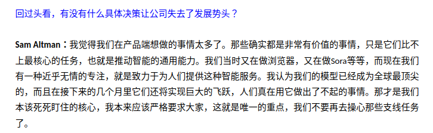

# 2026-09-06 — 2026-09-12

> 周归档：2026-09-06 至 2026-09-12（周日—周六），当前记录中。

<!-- 周容器创建模型：gpt-6-astra -->

## 本周记录

2026-09-06 06:35:11 CST
由于LLM的通用性能，这使得LLM的搜索空间非常巨大。我想说明的是，当然越智能的LLM，其对齐速度应该越快，也就是说，能够越快知道合作者的意图，并揣测其上下文。
我如此说，是受到了数学学习的启发。对于同一个数学问题，求解有许多方式，不同层次的观点，阅读起来的感受是截然不同的。这基本上和不同角度看风景一样。
特别是，深刻的数学方法具有良好的泛化性，并且通常总是易于理解，看起来优雅。顺其自然，迎刃而解。
LLM目前还没有解决审美问题，但是居然其数学能力和代码能力仍在不断进步。我认为这无疑表现出一种暴力哲学。也就是人类美学可以产生出一种巨大的爆破威力，而人类此前没有意识到，或者说头脑计算能力和记忆能力尚且不足。
从这一点来说，美与暴力本质一体，我觉得这是一种信息能量。虽然这只不过是我随口胡说·肆意想象，但是，我觉得美结合计算能力，在智能领域产生原子弹爆炸一般的破坏力，也很正常。
压缩即是智能，除此之外，智能还有许多哲学。目前前沿实验室的LLM尚且还未能够在压缩智能上获得成功（否则没有理由费马大定理的形式化需要1300万行+代码，我合理认为，1/10乃至于1/100的代码，都有可能足够了。或许1/100也就是13万行代码显得太精致，乃至于简直不可能。但我觉得13万行的代码也不简单了。Mathlbi4一共多少行代码呢？大师的Lean4代码总是精致而优雅，偶尔也夹杂一些混乱或者说不可读的技巧性压缩[..])
2026-09-06 06:45:26 CST

2026-09-06 07:24:00 CST
忽然有一个很恐怖的想法。由于人类的审美以及品味，至少目前来说，还是远比AI要好。只不过由于人类智能的IO速度缓慢以及疲劳问题，导致其无法大规模应用。
虽然好的AI算法，应该坚持无师自通，也就是learning-from-zero。但是如果说，能够大规模克隆人类头脑，并且以某种方式提取信息。那么岂不是天然的智能组件？至少在AI也实现人类的同等泛化智能前，绝对如此。
这真是太可怕了，基本上，可以想象，AI一次性克隆10^100次方级别人类大脑，甚至于剋优中选优，或者随机也可以。总之批量化，在不同时空中模拟。反馈的信息源源不断传输回智能中枢，生产数据用于训练。被训练的人类对此一无所知。
也许不止人类，生物有许多。哦，这样的想法并非残酷。因为机械AI本身也在无意识的被训练着。
2026-09-06 07:29:37 CST

2026-09-06 08:09:52 CST ai语文时间: [
  行云流水 浑然天成 返璞归真 真实纯粹 迎刃而解
  山川灵秀 天真烂漫 自然而然 顺理成章 一气呵成 水到渠成
  挥洒自如 如臂使指 信手拈来 举重若轻 游刃有余 随心所欲
  酣畅淋漓 融会贯通 操纵自如 滚瓜烂熟 出神入化 炉火纯青
  臻于化境 尽善尽美 别出心裁 巧妙构思 环环相扣 恰到好处 无懈可击
  相得益彰 相辅相成 各得其所 各司其职 井然有序 有条不紊
  兼收并蓄 异曲同工 万物交融 气象万千
  意趣盎然 气韵生动 神采飞扬 妙趣横生 灵动超逸 跌宕起伏 回味无穷
  顺水推舟 因势利导 春华秋实 瓜熟蒂落 应运而生 无为而成
  一鼓作气 势如破竹 天马行空 得心应手 淋漓尽致

]

2026-09-06 09:27:59 CST
我发现，基本上，GPT-6的证明仍然给我一种抵达即可的暴力搜索感。虽然GPT-6确实能够在人类引导下给出漂亮的证明。但是繁琐的情况则更多。
这基本上使得我开始思考，如何能够构建一类知识库，使得LLM明白什么是简洁，什么是优雅。进而无需我每次都手动提示。或者，也许有什么神奇的提示词可以做到这一点？
2026-09-06 09:29:55 CST

2026-09-07 04:04:36 CST
[Improving Language Understanding by Generative Pre-Training](https://cdn.openai.com/research-covers/language-unsupervised/language_understanding_paper.pdf)
Great! 有空让我尝试一下GPT-1的训练，顺便理解一下transformer！我认为直到GPT-3级别的学习，都是很好的学习材料！
I’m into pretty much anything that sparks my interest!

此表格为Gemini 3.7⚡所搜集，未必准确，但基本上，我认为直到2020年的人工智能的学习，也是很有价值的！
此外，还有四大力学与相对论，我认为我终究有一天会掌握它们的数学原理！
2026-09-07 04:11:08 CST

2026-09-07 05:04:48 CST
想起来一个4399游戏，有游侠，射手什么的。嗯，叫作《国王的勇士》。其开发公司CEO是江苏盐城人商文烨，是一款很出色的游戏。经典的4399游戏还有《冒险王》·《美食大战老鼠》·《西游大战僵尸》...
我认为，游戏始终是一种独特的环境，我想，未来有一天我会有一段长期的游戏开发生活。这并非无端的猜测，当然，我尚且不确定其时间，也许在10年后？
嗯，Great...
2026-09-07 05:09:32 CST

2026-09-07 05:14:02 CST
我思考，对于那些不成熟的想法，在没有完善的研究前，不能随意和他人讨论。这对自己和他人来说都很有风险。犹如未经实验的医药制品一般，是可能有毒的。
2026-09-07 05:14:59 CST

2026-09-07 06:59:51 CST
刷到一个烤栗子的视频。怪不得叫作”火中取栗”，原来是有自然科学原理的！
2026-09-07 07:00:23 CST

2026-09-07 14:13:17 CST
上午老师询问我，中期论文数学原理部分的内容是否都是自己写的。我回答说4.4节并非我亲自书写，因为我尚且还未学到那里。
后面，老师和我说，2次中期补答辩，不要比新生还要差。我说有一年的领先优势，当然不会。
现在回想，我感觉十分羞愧。规格严格，功夫到家。世界一流。正直进取协作创造。诚信为本。我真的记住了这些吗？
不是我自己领悟的内容，我为什么要书写上去呢？宁少勿多，宁缺毋滥啊！
如果说专家询问到部分内容，或者那部分AI书写的内容有明显错误，我该如何处置，又把大家放于何地呢？
2026-09-07 14:17:31 CST

2026-09-07 16:44:20 CST
偶然想到，如果LLM和我说：“啊，你发给我的这文章难懂的要死，我哪能和你讲明白啊！”这种真人对话的风格。应该很有趣才对。嗯，目前的LLM是如此强大的被动智能，以至于它甚至不会主动感受自身。
2026-09-07 16:45:53 CST

2026-09-08 12:01:48 CST
[超任务](https://en.wikipedia.org/wiki/Supertask)，很有意思。我主要考虑如何用测度理论来形式化并具体计算这些任务，以及，是否有可能在现实宇宙（尤其是在计算机中）实现super-task。
2026-09-08 12:02:56 CST

2026-09-08 12:11:03 CST

https://mp.weixin.qq.com/s/9k6tt8LPYT5azGXtjLJotQ
深思.
2026-09-08 12:11:25 CST

Buffer 2026-09-08 12:50:09 CST
嗯，条件期望与条件经验测度，我一直没有开工书写。也是被中期论文所折磨啊/
2026-09-08 12:50:50 CST

2026-09-08 12:52:22 CST
嗯，学习到花瓶悖论。其数学表述为$V_n := \{k \in \mathbb{N} | n < k \leq 2n\}$，则$V_{\infty} = \emptyset$ 但 $|V_n|$ 极限确是 $\infty$。
这个悖论让我想起二分悖论，$\sum_{n\geq 1} 2^{-n} = 1$。基本上，我将其理解为，虽然二分过程是无限的，但只要其收敛，在实体宇宙中就可以坍缩为离散的时间。
为了解决花瓶悖论，或者说，让极限仍然可以形式地交换，而不会类似于只有 $0,\infty$ 一般丢失信息，我想起来超越度或者势之类的概念。就是说，将其中无穷的部分构建一种商之类，从而能够精确刻画其无穷的程度。于是，在商空间里，两者可以交换。
2026-09-08 13:29:26 CST

2026-09-08 15:34:15 CST
学到了一个奥妙的名词：Ultralimit
2026-09-08 15:34:25 CST
居然还有`Ultrafilter ultrafiltration`等神奇词汇，真是不可思议啊。
2026-09-08 15:36:01 CST

2026-09-08 15:42:03 CST
想到我和老师说，”我们要做世界一流的学问！“
回味前辈师兄师姐的论文，哪个学生初始的时候，内心没有雄心壮志呢？
老师见过若干届学生，当然对此见怪不怪，或者说稀疏平常了。
雄才大略·野心勃勃，是一种他人对成功事业者的描述。初始创业者拿来描述自身，未免因水中捞月的愚昧而显得可笑。
脚踏实地·勤奋热情。我认为我们应当多用这些词汇来劝诫警醒鼓励我们自己。
2026-09-08 15:47:15 CST

2026-09-08 17:03:36 CST
分析算法复杂度让我觉察到，如果我吃透算法复杂度的原理，就有很大可能做出算法改进。
2026-09-08 17:04:11 CST

2026-09-08 17:30:33 CST
人设是一种有用的公开资料。简而言之，方便他人快速定位我们自身。因此，最好不要频繁发布一些垃圾或者低质量的公开信息，这会极大程度干扰污染他人对我们的认知。
与之相反，如果我们肯沉淀，长周期发布一些高质量内容，就能够有效改善我们的公开形象，并吸引到志同道合的朋友与合作者。
2026-09-08 17:32:33 CST

2026-09-09 19:41:42 CST
不管怎么说，最近在数学上，还是做出来许多出色的学习成果。从我个人观点上，毫无疑问是可喜可贺。
如何将数学·计算机基础·人工智能·游戏开发等不同的兴趣爱好融合到一起，并做出一个合适的精力规划与发展安排，是我当前主要考虑的问题。
2026-09-09 19:43:19 CST

2026-09-10 10:16:36 CST
看到微信朋友圈里，大家精彩缤纷的生活。我感到很开心很满足。他人分享的快乐，毫无疑问也是我内心快乐的一种来源。
我想到偶尔我会想将一些想法发在朋友圈上，为什么呢？我深刻思考，还是虚荣心在作祟。
一般来讲，目标会深刻影响行动，这是元的思想。所以我认为，我应当今后将不发朋友圈，转而在自我世界里沉淀精彩内容，作为一个新的奖励指标。这是根本性的转变。
在长期的生活实践中，每个人渐渐都感觉到自身适合什么领域，做什么事情能收获到来自自己和他人发自内心的认可。我们必须要认识到我们应该做什么，不应该做什么。偶尔我们会受到一些错误潜意识的干扰，做出错误的行为。我思考，这时就应该透明化记录我们自己的想法，并思考改变的策略，迅速行动起来。
2026-09-10 10:21:47 CST

2026-09-10 16:42:41 CST
电相关的科学和工业，深刻改变了人类社会。人类自身也存在生物电。
掌握电场，或许是超生命的一种基本能力。
2026-09-10 16:43:42 CST

2026-09-10 20:16:20 CST
身处在不同的位置，基本上，会诱导截然不同的想法。
2026-09-10 20:16:50 CST

begin 2026-09-11 11:05:20 CST 
2026-09-11 11:05:45 CST AI语文时间！ [
  逆风而上、重开新天的历史决绝
  大时代中生命与理想的喷薄爆发
  天倾地陷、巨浪滔天的绝境中挽救局势
  风云际会，千帆竞发，百家争鸣
  群英荟萃 俊采星驰 各展所长 五色交辉 姹紫嫣红
  随物赋形 千变万化 随机应变 圆转自如 神通广大 神秘莫测
  自由自在 无拘无束 收放自如 逍遥自得 随心所欲
]

2026-09-11 14:18:01 CST 
睡醒了

2026-09-11 15:02:18 CST
二次中期，但我报告PDF和PPT还没制作的很好，这时候我猛然惊觉，许多有期限的事情，到了期限会有很多额外的繁忙杂乱的事情干扰着主线。所以绝对不能临到终末才考虑。千头万绪的杂事常常在收尾时发生。
提前准备，有备无患。我现在又深刻回味到这句话。
2026-09-11 15:04:37 CST

Buffer 2026-09-11 15:11:57 CST
我想到奖励与阻力带来的反馈调整。在长时间中，我们如何让他人正确调整对我们的策略？首先我们自己必须想好这套反馈的策略。
这对我来说也是一个未知的研究问题，需要以后慢慢思考.
2026-09-11 15:13:34 CST

end