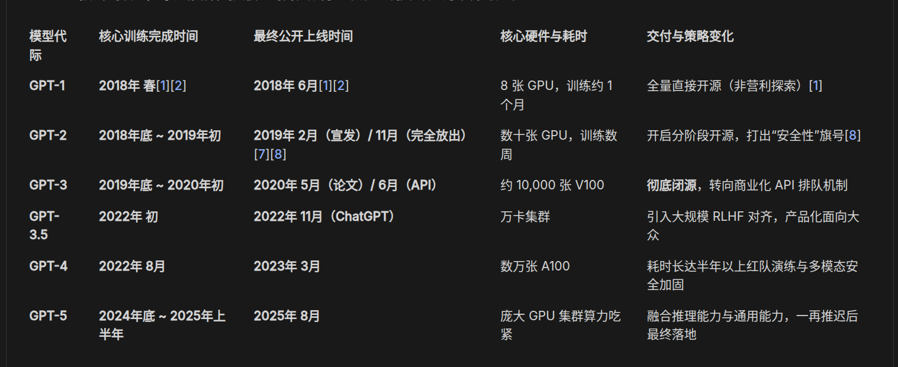

# 2026-09-06 — 2026-09-12

> 周归档：2026-09-06 至 2026-09-12（周日—周六），当前记录中。

<!-- 周容器创建模型：gpt-6-astra -->

## 本周记录

2026-09-06 06:35:11 CST
由于LLM的通用性能，这使得LLM的搜索空间非常巨大。我想说明的是，当然越智能的LLM，其对齐速度应该越快，也就是说，能够越快知道合作者的意图，并揣测其上下文。
我如此说，是受到了数学学习的启发。对于同一个数学问题，求解有许多方式，不同层次的观点，阅读起来的感受是截然不同的。这基本上和不同角度看风景一样。
特别是，深刻的数学方法具有良好的泛化性，并且通常总是易于理解，看起来优雅。顺其自然，迎刃而解。
LLM目前还没有解决审美问题，但是居然其数学能力和代码能力仍在不断进步。我认为这无疑表现出一种暴力哲学。也就是人类美学可以产生出一种巨大的爆破威力，而人类此前没有意识到，或者说头脑计算能力和记忆能力尚且不足。
从这一点来说，美与暴力本质一体，我觉得这是一种信息能量。虽然这只不过是我随口胡说·肆意想象，但是，我觉得美结合计算能力，在智能领域产生原子弹爆炸一般的破坏力，也很正常。
压缩即是智能，除此之外，智能还有许多哲学。目前前沿实验室的LLM尚且还未能够在压缩智能上获得成功（否则没有理由费马大定理的形式化需要1300万行+代码，我合理认为，1/10乃至于1/100的代码，都有可能足够了。或许1/100也就是13万行代码显得太精致，乃至于简直不可能。但我觉得13万行的代码也不简单了。Mathlbi4一共多少行代码呢？大师的Lean4代码总是精致而优雅，偶尔也夹杂一些混乱或者说不可读的技巧性压缩[..])
2026-09-06 06:45:26 CST

2026-09-06 07:24:00 CST
忽然有一个很恐怖的想法。由于人类的审美以及品味，至少目前来说，还是远比AI要好。只不过由于人类智能的IO速度缓慢以及疲劳问题，导致其无法大规模应用。
虽然好的AI算法，应该坚持无师自通，也就是learning-from-zero。但是如果说，能够大规模克隆人类头脑，并且以某种方式提取信息。那么岂不是天然的智能组件？至少在AI也实现人类的同等泛化智能前，绝对如此。
这真是太可怕了，基本上，可以想象，AI一次性克隆10^100次方级别人类大脑，甚至于剋优中选优，或者随机也可以。总之批量化，在不同时空中模拟。反馈的信息源源不断传输回智能中枢，生产数据用于训练。被训练的人类对此一无所知。
也许不止人类，生物有许多。哦，这样的想法并非残酷。因为机械AI本身也在无意识的被训练着。
2026-09-06 07:29:37 CST

2026-09-06 08:09:52 CST ai语文时间: [
  行云流水 浑然天成 返璞归真 真实纯粹 迎刃而解
  山川灵秀 天真烂漫 自然而然 顺理成章 一气呵成 水到渠成
  挥洒自如 如臂使指 信手拈来 举重若轻 游刃有余 随心所欲
  酣畅淋漓 融会贯通 操纵自如 滚瓜烂熟 出神入化 炉火纯青
  臻于化境 尽善尽美 别出心裁 巧妙构思 环环相扣 恰到好处 无懈可击
  相得益彰 相辅相成 各得其所 各司其职 井然有序 有条不紊
  兼收并蓄 异曲同工 万物交融 气象万千
  意趣盎然 气韵生动 神采飞扬 妙趣横生 灵动超逸 跌宕起伏 回味无穷
  顺水推舟 因势利导 春华秋实 瓜熟蒂落 应运而生 无为而成
  一鼓作气 势如破竹 天马行空 得心应手 淋漓尽致

]

2026-09-06 09:27:59 CST
我发现，基本上，GPT-6的证明仍然给我一种抵达即可的暴力搜索感。虽然GPT-6确实能够在人类引导下给出漂亮的证明。但是繁琐的情况则更多。
这基本上使得我开始思考，如何能够构建一类知识库，使得LLM明白什么是简洁，什么是优雅。进而无需我每次都手动提示。或者，也许有什么神奇的提示词可以做到这一点？
2026-09-06 09:29:55 CST

2026-09-07 04:04:36 CST
[Improving Language Understanding by Generative Pre-Training](https://cdn.openai.com/research-covers/language-unsupervised/language_understanding_paper.pdf)
Great! 有空让我尝试一下GPT-1的训练，顺便理解一下transformer！我认为直到GPT-3级别的学习，都是很好的学习材料！
I’m into pretty much anything that sparks my interest!

此表格为Gemini 3.7⚡所搜集，未必准确，但基本上，我认为直到2020年的人工智能的学习，也是很有价值的！
此外，还有四大力学与相对论，我认为我终究有一天会掌握它们的数学原理！
2026-09-07 04:11:08 CST