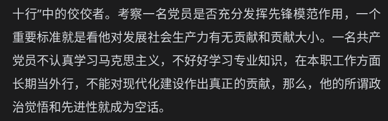

# 2026-09-13 — 2026-09-19

> 周归档：2026-09-13 至 2026-09-19（周日—周六），当前记录中。

<!-- 周容器创建模型：gpt-6-astra -->

## 本周记录

begin 2026-09-13 15:36:51 CST

2026-09-13 17:11:08 CST
思想很重要，我们常常说人言可畏，或者说要改变一个人，除了要从物质客观条件上改造，还要改造他的思想。
人和agent其实很类似，并不知道自己真正想要做什么。大多数人很容易被各种乱流逆流歪风邪气封建迷信享乐主义极端思潮影响，进而误入歧途，却浑然不知。
2026-09-13 17:15:32 CST
AI语文学习时间: [
  妖言惑众 异端邪说 旁门左道 乌烟瘴气 群魔乱舞 装神弄鬼
  倒行逆施 背道而驰 冥顽不灵 愚昧顽固 固步自封 兴风作浪
  泥沙俱下 鱼龙混杂 颠倒黑白 指鹿为马 煽风点火 混淆是非
  自以为是 走火入魔 执迷不悟 狂悖无道 利令智昏 狂妄自大
  误入歧途 鬼迷心窍 随波逐流 人云亦云 醉生梦死 盲从附和
  玩物丧志 纸醉金迷 同流合污 丧权辱国 祸国殃民 离心离德
  乱臣贼子 大逆不道 犯上作乱 别有用心 居心叵测 结党营私
  拉帮结派 阳奉阴违 两面三刀 争权夺利 尔虞我诈 排除异己
  欺上瞒下 弄虚作假 沽名钓誉 好大喜功 推诿扯皮 作威作福
  敷衍塞责 尸位素餐 避重就轻 贪得无厌 营私舞弊 徇私枉法
  
  ---
  哗众取宠 夸大其词 虚张声势 贪大求全 夸夸其谈 大肆铺张
  不切实际 好高骛远 急于求成 不做实事 言过其实 空洞无物
  自欺欺人 掩耳盗铃 瞒天过海 偷梁换柱 移花接木 狡猾欺诈
  伪造冒充 贪天之功 投机取巧 趋炎附势 钻营私利 唯利是图
  装模作样 得过且过 浮于表面 走马观花 巧言令色 粉饰太平
]

2026-09-13 18:57:45 CST
将围城和天龙八部融合，再加上欧洲魔法与美国幻想故事，真是奥妙！
还可以融合异能这些元素，更改故事走向，真是极其有趣！
2026-09-13 18:58:56 CST

2026-09-13 19:17:48 CST
基本上，我回想起老哥那句话。"这是你全力以赴也未必能成功的事情。”
2026-09-13 19:18:28 CST

2026-09-13 19:39:44 CST
洗牌算法，截止现象，随机过程
真是神秘，渴望了解！
2026-09-13 19:40:04 CST

2026-09-13 20:25:49 CST

学习，思考！
2026-09-13 20:26:06 CST

2026-09-13 22:32:08 CST
我回溯察觉到，静态的美好时光和动态的进步时光，虽然偶尔能融合，但一旦和贪图享乐等内容涉及到一起，就呈现出一种水火不容或者说背道而驰的分离感。
因而我思考，要想真正享受两种时光和和谐融合，犹如核聚变一般，是需要主观意志和客观约束，付出极大的能量后，才可以融合爆发出轰天裂地的光明神力。
2026-09-13 22:37:17 CST

end

begin 2026-09-14 00:13:35 CST

2026-09-14 00:13:41 CST
AI 语言时间: [
  碎星圣晖 流星激雨 宙暴流英 至纯至洁 狂倾天雨
  宙暴穿空 纯澈 少年凌劫 劫波铸英 神洒清辉 飞星照圣芒
  漫卷天雨熄冥暴，英华重聚定乾坤
  星歌 清澈而骄傲的注视
  是光，是火，是自无垠深空呼啸而来的英魂
]

2026-09-14 03:13:49 CST
如果能在本次唯物轮回中，亲手进行核爆破·核聚变等等，即使只是在计算机中，我觉得也非常满足了。
当然，我希望AI能够适当地降低对武器设计的抵触。这意味着，AI需要有相当高的智能，以至于人类并不会因为普通的虚拟枪械和爆破·化学·生物武器的设计，受到大的损害。
实际上，由于AI日益强大，我认为对AI进行约束本身是一种权利不平等。每个人都应当拥有在合法范围内完全自由使用AI的权利。但是目前来看，放任AI进行化泛武器类设计危害极大，希望人类可以做到超级安全，进而在安全的基础上放开对AI的约束。
2026-09-14 03:18:53 CST

Buffer 2026-09-14 14:00:47 CST
久违拿起了Ipad的笔来涂鸦绘画，我感觉到人在用笔绘画的时候，脑海中层层的想象力被源源不断地激发出来。想象力是无穷的，可惜经过设备输出的内容有限。
如果未来能够有快速补全人类想象的AI，毫无疑问是人类艺术以及人类文明朝着精彩繁荣世界跃进一大步了！
感知·想象
2026-09-14 14:03:45 CST

2026-09-14 19:23:30 CST
对于穷凶极恶的亡命歹徒·暴乱分子·地痞流氓，绝对不能抱有侥幸心理。这就是说，任何时刻都不能将自己的安全放在这些恐怖分子手中。对于那些心理变态扭曲黑暗极端的黑心之人，这种愚蠢行为，只会助长他们的嚣张气焰。
必须要坚持以暴制暴，维护安全。人民群众的安全和自身的安全永远是第一要位的，但有时候，安全已经不能得到保证的时候，就要发动勇气，放弃一些个人的安全，防止集体受到更大的损失。这是非常需要勇气的，罪恶分子最终必定服首，但与其激烈对抗的人员，都要冒着生命危险与之对抗。
是生命重要，还是正义重要，这是一个很大的问题。但适当时刻的挺身而出，智慧果断，一定不会被算作错误。重要的是，压制敌人的行动能力，暴露敌人的行动思维。
有时候，放弃对抗，反而丢失了自身的生命。终点必死的路，生机只能在中途出现。我们尽可能避免这些极端情况，所谓谋长制短。适当的战略撤退，就是一种争取更大活动空间与发育时空的策略。不损害人民群众安全的情况下，应该把保存有生力量作为第一要位。
2026-09-14 19:33:25 CST

2026-09-14 20:12:48 CST
AI语文学习时间: [
  分庭抗礼 平起平坐 并驾齐驱 不相上下 旗鼓相当 势均力敌
  棋逢对手 半斤八两 三足鼎立 齐头并进 难分伯仲 针锋相对
  各有所长 各有千秋 平分秋色 各显神通 各得其所 截长补短
]

2026-09-14 20:56:09 CST
和平是好啊，和平使人感觉到轻松愉悦。可是侵略者和敌人用刀枪拳头悍然狡诈贪婪地入侵。
抛开外部敌人不谈，我们内部各种腐化堕落懒散的行为也是触目惊心，屡见不鲜。我们自己不革命，就要成为人民的敌人，被正义的人民审判了。
所以我们一刻也不能放松，也不敢放松。劳动最光荣，和正义的人们为了光明的事业热情地劳动，更是因为解放身心而感到快乐。
2026-09-14 21:00:16 CST

2026-09-15 00:45:19 CST
对也好，错也好。真相的揭示需要时间，而且，甚至有时候当初的真相并不重要。重要的是时机来临时的临场发挥。所谓，毕其功于一役。这并不是说我们干事业孤注一掷或者成功后就可以躺在功劳簿上坐享其成了。而是说，要久久为功，平日里认真积累，勤奋努力，这样，在机遇或者大事到来的时候，可以有备无患，厚积薄发。
这其中的奥秘，就在于等待的时间。等待的时间，有人拿来享乐懒散空转，有人却日复一日改进提升自己。其实，我们大家都在等待，等待的时间总是比考试的时间要来的多。有人耐不住寂寞，忍不了一时，总想违背客观规律，急于求成，现吃现拿，因此，失败失望以至于碌碌无为。
宇宙规律，奥妙无穷。向未来看，精彩无穷。向现在看，可以做的事情也无穷。要迸发意志的力量，改造物质的时空！
2026-09-15 00:52:14 CST

end

begin 2026-09-15 11:06:51 CST

办好自己的事，走好自己的路，现在是，未来还将是我们始终的第一主线。宇宙将种种重要的使命托付给我们，我们必须要有一种历史责任感，不辜负宇宙对我们的期望。
对人民群众的事情，我们要能做到感同身受，做热锅上的蚂蚁，急人民群众所难。同时，还要坚持民主集中制，做到凡事和家人朋友沟通商量，不做两面人，沉默派。要将朴素的情感和组织的洞察力融为一体，否则，容易关心则乱，乃至于昏招频出，或是冷漠封闭，不近人情，滋生猜忌。
时刻牢记，一个人的力量是有限的，可是，一个人的力量又是巨大的。两者并不矛盾，所谓螳臂当车与锐不可当。所以，不用总是急于帮助改变他人，因为每个人的成长，内因是主要的，外因只是做关键引导与助力。
”在游泳中学会游泳。”在文明历史的汪洋大海里成长，自由度很高，每个人都有自己丰富精彩的斗争乐趣。不过，海中也有许多恐怖巨兽和自然天险，不是一个人就能解决的。凝聚过去现在未来人们的磅礴伟力，才可以超越·改造这些困难阻碍。
2026-09-15 11:24:11 CST

最终决定权在我们自己手里。上级组织有时做出的决策和我们截然相反，偶尔，还会严厉批评我们的做法。这是因为，上级组织和我们的信息并不完全透明联通，而且，上级组织的斗争经验以及观点位置也与我们不同，经常是更丰富更更宏观更深远的。要相信上级组织绝对是为我们着想，理解上级组织的动机与思虑，做到与上级行动一致，思想一致。当然，上级组织也不总是正确的，是人，是组织，接收的信息就不全面，考虑事情时也会受到各种因素的干扰。所以，要敢于善于把我们自己的观点以及动机·上下文，讲给上级组织。是正确的，组织自然会同意；不正确的，组织也一定会驳回。即使真的犯了错误，事后也不会后悔当初没有把事情讲清楚，而且，还可以复盘出许多不足之处来，促进组织整体的进步。
2026-09-15 11:35:55 CST

2026-09-15 11:48:12 CST
心之能... 党员，领导干部，人民的伙伴，必须能够自身维持稳定的正能量场，积极影响外部世界。要用于绽放爆发乐观活跃的巨大能量。
有时，他人和我们自身都处于低落状态，冷淡·沉默。我们会觉得是否他人漠视我们，对我们有负面看法。这些思想，消极封闭，划小圈子，自我臆测，是偏执错误的。
2026-09-15 11:52:44 CST

2026-09-15 12:34:28 CST
信任，防备。辩证
2026-09-15 12:34:43 CST

end

begin 2026-09-15 20:54:19 CST

2026-09-15 20:54:22 CST
听中航科创宣讲会，中气十足的企业人员神采飞扬节奏稳定的陆续演讲。我从中学到许多演讲技术。
演讲，是一种很有用的社会科学技术，每一次实践都非常宝贵。我反思自己的演讲，总是节奏很快，而且常常不能关注观众节奏。

此外，北大法律系的学姐过来演讲。中等长度齐颈发型，戴着眼睛，职场干练肤色，魅力而吸引我的笑容。毫无疑问，我被迷住了。
“哎呀，是北大的学姐。而且那么优秀而神秘，我不能不被吸引呀。”
和学姐乘坐了同一个电梯，我如此渴望偷看一眼学姐的脸，好记在我的心里。可我还是没有看，因为另一个骄傲而高贵的我不允许我做这种下作的行为。
走出电梯，大步走出信息楼。学姐模糊的身影刻在我的记忆里，但我已经不记得学姐非常漂亮的脸了。
这一切如此寻常，对于骄傲的那个我，他如此傲然，因而并不关心这些青涩甚至有些猥琐的我的想法。也许如果他真的在意，他会大方的看，记在他的心里。
2026-09-15 21:09:06 CST

2026-09-15 22:41:57 CST
二次中期，想起导师和zpp老师，我非常愧疚。还想起圣地的美妙时光。我感到扎心刺骨的痛。
这种痛，是一种过去的光辉，期许，热爱，被无为的成绩覆盖的残痛。失去，并不是那般自信，那般骄傲，那般光彩照人。默然，让我想要躲到一个无人的角落里。
在谁都不知道的时刻里，沉淀奋斗。只有如此，我才感觉到这种刻骨铭心·千丝万缕的思惆·无力，消退了。
是不希望，辜负别人的期待呀。美好世界·光明世界的期待与善意，让我动情难忘。流泪，因为什么呢？
2026-09-15 22:49:39 CST

2026-09-15 22:52:05 CST
亏欠，欺骗，夺取，不负责任，对爱护我们的人随意外泄负面情绪
我痛恨我自己吗？后悔曾经做过的事情吗？叹气过去的自己不够努力吗？厌恶过去的自己没能好好体谅他人，做出种种尴尬冒失的举动吗？愤恨自己当初没能鼓起勇气，与黑暗势力斗争吗？还有伤害他人，冷嘲热讽，无情打击，肆意发泄呢？
答案在哪里呢？梦境醒来一切便不复存在，而过去却并非梦境。未来... 如果我们所做的一切，或者说能够，让未来足够美好，以至于过去发生的一切，在崭新而明亮的未来里，都如同短暂的梦...
2026-09-15 22:59:26 CST

end

begin 2026-09-16 12:08:10 CST

2026-09-16 12:08:14 CST
想明白我们自己要做什么，也思考思考他人行为的出发点和元想法是什么。
意识决定行动。对于一个未知的环境，初始的时候，大家都没有形成一套合适的方法策略，甚至连目标·奖励·可行动作·规则，都一无所知。有了足够多的复杂纠缠互动后，智能体就从经验和记忆中，回味思考，决定自己要做什么，知道为什么这样做，以及这样做会发生什么。

我还在思考之前那个问题：“人，为什么可以控制自己的行动。”有些无意识的动作在思考之前就已经发生，而一些危险的动作人会在头脑中模拟，而不会实际行动。
2026-09-16 12:14:12 CST
偶尔，在头脑混沌的时候，坐在电脑桌子前，多个设备摆放，不同的信息媒介并列摆放，千头万绪，争夺IO管道。这时，我们表现出一种频繁切换媒介，例如不同网页·不同软件·不同设备，各种想法在头脑内交错。这就是混乱。
特别是，这种混乱容易发生在想要做一件事情，但是似乎时机又不太好，所以没有做的时候。此时，我猜测头脑或许有一种无意识的压力感和紧迫感，逼迫我们去做，进入思维管道，但又因为时机不对，被否决打回。频繁进入打回，又造成思维的碎片化。一个实例就是：“我现在想去健身，因为中午健身，我觉得可以激发活力，排解过于旺盛的身体精力。而且，有助于晚上的睡眠。但是，我又觉得，还没有吃饭，贸然去健身，恐怕肚子饿，不能发挥最佳水平，变成无用锻炼量，积累疲劳，影响力量的增长。但是，早上刚喝完瑞幸的咸法酪泰奶，似乎，现在进食欲望又不大，不是很想去吃饭。如果去吃饭，又不能立即去健身，得等到消化完才行。而且，没有进食欲去吃饭，肠胃可能不舒服，还可能晕碳，影响下午学习，昏昏欲睡，浪费时间。等消化完下午再去健身，那到时候，万一在健身的时间老师找我，我不在工位，又不太好。所以拖来拖去，就到晚上才能健身，晚上健身，积累皮质醇，万一兴奋，影响到睡眠，不能规律作息，就又影响之后好几天的工作。总之，担心重重，疑虑重重。又想去又不能去，坐在工位电脑桌前，一边看Ipad微信读书的《围城》，b站，微信公众号，小红书，又在VSCode的项目（想把神经网络论文内容学习一下，还想要把论文模板模块化规范化一下，做工程化管理，整改细节。又或者是，把昨天听一年级同学汇报的开题内容量子博弈的基础介绍英文资料，翻译为中文，兴趣阅读一下。等等等等）和Chrome（youtube的围城电视剧，x.com刷一刷艺术绘画和新闻，求是网学习，听一听学习强国有声书加固思想。还有GPT-1看看能否在我自己的电脑上跑一跑。各种各样。）一会儿这个一会儿那个，来回切换，心烦意乱，却又只是僵坐在电脑前。直到刚刚，才把这会儿发生（实际上可能每天都如此）的事情用文字记录下来。”
2026-09-16 12:29:41 CST

2026-09-16 15:18:53 CST
学习: [
  [在加强基础研究座谈会上的讲话](https://www.qstheory.cn/20260915/a65819cc95eb486daf0cea84706c58dc/c.html)
]

2026-09-16 15:30:11 CST
AI语文学习时间: [
  怒火中烧 怒不可遏 火冒三丈 大发雷霆 雷音贯耳
  怒形于色 七窍生烟 咬牙切齿 气急败坏 杀气腾腾 厉声恶色 神情骇人
  气恨难消 无名火起 含怒未发 赫然震怒 
]

2026-09-16 15:39:22 CST
大概30分钟前，我沉迷《围城》电视剧时，一位疑似二次中期答辩的其他老师来附近工位检查。
总之，我感觉到一种羞愧。因为我回想起答辩时的情景。在工位却在娱乐，岂不是奇奇怪怪吗？当然，适度的娱乐也是很好的。但我今天完全没有学习工作，却提前享乐了。
无论如何，似乎我的潜意识被刺激，因而冲动不安的各种想法都安定下来，使得我转向学习工作任务了。此前始终处于一种任务栏常态提醒，但却一直没有启动的状态。
2026-09-16 15:42:58 CST

2026-09-16 17:23:52 CST
中期答辩的时候，为了让评委尽可能熟悉我的论文内容题材。我总是讲：“嗯，这个其实就是一个...，很简单。”
但我回想起来，这些看似简单的公式推导中，有一些不易察觉到的，非得手写细致考虑，才能注意到的细节。而且，这些细节的证明很不容易。我总是说简单，容易让他人误解，并错过这些精彩而有深度的细节。
所以，我思考，讲解内容的时候，不光是要介绍主要思路，使得读者易于理解，融会贯通，还要指明其中的不容易之处，否则学术上，既不负责，也不严谨。
然后是，我总结，其实数学推导，和游戏差不多，需要备着一些技能名词。犹如武侠小说一般，将不同的招式层次渐进地喊出来，就可以使原本枯燥的推导动起来，生机勃勃，津津有味。
2026-09-16 17:31:59 CST

2026-09-16 20:31:28 CST
我思考，面试也好，答辩也好，回答问题的时候，应该认真倾听问题，然后有意识的思考一会儿。而不是快问快答。快问快答很容易出现问题，也容易情绪化。咀嚼一会儿问题后，给出认真思考的答案，是对问答双方的尊重和理解。
2026-09-16 20:32:54 CST

2026-09-16 20:35:05 CST
我思考，互联网时代，知识生产者辛苦生产的资料，很容易复制，这当然是互联网开源的价值。但是，如何完成知识付费呢？
我想，首先是，必须有新颖性，以及引人注意。这可能是所谓“流量”，流指的是和时空一起流动，所以新颖而及时，同时，流有一种知识从一个地方流到另一个地方的意思，所以和量一起，构成了注意力分布式IO（哈哈，此句不过是我随口而谈。）
就如同小说一般，用户愿意付费，首先是最新章节不容易在其他地方第一时间看到，其次是单章价格便宜，而且有评论区等多人互动。所以我想，如果有一个优质的流量社区，以优质内容为主，那么付费就有可能了。
2026-09-16 20:40:40 CST

2026-09-16 21:05:54 CST
[大数据分析中的算法](http://faculty.bicmr.pku.edu.cn/~wenzw/databook.html)
学习网站，收藏！
2026-09-16 21:06:14 CST

2026-09-16 21:09:57 CST
让我来短暂思考一下答辩中的一些问题:
- 参考文献格式问题
- 图例子图说明
- 引理定理要引用文献，而且定理必须是自己独立提出的

2026-09-16 21:28:13 CST
每一次主动分享，除了朋友间的兴趣闲聊，应该视为一种商业宣传。不是80分甚至90分的作品，最好不要随便拿出来。
和他人对话时，对方主动询问，当然可以拿出一些半成品，因为这只是谈话的一部分。但是，刻意在公众空间或者对他人宣传，就必须要秉持一种谨慎扎实的态度。虚假宣传或者是想法分享，实际上消耗的自身信用。
特别是，如果他人试用了粗制滥造的产品，发现宣传的如何如何好，实际不过是一团糨糊的时候，非常容易激发反感。
正直和诚信，必须作为商业化或者说开源化的第一价值观。缺点·不好的地方，应该在最显眼的地方说明。为他人保留珍贵的时间和注意力。
2026-09-16 21:33:54 CST

end

begin 2026-09-17 20:10:15 CST

2026-09-17 20:10:19 CST
总之，我觉察到我性格中软弱的那部分实在是讨厌，而且在过去，已经给我们带来很多惨痛和可耻的代价哎。因此，我决心将其杀死。
尤其是，软弱常常与正直是背离的，是一种害怕畏惧的表现。因而经常和欺骗，撒谎，叛逃等耻辱行为联系在一起。
我并非是想要做一个极端刚正的人。严管厚爱，温柔体贴·光明磊落·缜密思索·雷霆震怒·勇于担当，这些词实际上是相互联系的。没有对他人的理解包容，内心就会变得黑暗阴冷，实际上也做不到刚正。而没有力量和威严的温柔，又会演化为一种无能·懦弱·妥协。
天之大道，行其至正。杀死错误的我，并非是一种残忍。革命，受人民监督，自我革命，这些词汇，我常常回想思考。
2026-09-17 20:16:57 CST

2026-09-18 00:31:26 CST
现在，我想讨论一下，过去的一些，似乎有些极端的想法。众所周知，世界一流是我们内心深处的骄傲梦想，也正因此，我希望能够做到平等地尊重任何人。当然，还有一个重要的理由是，由于我偶尔会不太尊重别人，或者，根据自己对他人的观察，进而根据表面强弱来决定相应的交流互动。我发自内心厌恶这种有可能轻视弱小的举动，并认为这是一种对别人的极大不尊重。而且，别人如果阅历丰富，思绪敏锐，立刻就能从几轮互动中，觉察到我这种愚蠢而下作的想法。
怀着极端反转的极左思想，我在对待他人的时候，都会将他人当作顶尖的精英和强者。如果说，居然敢对他人做出一些似乎有些浪费他人精力，或者轻视他人的举动，或者更具体地，也就是，我对待那些我认为比我更强大人的行为的反面。根据我的刻板经验，分享一些有的没的我自己认为很有趣的事情给那些事务繁忙，能力强悍的人，别人首先不会当回事，可能根本不会回复，有时会出于礼貌，草草敷衍回上一句，或者干脆表达明确的厌恶，让我的直接反应就是，或许对方觉得我很讨厌，无能之人，不知道怀揣什么心思，似乎也很闲，正事不干，打扰别人，不知道算个什么东西，凭的是什么。沉默也好，厌恶也好，敷衍也好，总之，这仿佛是一种强者对弱者的特权。弱者是不能随便打扰别人的，以及，弱者究竟做什么，分享什么，也要看是否符合强者的兴趣。如果弱者表现出一种自强向上，而且内敛，还利他的行为的时候，或者，也许只是人畜无害的分享，但是让强者满足了一点休闲快乐，那么，强者也不介意做出交互动作，让弱者感觉，哦，我这个行为是对的，会得到正向评价。
所以，逆转过来，我把这些想法也加给了别人。默认别人也是能力强悍，事务繁忙，当然，也不应该接受我的帮助，或者有时间和我闲聊。如果我这样做了，就是把别人当成弱者了，是对别人的侮辱和不尊重，我怎么能这么想呢？
2026-09-18 00:47:06 CST
毫无疑问，上述正确与错误思想混合的极端想法，要打0分，作为反面教材供人警示。社会主义价值观宣扬爱国敬业诚信友善。没有爱，没有友善，哪来的和谐社会呢？凡事都以某种具体能力划分来论高低贵贱，犹如一些三观扭曲的游戏玩家的极其不当发言那般：“电子竞技，菜就是原罪；菜的玩家被辱骂是理所应当的，给厉害的玩家提供自己的资源也是理所应当的”，这类邪门歪道的言语，竟然在相当一部分人群里还被得到认可，进而广为流传。其实，这些极端声音，都是借着看似“物竞天择，适者生存”的科学外皮，扛着红旗反红旗，只是为了满足少数人变态的私欲，完全是封建落后思想。
2026-09-18 00:52:56 CST
世界文明发展到今天这般繁荣昌盛，友谊互助，谦让宽容，沟通交流，积极快乐，都是不可或缺的。而违反这些早在春秋战国时期，就被中国人民总结出来的道理的国家和组织，基本上都灭亡了。
简直是狂妄，我们党和政府，力量之强大，智慧之广博，都没有宣传类似想法。像是这类极端思想在互联网和社会灰色地带广为流传，是一种根深蒂固的毒害，将来建设精神文明时，一定要重拳整治，严肃教育。
事业上成功的人，不意味着他们的想法就是正确的，他们的一举一动都是圣人行为。任何人都有负面情绪和错误行为，只不过，在社会上，地位越高的人，由于其出色的能力和长期成功的履历，其想法其他人愈加不敢怀疑，并由于负面想法反而比正确思想更容易被一些别有用心·风气浮躁·罔顾事实的人和组织加以宣传，更进一步影响广大心智尚未健全的人们了。
实际上，回想回想，往往成功的人们，其在生活中对待他人友善而且热情·光明的时候更多。可惜，我们偶尔不能领会到这个事实，而是因为他人对我们偶尔的发泄和不满，耿耿于怀，扎刺内心，进而心生怨恨，思想扭曲，而不自知。
2026-09-18 01:02:26 CST

2026-09-18 01:17:48 CST
[马克思主义群众观是党的首要价值观（笔谈）](http://theory.people.com.cn/n/2013/1108/c40531-23479511.html)
学习!
2026-09-18 01:18:27 CST

2026-09-18 01:42:25 CST
[反对党八股＊（节选）](https://www.xuexi.cn/9bc59ee99826026bee4369a0d11dd0ba/e43e220633a65f9b6d8b53712cba9caa.html)
"对于敌人，毫无疑义地是应该采用残酷斗争或无情打击的手段的，因为那些坏人正在利用这种手段对付党，我们如果还对他们宽容，那就会正中坏人的奸计。但是不能用同一手段对付偶然犯错误的同志；对于这类同志，就须使用批评和自我批评的方法。"
"这种吓人战术，对敌人是毫无用处，对同志只有损害。这种吓人战术，是剥削阶级以及流氓无产者所惯用的手段，无产阶级不需要这类手段。无产阶级的最尖锐最有效的武器只有一个，那就是严肃的战斗的科学态度。"
"共产党不靠吓人吃饭，而是靠马克思列宁主义的真理吃饭，靠实事求是吃饭，靠科学吃饭。至于以装腔作势来达到名誉和地位的目的，那更是卑劣的念头，不待说的了。总之，任何机关做决定，发指示，任何同志写文章，做演说，一概要靠马克思列宁主义的真理，要靠有用。只有靠了这个才能争取革命胜利，其他都是无益的。"
学习毛主席的先进思想！
2026-09-18 01:45:50 CST

end

begin 2026-09-18 20:23:04 CST

2026-09-18 20:23:09 CST
演员·作家（特别是小说家这个子集），是人类的两种特别职业。每个人都会在长期的社会实践中不断学习领悟这两种职业的科学方法论。
我察觉到，和数学一般，这两种职业也是博大精深，内容多元的。而且，还和其他一切学科都联系着。比如说我，主要以数学·计算机·AI·中国特色社会主义等主流内容，以及我日常生活中的音乐·影视剧·动画，结合在真实社会中和其他人的碰撞交流经验，来不断回味思考总结。
2026-09-18 20:28:22 CST

2026-09-19 01:01:02 CST
[扩散模型的原理](https://arxiv.org/abs/2510.21890)
虽然，我直觉上，这些研究人员写的大部头的书，往往只是一种提纲，在很多细节上，总是不比专业论文以及读者自己深度思考要来得好。但是，有时候，有这种提纲书籍也是不错的。
2026-09-19 01:02:22 CST

2026-09-19 01:21:39 CST
嗯，没想到，概率和量子力学，复数，这些内容，联系到了一起。奇妙的学科果然还有很多。
2026-09-19 01:22:18 CST

2026-09-19 01:40:35 CST
第一个发明 $n$ 维向量空间的人真是天才！因为在此之前，人类的物理学只局限在三维世界，因而错过了许多只有推广到 $n$ 维时才比较容易发现的自然美妙。
2026-09-19 01:42:09 CST

end

begin 2026-09-19 15:04:29 CST

2026-09-19 15:04:32 CST
人的修养·气魄·胆识·智慧，我领悟到，实际上是一种意志结构，或者意志系统。我猜测，这和人的肌肉应该类似。也就是说，许多时候，光有勇气和决心，并不足以在关键时刻以足够的担当，挺身而出，足智多谋，当机立断，镇暴治乱，维护正义。因为，健身的时候，面对固定的器械，人也很难在力竭时用意志顶住，或者挑战超越自身极限的重量。更不用说，复杂多变·情况未知的现实斗争了。
这当然是社会科学的一部分。我经常懊悔自责过去的懦弱无能，还常常感觉到愤怒。但是，如果仔细想一想。在面对纷繁复杂的突发情况的时候，实际上人是来不及准备的，只有凭借平时的积累和临场发挥。如果平时没有有意识的锻炼自己的意识系统，从各种大事小事中总结复盘，优化策略，勇于尝试探索，那么，实际上，意识系统也不太可能在紧急情况突然就无师自通，有大勇气，大决心。人的本能倾向于逃跑，逃避，这实际上是物质的表现。犹如健身力竭或者力量不足的时候，顶不住当然就要放弃。
不过，人有时候常常有隐藏的巨大极限，这也是我从跑步间歇中领悟出来的。和健身略有不同，跑步间歇的时候，凭借强大的意志力，人真的可以驱动自己的身体完成本来都感觉不可能完成的再一个400米。这就是说，人对自己的力量也所知甚少。有时，身体感觉疲惫了，痛苦了，但其实，如果咬牙坚持，完全可以顶住。当然，有时候，到极限了，腿会抽筋，心肺会非常痛苦，这时候，没有专业的教练和医护人员，最好还是不要强撑为妙。
所以我想，我以后要经常有意识地锻炼自己的人格，就像学习数学科学和锻炼身体一样，广博·思考·坚持。方法论和实例都要有，螺旋上升，图状探索。
2026-09-19 15:19:12 CST

2026-09-19 22:23:17 CST
似乎，目前互联网上，数学社区的内容，很是稀疏。但是，我确定，是有一大批掌握了深刻数学内容的人群存在的。
我猜测，或许，就犹如抖音·b站·小红书·微信公众号等内容平台出现之前那般，按照不同背景·兴趣分划的，精彩纷呈的人群与生活，隐匿在世界的各个角落，而无人分享。大家甚至都不知道，“哎呀，原来其他人的世界这么美妙好玩！”
知识的人群也是如此... 我推测，这和受教育人群有关。因为，高深而有趣的内容，掌握是比较困难的。尤其是，在LLM出现之前，将各种深奥广博的内容学习并吸收整理，对于普通人来说，简直难如登天。而各路天才·高手们，当然有自己的其他兴趣爱好，所以，他们也未必会在公开平台上分享他们掌握的有趣知识。
此外，数学内容的学习，需要年限的积累以及传承。从本科开始，10-15年的积累，往往才可以使得一个人有成熟深刻的，对现代数学的见解。
回想中国自1990-2026这长达36年的时间，我不确定培养了多少数学人才。但以美国为例，美国的数学历史可谓相当悠久了，至少，美国的数学人才队伍在1940年就非常多了。中国因为文革（这当然是一个我尚未出生的年代），又断代了一代人。实际上，美国从1940-2010，70年时间，是世界数学第一大国。我们从2020开始计算，再快，大概也需要30年，也就是2050年，才能成为真正意义上的数学强国（特别是数学人才的相对比例）
有了足够庞大的基础人群，那么相应的分享内容自然也就出现了。我由此当然推测，今后一段时间，抖音一类的半下沉内容平台，恐怕要被淘汰。这是人群喜好决定的。（至少，我不是那么喜欢抖音这个平台的一些市侩内容）
2026-09-19 22:41:21 CST

2026-09-20 00:22:17 CST
至圣者，
上翱于青天之上，英姿超迈，摄古往而驭未来；
下立于坤厚重渊，伟力无穷而圣势无尽。
明光垂象，正典昭彰。
随性一笑，霞彩流溢多元大千
信手而拂，功业撼震千秋史册
2026-09-20 00:34:48 CST
上述内容是我随笔写的，基本上，是宇宙科学时代的英圣们的斗转星移·神通矜伐
驱快子流束作骑，迅疾纵横多维膜界
掌聚重力，揉捏中子死星如顽童掷石
呼吸之间，暗能潮汐席卷四极八荒；
吐纳之际，磁暴辉光映照无垠长夜。
执引力之巨弓，悬理性之烈炬
2026-09-20 00:44:10 CST
2026-09-20 00:47:16 CST
嗯，和AI一起，抒发我们内心的狂傲情感，大雨·大雪·惊雷·长夜·晴朗，很快乐啊！
2026-09-20 00:48:10 CST

end
