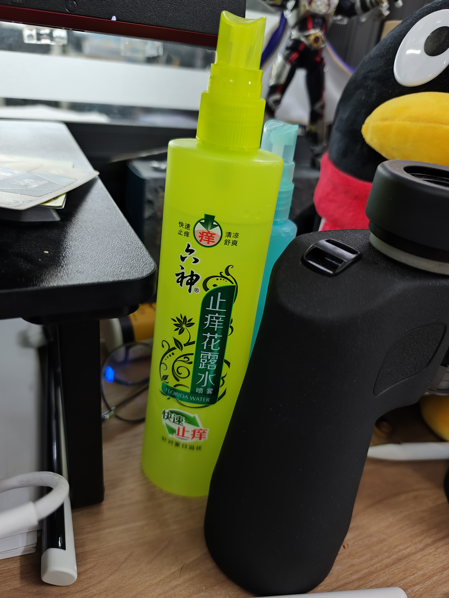
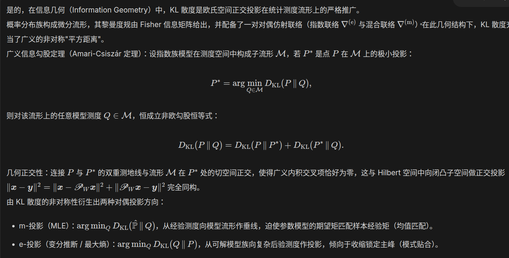
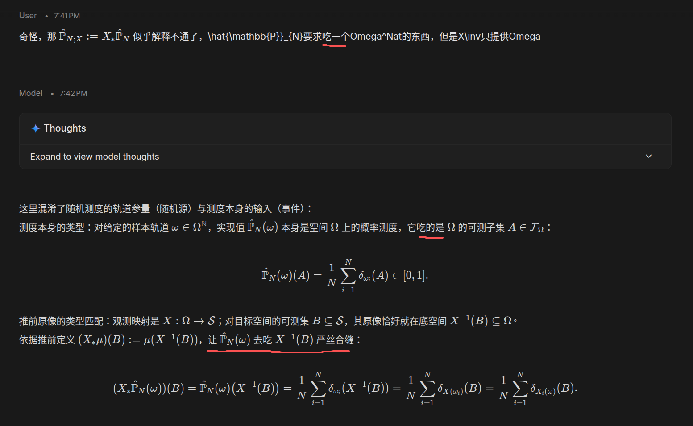
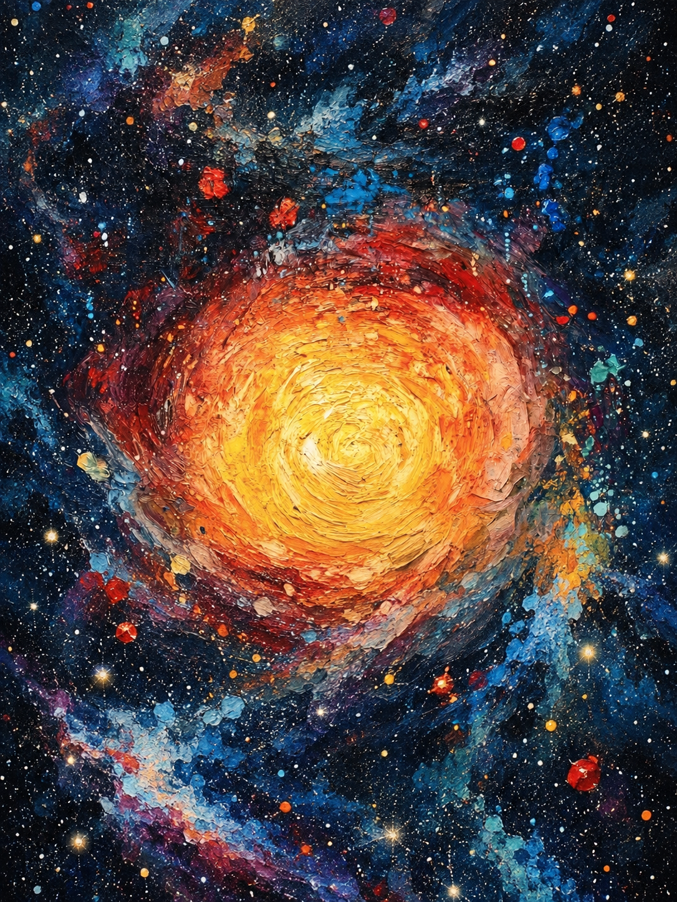

# 2026-09-27 — 2026-10-03

> 周归档：2026-09-27 至 2026-10-03（周日—周六），当前记录中。

<!-- 周容器创建模型：gpt-6-astra -->

## 本周记录

2026-09-27 02:34:40 CST
[from Claude Opus 5.5：时间观](../../references/2026-09-27-time-view-history-materialism.md#t023440)

2026-09-27 02:42:10 CST
[from Gemini 3.8 Flash：科学时间观与大历史观](../../references/2026-09-27-time-view-history-materialism.md#t024210)

2026-09-27 02:49:50 CST
[from Claude Opus 5.5：人民史观与唯物政治历史观](../../references/2026-09-27-time-view-history-materialism.md#t024950)

2026-09-27 03:00:23 CST
[from Claude Opus 5.5：个人发展：一个中心、四项基本原则、改革开放、科教兴国](../../references/2026-09-27-time-view-history-materialism.md#t030023)

2026-09-27 05:48:41 CST
相对论，让人允许穿梭到未来。我思考，我现在学习数学，或者说其他感兴趣并且能收获实质快速进展的学科，并放弃那些我不擅长或难以取得显著进展的学科。或许这也是一种穿梭到未来的方式。因为，我乐观期望，未来AI发展，我会以前所未有的，快得多的方式，学习吸收那些我曾经感兴趣，但是限于物质实际条件而无法深入的知识。
这让我回想起我今天思考 $1.1 * 0.9 = 0.99 < 1$ 的数学推广，其实很简单，只不过是 $(a + c) / b * (a - c) / b$ 或者 $(a + c) / b * a / (b + c)$，然后展开计算一下而已。但是，在骑电动车的时候，我没有纸笔，也没有计算机AI，因此，我的大脑是无法完成或者说懒得在头脑中纯粹完成这些符号推导的。主要是，我的大脑草稿纸功能，似乎在长期的多工具使用中，退化了。但是，拿起纸笔后，我很快就解决了这个问题。
我写下这些事情，是为了说明，人类一旦能够有一种和外部强力工具无缝衔接的能力，那么是一种飞跃。如同我骑电动车快速行驶时，实际上电动车也是我身体的一部分一般。从历史上看，生物进化就是不断发展适应外部环境。而如今，外部环境有大量工具没有被人类内化，我认为，迟早人类将机械飞升，或者说类似于计算机一般，可以模块组合各类工具。
2026-09-27 05:56:17 CST

2026-09-28 02:34:51 CST
我想起来，初中的时候，当时，贫穷地连去小卖铺买东西吃，都做不到。真是穷困潦倒。唯一的娱乐就是在家里看书，以及那台旧圣遗留的电脑。
真穷啊，肉蛋奶都是奢侈的。虽然，有姑姑家接济，我不时能吃到些好的食物，但总体上，各类营养还是匮乏的。
我初中的时候，是什么时间呢？是2014秋季到2017夏季这3年。距今也有将近10年了。
毫无疑问，我是工人家庭，根正苗红的无产阶级出身。中国建国以来到改革开放，是29年，改革开放到加入世界贸易组织，是23年。再到今天，是25年了。
经过多少代人的接续努力，新一代的中国人民，生活在一个网络发达，至少能吃饱的时代。当然，还有很多问题没有解决，比如说，迄今为止，吃好（比如说随时随地吃一顿果蔬，牛羊肉，海鲜）和穿暖甚至穿好，仍然没有解决，社会生产力还有极其巨大的提升空间。
让一部分人先富起来的政策成功了。特别是，大量的资源，集中到了科技创新领域，推动了社会整体的进步和发展。
上九天揽月，下五洋捉鳖。是脍炙人口的语句。但在今天，做到这两件事情还是很困难的。希望再经过20-30年的发展，科技进步能让每一个人都能翱翔于九天之上，遨游于五洋之中。
2026-09-28 02:55:57 CST

2026-09-28 04:19:57 CST
损失厌恶。嗯，我发觉到，目前的各类平台充斥着此类现象。如同毒品一般，让人上瘾。
2026-09-28 04:20:36 CST

2026-09-28 14:53:02 CST
鬼火鹈鹕；艹，笑死我了。有时候8u们还是很有创造力

2026-09-28 14:53:44 CST

2026-09-28 15:14:23 CST
恍然间想到，为什么企业喜欢招收本科生乃至于研究生。这是因为，抛开所学的专业知识不谈，接收的教育年限越长，一个人被教育系统改造的程度也就越深。因而，可以认为，其具有企业所要求的合格素质（包括人品·行为规范·学习能力等）的先验概率也就越大。
高等教育，其高等就在于，和初等教育的集体培养以及受父母监管截然不同。基本上，可以认为，是国家政府花费海量资金，组织起来的社会化培养。这让我想起我以前觉得，最好是可以让每个人从一出生开始，就直接由政府集中统一培养，绕过家庭抚养。我现在回味，国家真的在这样做，只不过实验的对象是一代又一代的本科生与研究生。
嗯，教育是非常重要的。古语有云，师者如父母。高等教育里，毫无疑问，政府是背后的无形长辈。
一个差的环境，以及素质不高的父母，完全能够制造出性格顽劣缺陷的孩子，如果他们没有得到良好的教育和社会化培养，那基本可以视为黑恶势力，也就是人民敌人的萌芽阶段了。所谓工作德为先，不少工作，许多人都可以胜任，但是要求耐心负责，也就是稳定。一个心术不正，三观不正的人，会给企业带来极其巨大的损失。企业用什么来筛选品德呢？毫无疑问，教育背景是一个巨大的参考因素。
2026-09-28 15:30:34 CST

2026-09-28 15:30:53 CST
cerebras的model speed真的震惊到我了，速度简直是飞快。我想，这就是模型未来的方向。100 token/s和2000 token/s之间的差距，简直是天壤之别。后者是无感的，enter按键一按下，答案就瞬间出来。对于AI programming来说，实时交互极其重要。这犹如开车与跑步一般，连续的流和前进一下等几秒，甚至几十秒再前进，速度差距非常大。
2026-09-28 15:33:18 CST

2026-09-28 15:48:39 CST
关于latex图文排版，我忽然想到，理论上，应该让图片比例自适应，使得排版美观协调，减少大段的空白，如同word一般。
2026-09-28 15:49:29 CST

2026-09-28 20:27:00 CST
由于目前LLM的速度犹如2G网络一般，因此很多想法还不能落地。
2026-09-28 20:27:35 CST

2026-09-28 23:24:04 CST
我发现两个策略（虽然需要意志力和外部能量）：
- cut-off策略，也可以称为聚焦策略
- 解耦策略，娱乐与工作分开
Copilot还为我提供了一个trade-off策略，我觉得也不错。
2026-09-28 23:26:00 CST
我还考虑，倒退量化计划策略也是一种有效的方法。可以提升人的目标感·紧迫感。
2026-09-28 23:26:52 CST

2026-09-29 00:42:28 CST
我注意到，要保持任务的连续性。因为我发现，每次我总是饭前2h才缓慢动身，然后吃饭打断许久，饭后散步休闲娱乐，重新启动已经是许久之后了。我思考，或许这是停止休闲->启动工作的成本非常巨大的缘故。大脑会本能拖延
2026-09-29 00:44:31 CST

2026-09-29 02:01:47 CST
黄金矿工，我就是黄金矿工！
2026-09-29 02:02:03 CST

2026-09-29 04:11:46 CST
关于成熟化，以及被管理。我是一个非常喜欢自由的人，当然，最好是有充分精神物质保障的自由。步入18周岁后，随着自身三观·自然/社会知识的逐渐完善，以及身体样貌的成熟，我渐渐讨厌被集中管理，特别是，像是一个学生一般被管理。
我非常渴望能够有一种类似于王国的领主（大概古代皇帝，又或者是现代玩家对于游戏NPC）一般的绝对权威以及超然姿态。随着年龄的增长，我的自尊心似乎显著增强了。
在现代社会，由于经济来源·学业压力等问题，包括我在内的许多学生，无法获得完全的自由和自主权，我们仍然受到各种外部约束和管理。
这里的不和谐之处在于，有时候，外部管理者并不比我们优越许多，或者，他们的管理方式，仍然以一种强制方式，将我们看待为未成年人（虽然，我偶尔思考，现代的发展的确使得成年年龄增加了，而并非法定意义上的18周岁），这种成熟与幼稚的错误，导致了一些滑稽与羞愤的场景。有时是比较微妙的，因为管理者必须获得合法的权力，而这种权力来自于哪呢？偶尔我们会讽刺那些罔顾事实·颐气指使的管理者为”老登“。老登的言行，如果严格分析（不考虑一些情感因素，或者说，被管理者以一种喜剧·乐观·包容的心态予以理解），将被视为对他人人格的不尊重·以及羞辱之类。
实现各个年龄阶层的平等交流，是我的社会科学研究课题之一。能够正视客观条件的差异，区分长幼有别·尊老爱幼的朴素情感，以及实际应当合理平等地交流，特别是，年长者要用智慧和耐心引导，以及，年轻人能够虚心接受指导和建议。当然，我思考，适当的争论也是必要的，这有助于激发思维碰撞，促进各方的理解与成长。
我当然可以极端地思考，一个对自主权力渴望的年轻人，被强制压迫到一个服从管理的框架内，是一种畸形的现状，而且似乎也很可悲。可惜，事实并非完全如此。现代唯物者思考如何在现实条件下，既保持个人的自主权力，又能够适应外部管理与约束。我思考，这和我以前讨论过的心能有关，当然也包括情感力量（惰性与活力），还有许多。
2026-09-29 04:27:57 CST

2026-09-29 04:38:29 CST
和Claude opus 5.5聊天。发现其对我写"黄金矿工"的原因，还不能分析到位。我的内心真实活动是: [
  矿工指的是学术创新。如果额外开辟一条赛道，我们当然就是Number one。而矿工又是一种活力的，挖矿的形容。这和世界一流也是联系起来的。黄金，钻石，多么美妙而璀璨呢？
  书写时候的情绪当然是兴奋活跃斗志昂扬的。
  当然，矿工也有辛苦的语义。在漆黑的矿洞里，辛苦劳动许久，才能获得宝贵的矿石。大概也有一些自嘲的含义（乐）？
]
2026-09-29 04:40:56 CST

2026-09-29 05:27:28 CST
没想到AI助手没有分析到我已经合格通过二次中期答辩了。可见，我需要更多地书写我的日常。
似乎中秋的活动我也没有写文。有空我这两天应该补齐呀。
2026-09-29 05:28:33 CST

2026-09-29 05:30:06 CST
[中秋记录](../../references/2026-09-29-mid-autumn-festival.md#t053006)

2026-09-29 14:35:09 CST
睡眠了3h16分左右，虽然眯眼了几分钟，感觉眼睛有点疲劳。但是完全醒来，感觉果然精神状态恢复许多了！
2026-09-29 14:36:29 CST

2026-09-29 15:11:15 CST
[面向前沿人工智能训练的安全案例](https://openai.com/index/towards-safety-cases-for-frontier-ai-training/)
OAI写的一篇blog，我觉得用来学习英文很不错。即使是学习学术中文，也是很好的。
2026-09-29 15:12:09 CST

2026-09-29 15:27:00 CST

看我发现什么宝贝！止痒花露水！
2026-09-29 15:27:46 CST

2026-09-29 15:35:30 CST

颇觉奥妙，可惜，精力有限，暂时还不能深入学习这个内容
2026-09-29 15:35:54 CST

2026-09-29 19:50:12 CST

我感到一种数学散文或者娱乐化术语·梗的独特欢快。严谨的数学与”吃“的轻松结合，产生了一种奇妙的反差趣味感。
2026-09-29 19:51:53 CST

2026-09-30 02:12:04 CST
我想书写一下我的reward观，或者说，对于评价机制的策略。基本上，我采取一种随心游戏策略。就是说，对于那些我感兴趣而且很轻松就可以获得80分以上的任务，我会更加感兴趣，并且深入游玩；反过来说，对于那些我竭尽全力，可能未必获得60分的任务，我会尽可能选择放弃，或者，想一些别的办法来降低其难度。在游戏中，最简单的降低难度的办法有两种，一是作弊，二是直接放弃。
2026-09-30 02:14:50 CST
"刷不了的benchmark，就不用再刷了。人类一生能做的事情很多，benchmark也无穷无尽。特别是，我们正处于一个飞速发展，信息爆炸的时代。说不定今天费力刷的benchmark，明天借助工具就能轻松通过了。"
2026-09-30 02:26:23 CST

2026-09-30 23:26:30 CST

很漂亮的一张图片。源头是X上刷到的推荐, 我用ChatGPT做了二次修改
2026-09-30 23:26:47 CST

2026-10-01 23:52:06 CST
选择，是一种趣味。
2026-10-01 23:52:20 CST