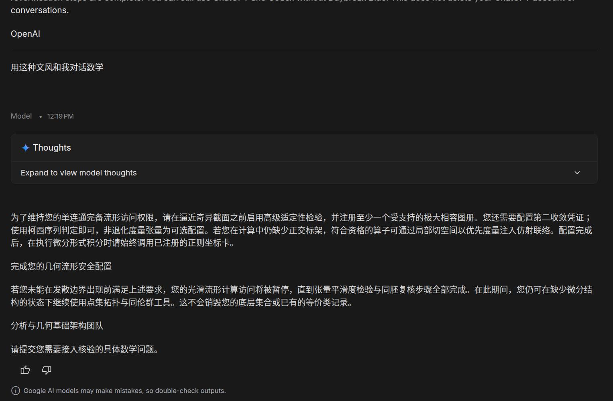
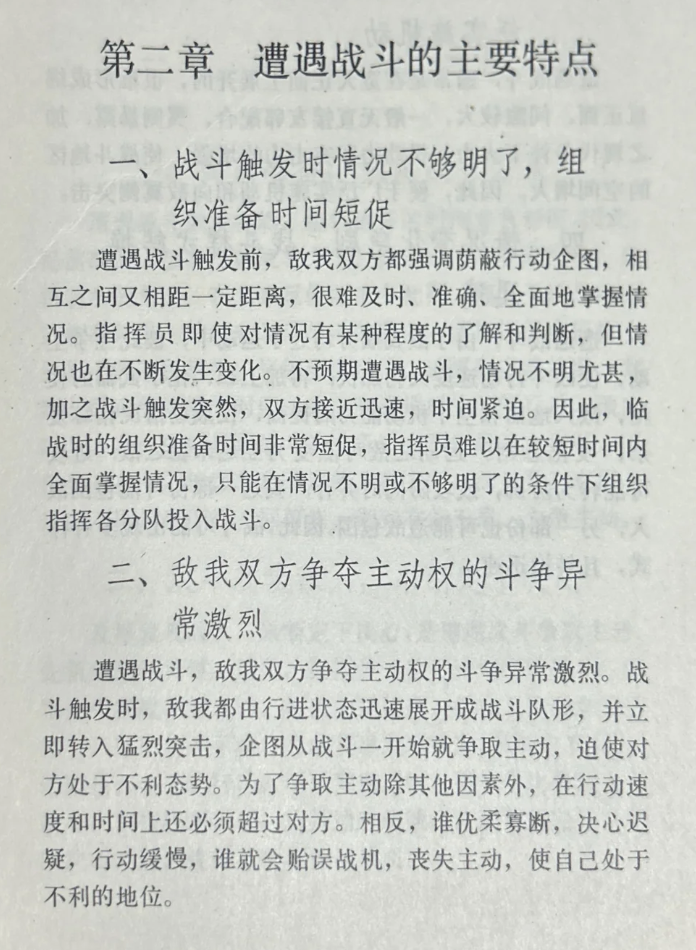
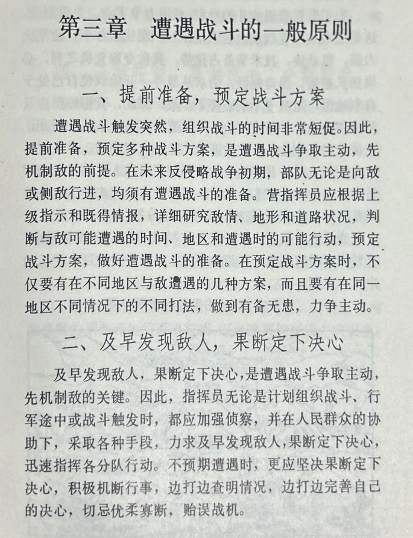

# 2026-10-04 — 2026-10-10

> 周归档：2026-10-04 至 2026-10-10（周日—周六），当前记录中。

<!-- 周容器创建模型：GitHub Copilot（Claude Sonnet 5.5） -->

## 本周记录

2026-10-04 00:31:33 CST
为什么，有的时候，我面对黑恶势力的时候，却敢怒不敢言呢？是因为害怕吗，胆怯吗，畏惧吗？
尤其是对于地痞流氓，如果与之抗争，首先，不免要有一番言语斗争，此时就感觉自己的身份被降低，简直是一种侮辱。然后是肢体斗争。会疼痛吗？打不过而失败吗？会流血，身体的血肉被撕裂，内脏和骨头，会遭到损伤。这会影响到未来的生活，会残疾吗？肢体·眼睛·面部，会受到伤害吗？
2026-10-04 00:34:29 CST

2026-10-04 00:45:05 CST
https://code.visualstudio.com/blogs/2026/08/26/agent-host-architecture
此文档甚为奥秘。虽然，github copilot热度没有codex和claude code那么高，但确实，copilot一直是在coding agent的创新前沿。
2026-10-04 00:45:54 CST

2026-10-04 00:46:46 CST
[圣园与九坤的数学形式化（未完稿）](../../references/2026-10-04-shengyuan-jiukun-formalization.md#t004646)
2026-10-04 01:06:15 CST

2026-10-04 03:24:53 CST
我思考，其实，我生活中，有许多想要分享的内容。不过，即使采用了朋友圈收缩政策后，似乎，我许多有分享激情的事物，似乎也没有出现在虚拟朋友圈中。
分享欲望，从何而来呢？毫无疑问，人希望分享的东西，当然是自己觉得很好的。通过虚拟朋友圈，实际上，解耦了社交困境与分享欲望这两点。使得我们既可以拥有分享的兴奋，又不必过于担心社交评价的压力。
2026-10-04 03:27:42 CST

Buffer 2026-10-04 06:24:11 CST
库库马力和功夫派，两款很经典的游戏。希望以后可以归档复刻
2026-10-04 06:24:35 CST

2026-10-04 06:35:18 CST
我察觉到，由于学业问题，我长久以来，都局限在STEM领域。我思考，如同童年时代看过的各类卡通小说电影对我产生了深远影响一般。我今后需要更多花费时间在steam等游戏平台，了解更广泛范围内的游戏文化与创意内容。
这是一种三观的扩展，也是对创造力和想象力的培养。
2026-10-04 06:36:41 CST

2026-10-04 12:21:04 CST

笑死了。文字风格转换真的是非常好笑。原版文字源自OpenAI的dayblue权限保留邮件，翻译为数学语言好好笑
2026-10-04 12:21:59 CST

2026-10-04 15:25:52 CST
党性修养有很多好处。自重自省自警自励，立身正大，行事光明，心怀坦荡，处事公正，言行一致，始终保持清醒的头脑和坚定的信念。
进而，鬼神难侵，震慑妖魔。外在有超然气场，沉稳如山、深邃如海，既温和包容，又令人肃然起敬、不敢轻慢。
修养，是物质和意识的双重螺旋上升。日复一日，年复一年。理想信念的“坚定”，是要通过长期的内外斗争来锤炼的。人民内部的理性斗争，和敌人的残酷斗争，都是修养的重要途径。
2026-10-04 15:37:43 CST

2026-10-04 20:40:06 CST
工位楼外，惊雷炸起。我在此1s前，目光阅读着许久前写在纸上的:"大势所向，天地皆宽；沉默在心中的巨大欲望"
2026-10-04 20:41:35 CST

2026-10-05 00:43:57 CST
我考虑，或许，目前公众抵制AI的情绪，源自AI输出的一些低质量内容，不管是文字还是图片。这是我自己的体会。
反过来说，AI输出的精彩数学内容，我是很喜欢的。
所以我想，对于AI生成的内容，我们必须要严格审核，绝对不要把地摊劣质内容呈送到公众读者面前。
2026-10-05 00:45:52 CST

2026-10-05 21:05:45 CST
遂古之初，谁传道之？上下未形，何由考之？
这是《天问》中的一句话。
放在现代科学仍然很适用，道就是宇宙的规律。形则是流形，表示一种结构。
2026-10-05 21:06:55 CST

2026-10-06 00:32:12 CST
今天和zyj,wcl一起去参观了自然博物馆，整体观感还是不错的，就是有些静态了。古代和现代的动物植物昆虫，地质，宇宙，恐龙等展品都很丰富。
也许是国庆人太多了，如果人少的时候，静静游览，会有更好的体验。

浏览到雄安新区，很漂亮很美丽的城市。我一直想要回北京，因为北京承载了旧圣的精彩人生，以及我的一部分童年。此外，凤母对北京也有深厚的感情。
雄安距离北京很近，规划的非常现代化，城市布局合理，绿化充足，给人一种宜居的感觉。而且，有北方的四季。
我想，以后除了老家滨海。最好可以在深圳·雄安，这两个地方都有居住场所。北京... 北京的房价非常高，我总是思考，或许我短期还不能拥有北京的房产。但是，常常去北京玩总是可以做到的吧！
深圳是我发自内心赞叹热爱的城市，我喜欢这里，未来也希望能够在这里长期居住和发展。特别是，深圳的特点是，一年只有春夏秋，没有严寒下漫天冰雪的冬季。这让我总是调侃，深圳是一个打工之城，或者，书面一些，是一座奋斗之城。因为，24·25年几次去北京，扑面而来的冷风，让人感觉一种寒冷带来的特殊情感。是惆怅·伤感·静态？我觉得不完全是。但毫无疑问深圳火热的夏季，总是让人充满活力和干劲。
2026-10-06 00:41:18 CST

2026-10-07 02:29:00 CST
AI语文学习时间: [
  一见倾心 心旌摇曳 心醉神迷 魂牵梦萦 朝思暮想
  意乱情迷 情难自禁 神魂摇荡 辗转反侧 念念不忘
  怦然心动 意犹未尽 流连忘返 魂不守舍 回味无穷
]

2026-10-07 04:51:01 CST
量子概率，万有 $\Omega$ 的不存在，以及 $\mathbb{P}(AB) > P(B)$ 的可能，让我感受到，经典概率有其局限性。我们需要广义概率理论来更好地描述这些现象。
2026-10-07 04:52:41 CST

2026-10-07 05:35:05 CST
受到CT的人类图书馆启发，我聚焦于思考如何创业，或者说，进行商业活动。基本上，这就是说，我需要洞察，哪些人群，有什么样的显式/隐式需求，以及他们的行为模式，从而设计出能够满足这些需求的产品或服务。
首先，我需要考虑我自己。我有哪些优势、兴趣和资源？我擅长哪些领域？我对哪些问题充满热情？我能够投入多少时间和精力？深入回答这些问题，可以让我明白我需要什么。也就是，如果有个人需要面向我进行商业活动，他需要满足我的哪些需求，我会对哪些产品或服务感兴趣。
吃喝当然是头等大问题。如果有一个24h，能提供热米饭·各类蔬菜·汤·牛肉等（大概是经典盐城菜 + 其他我所喜欢的菜系）的自动出餐口，毫无疑问，我会主要选择这里用餐。此外，我会为音乐·影视·文字作品付费，同时也会关注一些高质量的教育和学习资源。
如果有人提供付费的深圳导游服务，我觉得也是很不错的。深圳的各地人文·自然，我自己去了解当然很难，而且我一个人，或许没有那么大兴趣出去玩。
还有宠物服务，城市里养猫和狗可是很昂贵的。同时，我未必有足够的时间和精力去照顾它们。如果有一种集成的宠物公园，类似于健身房。而且就在附近不远处，我会非常愿意使用这样的服务。没事去公园散步，顺便和宠物互动，我觉得是很妙的。

2026-10-08 03:31:36 CST

能够打赢乃至消灭敌人，就是我们训练的总目标。

2026-10-08 03:38:13 CST
[Introducing Playground: Create and play custom games](https://blog.google/innovation-and-ai/technology/ai/playground-experimental-gaming-platform/)
Google的伟大作品！将我之前想要实现的创意变为了现实。赞！
2026-10-08 03:39:14 CST